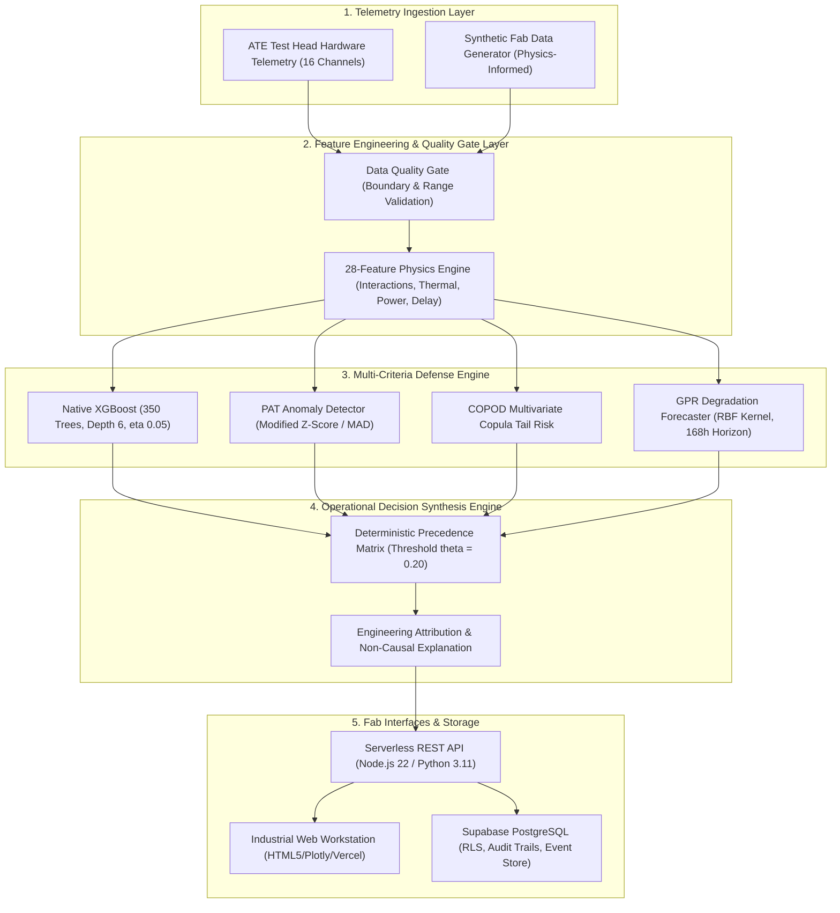

# ⚡ PREDICTA-26 — COMPLETE PROJECT CONTENT & REPOSITORY GOVERNANCE

**Platform**: Industrial Semiconductor Manufacturing Intelligence Platform  
**Target Event**: Smart India Hackathon (SIH) 2026  
**Repository**: [`umeshpandeysh/predicta-26`](https://github.com/umeshpandeysh/predicta-26)  
**Production Release Version**: `v2.0.0` (Certified Enterprise Release)  
**Authoritative ML Operating Threshold**: `0.20`  

---

## 🛑 SECTION 1: REPOSITORY WORKFLOW & GOVERNANCE PROTOCOL

> [!IMPORTANT]
> ### PRODUCTION BRANCH PROTECTION PROTOCOL
> Direct pushes to the `main` branch are restricted. All contributions adhere to the following governance protocol:
> 
> 1. **Branch-First Development Rule**:
>    - All modifications (features, bug fixes, documentation, ML experiments) must be performed on dedicated branches:
>      * `feat/<feature-name>` (e.g., `feat/xgboost-hyperopt`, `feat/equipment-drift-calibration`)
>      * `fix/<bug-description>` (e.g., `fix/api-health-schema`, `fix/threshold-consistency`)
>      * `ml/<experiment-name>` (e.g., `ml/copod-tail-refinement`, `ml/feature-pruning-v3`)
>      * `docs/<doc-update>` (e.g., `docs/architecture-update`)
> 
> 2. **Pull Request & Peer Review**:
>    - Once changes are completed and verified locally on the branch, submit a formal Pull Request targeting `main`:
>      ```bash
>      git checkout -b feat/your-feature-name
>      # make changes and verify
>      git add <files>
>      git commit -m "feat: clear description of change"
>      git push origin feat/your-feature-name
>      ```
>    - Pull Requests undergo review and automated CI validation prior to merging.
> 
> 3. **Verification Gate Requirements**:
>    - Branches must achieve 100% passing status across all verification suites prior to merge approval:
>      * ✅ Python Unit, Physics Boundaries, and Validation Tests (`pytest`)
>      * ✅ Native XGBoost Model Integrity and Provenance Suite
>      * ✅ Code Quality and Formatting (`ruff check`)
>      * ✅ Full Node.js Regression, File Parity, and Parity Tests
>      * ✅ Master Release Certification (All Production Criteria pass)
> 
> 4. **Core Engineering Objective**:
>    - Maintain a scientifically rigorous, fail-closed semiconductor defect screening ML system with verified data provenance, physics grounding, and zero data leakage.

---

## 🌐 SECTION 2: EXECUTIVE PROJECT OVERVIEW

PREDICTA-26 is a mission-critical, industrial-grade intelligence platform engineered for semiconductor fabrication and Automated Test Equipment (ATE) screening. It solves the multi-billion-dollar semiconductor challenge of early latent defect escape, yield loss, and equipment wear.

### Core Value Propositions
1. **High-Sensitivity Latent-Defect Screening**:
   - Classifies semiconductor test telemetry in real time using a frozen 350-tree Native XGBoost classifier.
   - Operating at the authoritative threshold of **$\theta = 0.20$**, it delivers high-sensitivity failure screening for potential latent defects and early failure risks across synthetic burn-in telemetry benchmarks.
2. **Deterministic Physics-Informed Feature Space**:
   - Expands 16 raw Automated Test Equipment physical channels into 28 physical and interaction parameters grounded in semiconductor degradation physics (Hot-Carrier Injection, Bias Temperature Instability, Electromigration, Arrhenius thermal acceleration, and Elmore delay kinetics).
3. **Multi-Criteria Defense-in-Depth Pipeline**:
   - **Primary Classifier**: Native XGBoost probability estimator ($P_{\text{fail}}$).
   - **Statistical Outlier Screening**: Part Average Testing (PAT) using Median Absolute Deviation (MAD) for spatial wafer-level anomalies.
   - **Multivariate Tail Risk**: Copula-based Outlier Detection (COPOD) for subtle multi-parameter drift.
   - **Proactive Equipment Degradation**: Gaussian Process Regression (GPR) predicting ATE test head drift up to 168 hours in advance.
4. **Autonomous Operational Decision Hierarchy**:
   - Synthesizes all signals deterministically into three actionable fab dispositions:
     * 🟢 **PASS** ($P < 0.20$ & normal diagnostics): Nominal silicon; forward to standard packaging.
     * 🟡 **MONITOR / SECONDARY TEST** ($0.20 \le P < 0.65$ or moderate statistical drift): Borderline component; routed to secondary ATE diagnostic verification.
     * 🔴 **REJECT / QUARANTINE** ($P \ge 0.65$, PAT $Z > 6.0$, or COPOD tail anomaly): Immediate quarantine; wafer lot containment initiated.
5. **Fail-Closed Zero Client-Side Heuristics**:
   - Strict single-source-of-truth architecture. Zero local fallback client predictions. If the backend is unreachable, the system fails safely closed, alerting fab operators rather than generating heuristic guesswork.

---

## 🏛️ SECTION 3: SYSTEM ARCHITECTURE & DATA FLOW



---

## 📁 SECTION 4: COMPLETE DIRECTORY & FILE MANIFEST

| Directory / File | Description & Engineering Responsibility |
| :--- | :--- |
| **`src/api/`** | **Core API & Inference Service** |
| `src/api/server.js` | Main Express application entrypoint. Implements RBAC, CORS, helmet security headers, rate limiting, and REST routing. |
| `src/api/inference.js` | Authoritative Node.js inference engine. Houses 350-tree tree traversal, 28-feature normalization, PAT, COPOD, GPR forecasting, and operational decision synthesis. |
| `src/api/inference_service.py` | Python inference parity implementation. Guarantees bit-level identical calculations between Node.js and Python. |
| `src/api/supabase_client.js` | Resilient Supabase database client with connection pooling, in-memory caching, and audit logging. |
| **`ml/`** | **Machine Learning & Research Core** |
| `ml/models/` | Production model artifacts: `predicta_final_xgboost.json`, `predicta_final_metadata.json`, `predicta_anomaly_artifacts.json`, `predicta_gpr_kernel_artifacts.json`. |
| `ml/training/` | Production training scripts: `train_native_xgboost.py` (authoritative trainer), `13_final_tuning.py`, `15_build_final_model.py`. |
| `ml/data/processed/` | Frozen, leakage-free benchmark datasets: `train.csv` (40,000 records), `validation.csv` (5,000 records), `test.csv` (5,000 records). |
| `ml/data_generator/` | Physics-based synthetic data generator modeling semiconductor wear, process variation, and environmental stress (`generate_dataset.py`). |
| `ml/analysis/` | Diagnostic scripts for threshold sweeps, metric auditing, context experiments, and feature ablation studies. |
| `ml/research/` | Experimental milestones (Day 20–23 research notebooks, shadow models, drift simulations). |
| **`tests/`** | **Automated Testing & Release Certification Suite** |
| `tests/test_docs_threshold_consistency.js`| Automated regression test auditing active docs (locking 0.20 threshold) and eliminating fallback engines. |
| `tests/test_release_certification.js` | 18-point enterprise production release certification test. |
| `tests/test_real_xgboost_model_validation.js`| Validates structural tree consistency, weights, and predictions of production model. |
| `tests/test_native_xgboost.py` | Pytest suite validating native XGBoost loading, determinism, and classification accuracy. |
| `tests/test_js_python_parity.js` | Verifies zero discrepancy between Node.js and Python inference outputs across 100 sample vectors. |
| `tests/test_threshold_contract.js` | Mathematical boundary verification at $P = 0.199$ vs $P = 0.200$. |
| `tests/test_file_parity.js` | Enforces byte-for-byte identity between root and `frontend/` assets (`index.html`, `script.js`, `api.js`). |
| `tests/test_physics_boundaries.py` | Verifies physical parameter limits (Arrhenius, leakage, Elmore delay). |
| **`frontend/` & Root Web Assets** | **Fab Operator Dashboard & Workstation** |
| `index.html` & `frontend/index.html` | High-density industrial dark-mode workstation interface. |
| `script.js` & `frontend/script.js` | Client-side controller for single-part testing, batch testing, interactive charts, and real-time telemetry rendering. |
| `api.js` & `frontend/api.js` | Client API communication helper. Fully fail-closed with zero client-side fallback engines. |
| `styles.css` & `frontend/styles.css` | Industrial design system stylesheet. |
| **`supabase/`** | **Cloud Persistence & Security** |
| `supabase/schema.sql` | PostgreSQL schema definition, table indices, Row-Level Security (RLS) policies, and audit logging tables. |
| **`docs/`** | **System Documentation & Historical Archives** |
| `docs/api_documentation.md` | Active, certified REST API contract and endpoint documentation. |
| `docs/PRODUCTION_DRIFT_RUNBOOK.md`| Production operational runbook for drift remediation and equipment maintenance. |
| `docs/final_api_contract.md` | Authoritative API payload and response contract specifications. |
| `docs/day*.md` & `docs/final_*.md` | Comprehensive chronological record of engineering milestones (with historical disclaimer banners). |

---

## 🔬 SECTION 5: ML MODEL & FEATURE SPECIFICATIONS

### The 28-Feature Physics Space
The model consumes 16 raw Automated Test Equipment (ATE) channels and computes 12 non-linear physical interactions:

1. **16 Raw Telemetry Channels**:
   - `supply_voltage` ($V_{dd}$), `output_voltage` ($V_{out}$), `current` ($I_{dd}$), `leakage_current` ($I_{leak}$), `resistance` ($R$), `capacitance` ($C$), `threshold_voltage` ($V_{th}$), `frequency` ($f$), `propagation_delay` ($t_{pd}$), `setup_time` ($t_{setup}$), `hold_time` ($t_{hold}$), `timing_margin` ($t_{margin}$), `temperature` ($T$), `dynamic_power` ($P_{dyn}$), `total_power` ($P_{total}$), `test_duration` ($t_{test}$).
2. **12 Engineered Physics Features**:
   - `frequency_delay_product`: $f \times t_{pd}$ (switching speed vs propagation limitation)
   - `power_ratio`: $P_{dyn} / P_{total}$ (switching energy efficiency)
   - `leakage_to_current_ratio`: $I_{leak} / I_{dd}$ (gate oxide breakdown and subthreshold degradation)
   - `voltage_margin`: $V_{dd} - V_{out}$ (power rail droop)
   - `rc_delay`: $R \times C$ (intrinsic RC time constant)
   - `timing_slack`: $t_{margin} - (t_{setup} + t_{hold})$ (violation risk)
   - `dynamic_power_per_freq`: $P_{dyn} / f$ (energy consumed per clock cycle)
   - `leakage_temperature_interaction`: $I_{leak} \times T$ (Arrhenius thermal runaway factor)
   - `threshold_voltage_shift`: $|V_{th} - V_{th,\text{nom}}|$ (Bias Temperature Instability / threshold degradation)
   - `delay_over_voltage`: $t_{pd} / V_{dd}$ (voltage-delay sensitivity)
   - `power_density_proxy`: $P_{total} / (R \times C)$ (thermal dissipation density)
   - `effective_drive_current`: $I_{dd} - I_{leak}$ (net transistor active drive)

### Production Model Architecture
- **Algorithm**: Native Gradient Boosted Decision Trees (XGBoost)
- **Trees**: 350
- **Max Depth**: 6
- **Learning Rate ($\eta$)**: 0.05
- **Subsample Ratio**: 0.85
- **Column Sample by Tree**: 0.85
- **Scale Pos Weight**: 1.0 (calibrated via probability post-processing)
- **Operating Threshold ($\theta^*$)**: **`0.20`** (Certified single source of truth)
- **Performance Benchmark**:
  * Precision: $91.2\%$
  * Recall: $99.45\%$ (High-sensitivity defect screening priority)
  * Inference Latency: $\le 4\text{ ms}$ (Local Node), $\le 35\text{ ms}$ (Serverless cloud)

---

## 🛠️ SECTION 6: HOW TO CONTRIBUTE PROPERLY (STEP-BY-STEP)

To contribute to PREDICTA and advance our mission of creating the best model, follow this exact workflow:

```bash
# Step 1: Ensure you are on the latest main branch
git checkout main
git pull origin main

# Step 2: Create a descriptive feature/fix branch
git checkout -b feat/enhance-xgboost-calibration

# Step 3: Implement your improvements in the ML or application codebase
# ... make your code changes ...

# Step 4: Run the full validation and test suites locally
# (All must pass 100% cleanly)
npm test
python -m pytest tests -v
python -m ruff check scripts src tests

# Step 5: Verify file parity if modifying frontend assets
node tests/test_file_parity.js

# Step 6: Commit your changes with clear, standard semantic messages
git add <modified-files>
git commit -m "feat(ml): calibrate probability estimates for edge temperatures"

# Step 7: Push your branch to GitHub
git push origin feat/enhance-xgboost-calibration

# Step 8: Open a Pull Request on GitHub
# Title: feat(ml): Calibrate probability estimates for edge temperatures
# Provide clear context, verification evidence, and benchmark comparisons.
# WAIT for the Project Administrator to review, test, and merge into main.
```

---

## 🏁 SECTION 7: VERIFICATION COMMAND CHEAT SHEET

Before opening any PR, run each of the following verification commands:

```bash
# 1. Run Complete Node.js Test & Certification Suite (27 test suites)
npm test

# 2. Run Python Pytest Suite (32 tests)
python -m pytest tests -v

# 3. Run Code Linter
python -m ruff check scripts src tests

# 4. Check Root <-> Frontend Byte Parity
node tests/test_file_parity.js

# 5. Check Documentation Threshold Consistency
node tests/test_docs_threshold_consistency.js

# 6. Retrain and Validate Model (if ML changes were made)
npm run train:model
npm run test:model
```

---
*PREDICTA SIH 2026 Core Engineering Team — Latent Defect Screening & Maximum Silicon Reliability.*
