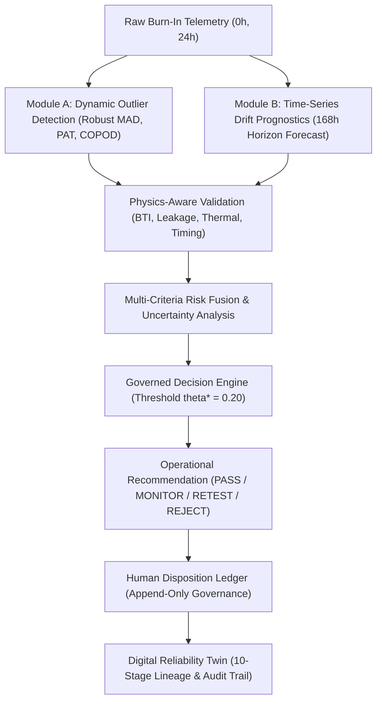
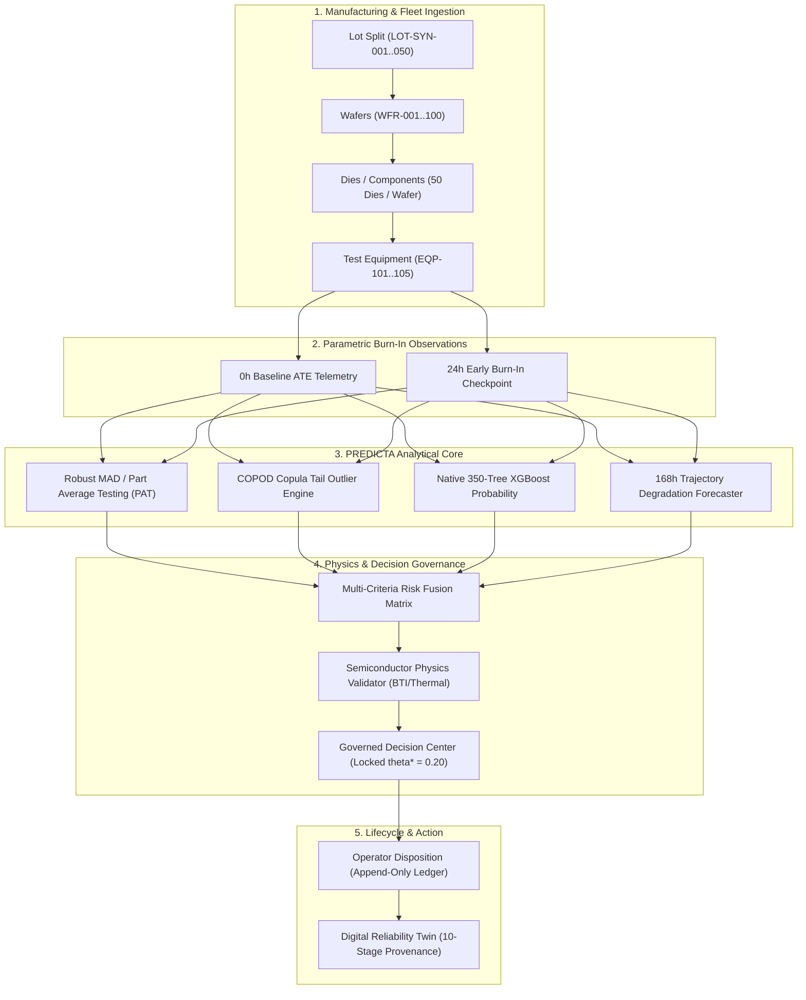
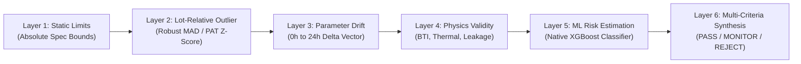
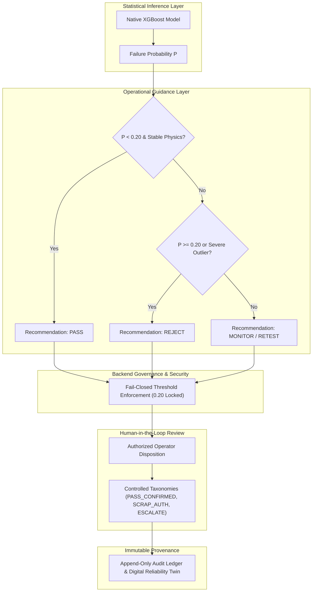
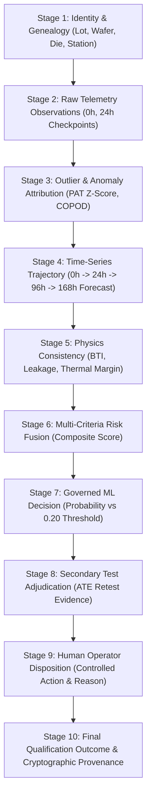

# PREDICTA-26
### Predictive Reliability Engine for Dynamic Identification, Component Testing & Analysis

## AI-Driven Semiconductor Burn-In Telemetry & Latent Defect Screening

[](https://sih.gov.in)
[](https://github.com/umeshpandeysh/predicta-26)
[](https://python.org)
[](https://nodejs.org)
[](ml/models/production/predicta_xgboost_model.json)
[](tests/)
[](ml/reliability_twin/reliability_twin_contract.json)
[](LICENSE)

---

## Problem Context

In aerospace, defense, and high-reliability semiconductor qualification (Smart India Hackathon 2026, Problem Statement 170 — ISRO / Department of Space), integrated circuits undergo rigorous **burn-in thermal and electrical stress testing**. Conventional screening relies heavily on static, point-in-time limit checking (e.g., ATE pass/fail at 0h or 24h).

This introduces two critical failure modes in semiconductor manufacturing:
1. **Latent-Defect Escapes:** Marginal dies with internal gate-oxide, metallization, or interface defects pass static parametric limits at 0h and 24h, yet degrade progressively during burn-in stress, leading to premature mission failure in the field.
2. **False Alarms & Wasteful Scrap:** Normal wafer-to-wafer process variations cause benign parameter shifts that breach overly tight static limits, resulting in the wasteful scrapping of healthy, flight-grade silicon.

---

## What PREDICTA Does

**PREDICTA-26** is a comprehensive, physics-informed semiconductor qualification workstation that converts early burn-in telemetry into traceable, auditable screening decisions:

* **Module A (Dynamic Outlier Detection):** Lot-relative multivariate anomaly detection (Robust MAD/PAT, COPOD, Isolation Forest) to catch anomalous dies that pass static limits but deviate from their cohort baseline.
* **Module B (Time-Series Drift Prognostics):** Trajectory forecasting from early 0h+24h telemetry checkpoints through the **168h Burn-In Evaluation Horizon** to project parameter degradation before final packaging.
* **Physics & Risk Fusion:** Physics consistency validation against semiconductor degradation mechanisms (BTI, thermal acceleration, gate leakage, timing margin) combined with multi-criteria risk synthesis.
* **Governed Decision & Human-in-the-Loop:** Decoupled statistical inference from operational manufacturing actions ($\theta^* = 0.20$ locked) with append-only human disposition audit trails.
* **10-Stage Digital Reliability Twin:** An immutable read-model ledger preserving complete genealogy and lifecycle evidence from wafer sort to final disposition.



---

## 60-Second Demo

Experience the full end-to-end PREDICTA screening pipeline in under one minute:

> **Try the Live System:** Open the deployed PREDICTA application at **[https://ceenew.vercel.app](https://ceenew.vercel.app)**<br>
> *(No local installation or environment setup required)*

1. **Open the Application:** Launch the live deployment in any modern browser.
2. **Select a Demonstration Case:** On the Home screen or Decision Center, click one of the three canonical cases:
   * **Case A (`NORMAL`):** Nominal device operating safely within all limits.
   * **Case B (`LATENT_DEFECT`):** Static-limit escape caught by lot-relative PAT outlier scoring and 168h drift trajectory.
   * **Case C (`FALSE_ALARM`):** Benign process timing shift routed to non-destructive monitoring to prevent scrap.
3. **Inspect the Population Context:** View `#fleet-monitoring-dashboard` to observe the 50-lot manufacturing cohort, constituent wafers, and equipment distributions.
4. **Inspect the Digital Reliability Twin:** Open `#component-reliability-card` in Decision Center to view the 10-stage lifecycle ledger.
5. **Follow the Evidence Timeline:** Track the 0h $\to$ 24h $\to$ 96h $\to$ 168h parametric drift checkpoints.
6. **Review "WHY FLAGGED":** Inspect the 6-layer evidence breakdown showing statistical model attribution (`MODEL ATTRIBUTION — NOT A CAUSAL CLAIM`).
7. **Inspect the Governed Decision:** Verify the automated recommendation against the locked operating threshold ($\theta^* = 0.20$).
8. **Review Human Disposition & Audit:** Submit or inspect governed disposition actions recorded in the immutable audit ledger.

---

## System Architecture & Manufacturing Data Flow

PREDICTA ingests telemetry directly from automated test equipment (ATE) and burn-in chambers across standard manufacturing splits:



---

## Multi-Layer Evidence Pipeline

Rather than relying on a black-box model score, PREDICTA constructs a 6-layer evidence stack for every screening decision:



1. **Static Parametric Limits:** Verifies basic datasheet tolerances ($V_{\text{dd}}$, $I_{\text{leak}}$, $T_{\text{pd}}$, $V_{\text{th}}$).
2. **Lot-Relative Outlier Scoring:** Evaluates Part Average Testing (PAT) and COPOD scores relative to the specific lot cohort.
3. **Time-Series Parameter Drift:** Measures 0h $\to$ 24h degradation rate ($\Delta I_{\text{ddq}} / \Delta t$, $\Delta T_{\text{pd}} / \Delta t$).
4. **Physical Degradation Consistency:** Evaluates kinetic plausibility against Bias Temperature Instability (BTI) and Arrhenius thermal acceleration.
5. **Machine Learning Risk Estimation:** Evaluates native XGBoost failure probability calibrated via Platt scaling against operating threshold $\theta^* = 0.20$.
6. **Multi-Criteria Synthesis:** Produces final operational routing (`PASS`, `MONITOR`, `RETEST`, `REJECT`).

---

## Machine Learning & Statistical Anomaly Detection

* **Part Average Testing (PAT) & Robust MAD:** Univariate and bivariate median absolute deviation scoring relative to the active wafer and lot distribution.
* **COPOD (Copula-Based Outlier Detection):** Non-parametric multivariate tail-probability estimation to detect joint distribution shifts across leakage, delay, and current.
* **Isolation Forest:** High-dimensional recursive partitioning to detect subtle non-linear multi-parameter outliers.
* **Native XGBoost Classifier (`predicta_xgboost_model.json`):** 350-tree gradient boosted decision tree classifier operating on 28 engineered reliability features, calibrated via Platt scaling ($A = -1.0412, B = 1.0037$).

---

## Physics-Aware Reliability Analysis

PREDICTA cross-checks statistical ML outputs against physical degradation mechanisms:
* **Bias Temperature Instability (BTI):** Models threshold voltage shift $\Delta V_{\text{th}} \propto t^{n}$ ($n \approx 0.16\text{--}0.25$) to ensure drift is physically plausible.
* **Gate & Standby Leakage:** Evaluates Poole-Frenkel and trap-assisted tunneling leakage scaling relative to junction temperature.
* **Thermal Acceleration:** Arrhenius acceleration factor $AF = \exp\left(\frac{E_a}{k_B}\left(\frac{1}{T_1} - \frac{1}{T_2}\right)\right)$ calibrated with activation energy $E_a = 0.7\,\text{eV}$.
* **Timing Degradation:** Verifies propagation delay drift against dynamic operating frequency and setup/hold margins.

---

## Governed Decision & Disposition Architecture

PREDICTA strictly decouples raw statistical inference from operational manufacturing actions:



* **Operating Threshold Lock:** Fixed unconditionally at $\theta^* = 0.20$.
* **Controlled Action Taxonomies:** Standardized actions (`PASS_CONFIRMED`, `MONITOR_EXTENDED`, `RETEST_ATE`, `SCRAP_AUTHORIZED`, `ESCALATE_TO_MRB`).
* **Immutability Guarantee:** Human operator dispositions append to the audit ledger without overwriting original ML inference or ground-truth records.

---

## Digital Reliability Twin & Cryptographic Traceability

Every component die is assigned a deterministic Digital Reliability Twin read model maintaining 10 immutable stages of evidence:



---

## Demonstration Cases

PREDICTA provides three authoritative, reproducible canonical cases derived directly from [`src/governance/canonical_demo_data.json`](src/governance/canonical_demo_data.json):

| Canonical Case | ID & Trace | Telemetry Profile | Detection & Evidence | Governed Decision | Operational Meaning |
| :--- | :--- | :--- | :--- | :---: | :--- |
| **Case A: NORMAL** | `COMP-NORMAL`<br>`TR-NORMAL-2026` | $I_{\text{leak}} = 111.7\,\mu\text{A}$<br>threshold_voltage $V_{\text{th}} = 0.45\,\text{V}$<br>$T = 28.6\,^\circ\text{C}$ | ML Probability $P = 0.0048$<br>Anomaly Score $= 0.1095$<br>168h Forecast $= 145.2\,\mu\text{A}$ | **PASS**<br>`ACCEPT` | Nominal baseline device operating safely within all static, lot-relative, and physical drift bounds. |
| **Case B: LATENT DEFECT** | `COMP-LATENT_DEFECT`<br>`TR-LATENT-2026` | $I_{\text{leak}} = 145.0\,\mu\text{A}$<br>*(Passes static $250\,\mu\text{A}$ limit)* | PAT Z-Score $= 6.08 > 3.0$<br>168h Forecast $= 278.4\,\mu\text{A}$<br>ML Probability $P = 0.0840$ | **REJECT**<br>`CRITICAL` | **Static Limit Escape:** Device passes single-point limits but lot-relative outlier score and 168h drift trajectory reveal severe latent degradation. |
| **Case C: FALSE ALARM** | `COMP-FALSE_ALARM`<br>`TR-FALSE-2026` | $T_{\text{pd}} = 11.89\,\text{ns}$<br>$I_{\text{leak}} = 108.2\,\mu\text{A}$ | Timing shift triggers PAT Monitor,<br>but ML Risk $P = 0.0048$<br>Physics = Stable | **MONITOR**<br>`HOLD` | **Scrap Avoidance:** Benign process shift flagged for non-destructive retest/monitoring without discarding healthy flight silicon. |

---

## Dataset Used

PREDICTA is built upon authoritative, cryptographically verified qualification telemetry data:

### 1. Primary Production Telemetry Dataset
* **File Path:** [`ml/data/synthetic/predicta_dataset_v3_50000.csv`](ml/data/synthetic/predicta_dataset_v3_50000.csv)
* **Dataset Size:** 50,000 complete telemetry records (17.77 MB).
* **Manufacturing Structure:** 50 disjoint lots (`LOT-SYN-001` through `LOT-SYN-050`), 100 constituent wafers (`WFR-001` through `WFR-100`), 50 dies per wafer (5,000 unique dies across 10 temporal steps).
* **Test Stations:** 5 equipment stations (`EQP-101` through `EQP-105`).
* **Telemetry Channels:** 14 primary parametric channels:
  * Electrical: Supply Voltage ($V_{\text{dd}}$), Output Voltage ($V_{\text{out}}$), Total Current ($I_{\text{dd}}$), Quiescent Leakage ($I_{\text{ddq}}$), Gate Leakage ($I_{\text{leak}}$), Threshold Voltage ($V_{\text{th}}$).
  * Timing & Performance: Propagation Delay ($T_{\text{pd}}$), Operating Frequency ($f_{\text{clk}}$), Setup Time, Hold Time, Timing Margin.
  * Thermal & Power: Temperature ($T$), Dynamic Power, Total Power, Test Duration.
* **Temporal Checkpoints:** Observations captured across 0h, 24h, 96h, and 168h burn-in intervals.
* **Disjoint Cohort Split (`split_manifest.json`):**
  * 35 Training Lots (`LOT-SYN-001` .. `LOT-SYN-035` / 3,500 dies)
  * 3 Validation Tune Lots (`LOT-SYN-036` .. `LOT-SYN-038` / 300 dies)
  * 4 Calibration Lots (`LOT-SYN-039` .. `LOT-SYN-042` / 400 dies)
  * 8 Independent Test Lots (`LOT-SYN-043` .. `LOT-SYN-050` / 800 dies)
* **Protected SHA-256 Checksum:** `48e718643b6fe99bc410421f5b48715c294f1c4c2edabf10870935afdb820a06`

### 2. External & Reference Benchmarking Datasets
For scientific benchmarking and cross-validation, PREDICTA also references:
* **ST-AWFD (Semiconductor Wafer Defect Dataset):** Spatial defect cluster evaluation.
* **SECOM (Semiconductor Manufacturing Data):** Feature relevance benchmarking.
* **AI4I (Predictive Maintenance Dataset):** Multi-modal tool failure benchmarking.
* **NASA PCoE IGBT #8 (Power Semiconductor Accelerated Aging):** Thermal and electrical degradation validation.

> [!NOTE]
> The primary dataset is a synthetic qualification cohort modeled after JEDEC JESD22 burn-in standards. It is explicitly identified as synthetic data to preserve full scientific honesty and prevent confusion with proprietary fab silicon records.

---

## Scientific Rigor & Governance Boundaries

PREDICTA enforces strict scientific honesty and integrity standards:

1. **Evaluation Horizon Disclaimer:**
   > `168H_EVALUATION_HORIZON_NOT_FAILURE_TIME`  
   > 168 hours represents the standard semiconductor burn-in evaluation horizon, **not** a physical time-to-failure or Mean Time Between Failures (MTBF) claim.
2. **Model Attribution vs. Causality:**
   > `MODEL ATTRIBUTION — NOT A CAUSAL CLAIM`  
   > Feature contribution scores represent statistical model attribution within the trained feature space, not physical root-cause assertions.
3. **Read-Only Reliability Twin:**
   The Digital Reliability Twin is an authoritative **read model**. Requesting a twin record never triggers hidden background ML inference or mutates ground-truth datasets.
4. **Fail-Closed Security:**
   Missing fields, out-of-bounds telemetry, corrupted manifests, or unregistered lot/component queries fail closed safely without fabricating default values.
5. **Protected Artifact Cryptographic Lock:**
   * **Production XGBoost Model:** `91bb598ae91155674e40cb0a9f39d1e9bdeacd39875542db88b65e3668f29d98`
   * **Production Dataset:** `48e718643b6fe99bc410421f5b48715c294f1c4c2edabf10870935afdb820a06`
   * **Authoritative Operating Threshold:** `0.20`

---

## Technical Stack

* **Machine Learning & Analytics:** Python 3.11, Native XGBoost (`xgboost==2.0.3`), NumPy, SciPy, Scikit-Learn.
* **Backend API Gateway:** Node.js 18/20 HTTP REST Gateway, Express, crypto SHA-256 validation engines.
* **Physics & Degradation Models:** Custom BTI kinetic, Poole-Frenkel leakage, and Arrhenius thermal evaluators.
* **Frontend Workstation:** Pure HTML5/ES6 architecture with exact byte parity across root and `frontend/` mirrors (zero build-step dependency, zero third-party CDNs).
* **Test & Verification Framework:** Pytest 9.x, Node test runners, Ruff linter, multi-runtime parity test suites.

---

## Repository Map

```text
predicta-26/
├── src/
│   ├── api/                 Inference service, REST routes, schemas, server.js
│   ├── anomaly_detection/   MAD, PAT, COPOD, and statistical outlier engines
│   ├── features/            Feature contract, normalization, and bounds
│   ├── fleet/               Authoritative FleetManager (Python & Node.js)
│   ├── governance/          Disposition manager, taxonomies, canonical_demo_data.json
│   ├── physics/             BTI, thermal acceleration, and leakage consistency
│   ├── prognostics/         168h trajectory forecaster and governance gates
│   ├── reliability_twin/    10-stage Digital Reliability Twin read model
│   └── risk_fusion/         Multi-criteria risk fusion matrix
├── ml/
│   ├── data/                50k production dataset & 50-lot split manifest
│   ├── models/production/   Protected XGBoost model and calibration artifacts
│   ├── reliability_twin/    Reliability twin immutability contract
│   └── training/            Native XGBoost training & validation scripts
├── frontend/                100% byte-identical client mirror (index.html, script.js, api.js)
├── tests/                   700+ automated unit, integration, parity, and adversarial test suites
├── docs/                    API specifications, mathematical proofs, and runbooks
├── index.html               Main demonstration application & Guided Walkthrough
├── script.js                Frontend workstation application script
├── api.js                   REST API client library
└── style.css                Workstation styling & design system
```

---

## Local Development & Installation

For developers contributing to or running PREDICTA locally:

```bash
# 1. Clone Repository
git clone https://github.com/umeshpandeysh/predicta-26.git
cd predicta-26

# 2. Install Python & Node.js Dependencies
pip install -r requirements.txt
npm install

# 3. Start Backend REST API Server (Port 3000)
node src/api/server.js

# 4. Open Application
# Open http://localhost:3000 in your browser or launch index.html
```

### Automated Verification & Test Commands

```bash
# 1. Run Complete Python Test Suite (700+ Tests)
python -m pytest tests/ -v

# 2. Run Phase 19 Test Suites (Fleet & Guided Journey)
python -m pytest tests/test_phase19_fleet.py tests/test_phase19_judge_journey.py -v
node tests/test_phase19_fleet.js
node tests/test_phase19_judge_journey.js

# 3. Run Cross-Runtime Parity & Production Certification Stack
npm test

# 4. Run Static Analysis & Linter
python -m ruff check src tests
```

---

## SIH Problem Statement Reference

* **Organization:** Smart India Hackathon (SIH 2026)
* **Problem Statement:** PS-170 — AI-Driven Anomaly Detection in Component Burn-In & Screening
* **Theme:** Smart Automation / Software
* **Ministry / Department:** ISRO • Department of Space

---

**PREDICTA-26** · Semiconductor Burn-In Telemetry & Latent Defect Screening  
[GitHub Repository](https://github.com/umeshpandeysh/predicta-26)
