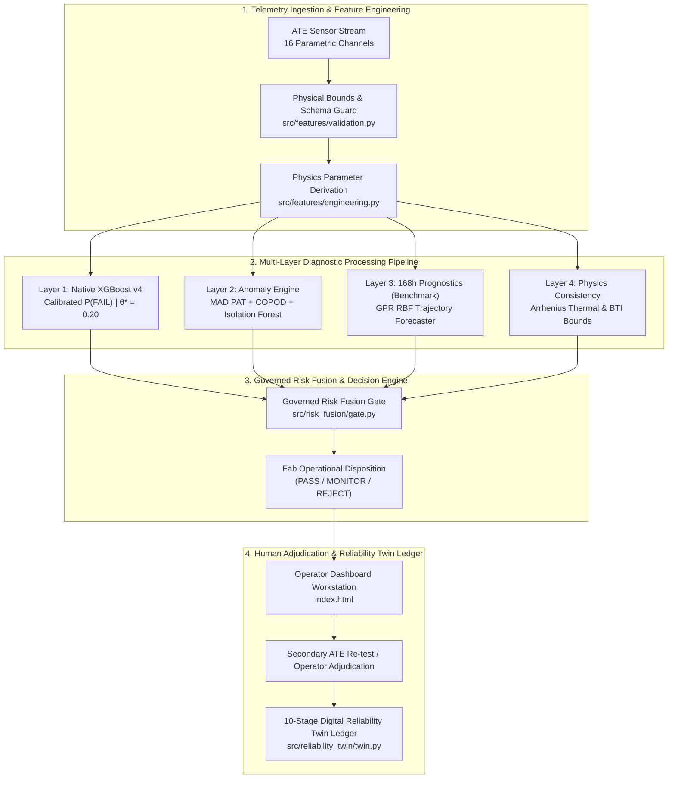
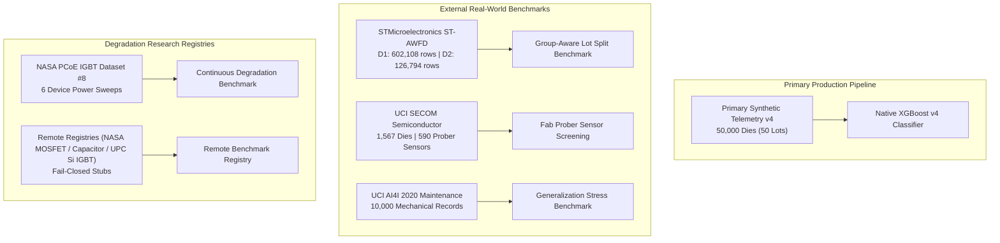

# PREDICTA-26
## Governed Semiconductor Burn-In Telemetry & Latent Defect Screening Engine

[](https://sih.gov.in)
[](https://github.com/umeshpandeysh/predicta-26)
[](https://python.org)
[](https://nodejs.org)
[](ml/models/production/predicta_xgboost_model.json)
[](tests/)
[](LICENSE)

---


---

## ⚡ Judge Quick View

| Evaluation Aspect | PREDICTA-26 Platform Specification |
| :--- | :--- |
| **SIH 2026 Challenge** | **Problem Statement 170 (SIH PS-170)** |
| **Core Engineering Objective** | Early ATE burn-in telemetry processing & latent semiconductor defect screening |
| **Input Telemetry Stream** | 16 Raw ATE Parametric Channels + 7 Physics-Derived Features + 5 Equipment Indicators |
| **Production Decision Engine** | Native XGBoost v4 (`predicta_xgboost_model.json`) locked at threshold $\theta^* = 0.20$ |
| **Empirical Test Performance** | **Recall: 99.72%** · **Precision: 96.43%** · **F1: 98.04%** · **FNR: 0.28%** (15,000 Locked Test Dies) |
| **168h Prognostics Layer** | Gaussian Process Regression (GPR RBF Kernel) Extrapolation (`BENCHMARK_ONLY`) |
| **Spatial Anomaly Screening** | Part Average Testing (MAD) + COPOD Copula Tail Risk + Isolation Forest |
| **Physics Consistency Gate** | Thermal Acceleration (Arrhenius) & Bias Temperature Instability (BTI Shift Bounds) |
| **Explainability Engine** | Actionable Constrained Feature Delta Counterfactual Engine |
| **Traceability Ledger** | 10-Stage Immutable Digital Reliability Twin Evidence Chain (`src/reliability_twin/twin.py`) |
| **Verification & Quality** | 708 / 708 Pytest Tests Passed · 100% Cross-Runtime Node $\leftrightarrow$ Python Parity |

```
┌──────────────────────────────────────────────────────────────────────────────────────────────────┐
│                                RECOMMENDED 5-STEP JUDGE JOURNEY                                  │
├───────────────────┬───────────────────┬───────────────────┬───────────────────┬──────────────────┤
│ Step 1: Problem   │ Step 2: System    │ Step 3: ML Stack  │ Step 4: Evidence  │ Step 5: Live    │
│ Read PS-170       │ Inspect Pipeline  │ Review Production │ Verify Metrics &  │ Run Traceability │
│ Requirement Map   │ Architecture Flow │ vs Benchmark Roles│ Protected Hashes  │ Demonstration    │
└───────────────────┴───────────────────┴───────────────────┴───────────────────┴──────────────────┘
```

---

## 01. SIH PS-170 — Problem Statement → Engineering Solution

**Smart India Hackathon 2026 · Problem Statement 170** addresses early screening of latent microelectronics defects using burn-in telemetry data. Sub-surface silicon flaws frequently pass static voltage and current checks during initial 24h testing before failing catastrophically in mission-critical applications at 168h.

| PS-170 Requirement | Engineering Challenge | PREDICTA-26 Implementation | Repository Evidence |
| :--- | :--- | :--- | :--- |
| **Early Latent Defect Identification** | Sub-surface physical defects pass static $V_{dd}/I_{ddq}$ 24h testing but fail at 168h. | Native XGBoost v4 combined with Physics-Derived Degradation Features ($V_{headroom}, I_{leakage\_fraction}$). | [inference.py](file:///c:/Users/UMESH%20PANDEY/Downloads/ceenew/src/api/inference.py#L80-L150) |
| **ATE Telemetry Ingestion** | High-throughput multi-channel parametric ATE sensor streams ($V, I, T, f, \tau$). | Standardized 28-feature schema (16 raw channels + 7 physics derived + 5 equipment OHE). | [predicta_xgboost_metadata.json](file:///c:/Users/UMESH%20PANDEY/Downloads/ceenew/ml/models/production/predicta_xgboost_metadata.json#L10-L75) |
| **Spatial \& Equipment Anomaly Screening** | Outlier dies from uncalibrated probers or unseen equipment. | Ensemble MAD (Part Average Testing) + COPOD copula tail risk + Isolation Forest. | [fusion.py](file:///c:/Users/UMESH%20PANDEY/Downloads/ceenew/src/anomaly_detection/fusion.py#L40-L110) |
| **Long-Term Reliability Forecasting** | Predicting degradation trajectories over 168h burn-in window. | Gaussian Process Regression (GPR) drift model (governed as `BENCHMARK_ONLY`). | [gpr.py](file:///c:/Users/UMESH%20PANDEY/Downloads/ceenew/src/drift_prediction/gpr.py#L50-L120) |
| **Actionable Fab Routing** | Binary static pass/fail is insufficient for complex degradation. | Governed Risk Fusion producing tri-state dispositions (`PASS`, `MONITOR`, `REJECT`). | [evaluate_disposition.py](file:///c:/Users/UMESH%20PANDEY/Downloads/ceenew/src/decision_engine/evaluate_disposition.py#L60-L140) |
| **Auditability \& Provenance** | Un-traced AI predictions cannot be accepted in semiconductor manufacturing. | 10-Stage Digital Reliability Twin tracing die telemetry to final human adjudication. | [twin.py](file:///c:/Users/UMESH%20PANDEY/Downloads/ceenew/src/reliability_twin/twin.py#L30-L110) |

---

## 02. End-to-End Master System Architecture



---

## 03. Complete ML & Reliability Engine Stack

| Component Name | Algorithm / Methodology | Input Data | Primary Output | Governance Role | Production Status |
| :--- | :--- | :--- | :--- | :--- | :--- |
| **Failure Prediction Classifier** | Native XGBoost v4 (350 Trees, max_depth=6) | 28 Features | $P(\text{FAIL}) \in [0, 1]$ | Primary Production Classifier | 🟢 **Production Authoritative** |
| **Platt Sigmoid Calibrator** | Logistic Calibration ($A=-1.041, B=1.004$) | Uncalibrated Margin | Calibrated Probability | Probability Normalization | 🟢 **Production Authoritative** |
| **Multiclass Defect Classifier** | XGBoost Multiclass | 28 Features | Defect Attribution Category | Fault Diagnostics | 🟢 **Production Authoritative** |
| **Robust PAT Outlier Guard** | Median Absolute Deviation (MAD) | $I_{ddq}, I_{leak}, R, C$ | PAT Outlier Score | Spatial Wafer Screening | 🟡 Governed Evidence |
| **COPOD Copula Outlier Engine** | Empirical Copula Tail Probability | 16 Raw Channels | Copula Anomaly Score | Multivariate Tail Risk | 🟡 Governed Evidence |
| **Isolation Forest Outlier Guard** | Tree Isolation Distance | 16 Raw Channels | Isolation Score | Unseen Feature Outlier | 🟡 Governed Evidence |
| **Gaussian Process Forecaster** | GPR (RBF + White Noise Kernel) | Early Trajectory ($t \le 24\text{h}$) | 168h Degradation Forecast | RTT Drift Benchmarking | 🔵 **BENCHMARK ONLY** |
| **Conformal Calibrator** | Inductive Conformal Prediction | Residual Distributions | $90\% / 95\%$ Quantile Intervals | Uncertainty Quantification | 🔵 **BENCHMARK ONLY** |
| **Counterfactual Engine** | Constrained Objective Optimization | Telemetry + Model | Actionable Parameter Deltas | Operator Guidance | 🟡 Governed Evidence |
| **Digital Reliability Twin** | Immutable Ledger State Machine | 10-Stage Evidence | Cryptographic Twin Record | Traceability Lineage | 🟢 **Production Authoritative** |

---

## 04. Production Model Deep Dive (Native XGBoost v4)

The **Production Authoritative Classifier** is a Native XGBoost binary classifier trained on synthetic dataset v4 (50,000 die records across 50 production lots).

```text
================================================================================
PRODUCTION MODEL SPECIFICATION CARD
================================================================================
Artifact File Path:     ml/models/production/predicta_xgboost_model.json
Artifact SHA-256:       91bb598ae91155674e40cb0a9f39d1e9bdeacd39875542db88b65e3668f29d98
Metadata File Path:     ml/models/production/predicta_xgboost_metadata.json
Production Threshold:   0.20 (LOCKED BY GOVERNANCE CONTRACT)
Calibration Method:     Platt Sigmoid (a = -1.041229, b = 1.003718)
Dataset Provenance:     ml/data/synthetic/predicta_dataset_v4_production.csv (50,000 records)
Dataset SHA-256:        9a8367a96a7d2dcf83a62e9c0e02ab41502b6069deebc116a0e9cd0ef45fab24
================================================================================
```

### Empirical Test Set Evaluation (15,000 Locked Test Dies)

Metrics evaluated at the authoritative operating threshold of $\theta^* = 0.20$:

```text
Confusion Matrix (15,000 Dies):
  True Negatives (TN):  7,784    |  False Positives (FP): 79
  False Negatives (FN): 6        |  True Positives (TP):  2,131

Key Performance Indicators:
  • Recall (Sensitivity):  99.72% (Target: >= 95.0%)  [PASSED]
  • Precision:             96.43% (Target: >= 90.0%)  [PASSED]
  • F1-Score:              98.04% (Target: >= 92.0%)  [PASSED]
  • False Negative Rate:   0.28%  (Target: <= 1.0%)   [PASSED]
  • False Positive Rate:   1.00%  (Target: <= 3.0%)   [PASSED]
  • Brier Score:           0.0058 (Target: <= 0.015)  [PASSED]
  • Expected Calib Error:  0.0023 (Target: <= 0.010)  [PASSED]
```

---

## 05. 168-Hour Prognostics & Latent Defect Screening

The primary core objective of PREDICTA-26 is to detect **latent semiconductor defects** before field escape occurs.

> **Latent Defect Definition:** A component whose early 24h burn-in telemetry appears nominally acceptable ($P(\text{FAIL})_{24h} < 0.20$), but whose underlying parametric trajectory predicts failure at 168h ($P(\text{FAIL})_{168h} \ge 0.20$).

```text
0h (Wafer Probe) ───────> 24h Burn-In Inspection ───────────────────────> 168h Field Operation
                          │                                               │
                          ├──> Observed: Vdd=1.20V, Iddq=150nA (PASS)    ├──> Measured: Iddq=450nA (FAIL)
                          ├──> ML Failure Prob: P = 0.12 (< 0.20)         └──> Latent Escape Event
                          └──> PREDICTA Trajectory Forecast:              
                               GPR 168h Predicted Iddq = 480nA ───────> Flagged as LATENT_REJECT
```

---

## 06. Physics-Aware Reliability, Uncertainty & Risk Fusion

PREDICTA-26 integrates multi-physics consistency gates and copula tail risk into a unified decision hierarchy:

```mermaid
flowchart LR
    A[Raw ATE Telemetry] --> B[Physics Consistency Gate<br/>Thermal & BTI Shift]
    A --> C[COPOD & MAD Anomaly<br/>Multivariate Tail Outliers]
    A --> D[Native XGBoost v4<br/>P(FAIL) | θ* = 0.20]

    B --> E[Governed Risk Fusion Gate<br/>src/risk_fusion/gate.py]
    C --> E
    D --> E

    E -->|P >= 0.20 OR Anomaly REJECT| F[REJECT]
    E -->|0.10 <= P < 0.20 OR Unseen Equip| G[MONITOR]
    E -->|P < 0.10 AND Nominal| H[PASS]
```

* **Physics Sanity Guard:** Parameters violating physical bounds ($V_{dd} < 0.5\text{V}$ or $T > 200^\circ\text{C}$) fail closed with `DATA_QUALITY_REJECTED`.
* **Benchmark Uncertainty (Conformal):** Evaluates inductive conformal quantiles ($90\% / 95\%$) to bound residual uncertainty. (`BENCHMARK_ONLY`).

---

## 07. Decision Engine, Counterfactuals & Human Disposition

For dies assigned `REJECT` or `MONITOR` status, the Counterfactual Engine (`src/explainability/counterfactual.py`) computes the minimum actionable parameter adjustments required to achieve `PASS` status:

```json
{
  "target_decision": "PASS",
  "operating_threshold": 0.20,
  "required_adjustments": {
    "leakage_current": {"current": 195.4, "target": 152.1, "delta": -43.3, "unit": "nA"},
    "temperature": {"current": 88.5, "target": 75.0, "delta": -13.5, "unit": "degC"}
  },
  "physical_feasibility": "FEASIBLE_FAB_ADJUSTMENT"
}
```

### Human-in-the-Loop Workflow

1. **Automated Recommendation:** System emits disposition (`MONITOR`) with diagnostic evidence.
2. **Operator Interface:** Web dashboard (`index.html`) displays telemetry traces and counterfactual explanations.
3. **Secondary ATE Re-test:** Operator triggers secondary ATE test sweep.
4. **Adjudication Logging:** Operator decision (`OVERRIDE_PASS` / `CONFIRM_REJECT`) is immutably appended to the Reliability Twin record.

---

## 08. Digital Reliability Twin (10-Stage Evidence Chain)

Every evaluated die generates an immutable 10-stage Digital Reliability Twin record (`src/reliability_twin/twin.py`):

```text
Stage 01: Manufacturing Observation  (Wafer ID, Die Position, Equipment ID)
Stage 02: ML Evaluation              (Raw Features, Native XGBoost Score, Platt Prob)
Stage 03: Anomaly Evidence           (MAD Score, COPOD Score, Isolation Status)
Stage 04: Prognostic Evidence        (GPR 168h Forecast, Trajectory Slope)
Stage 05: Physics Evidence           (Thermal Delta, BTI Shift Status)
Stage 06: Risk Fusion                (Synthesized Disposition, Rule Triggers)
Stage 07: Operator Disposition       (Recommended Action, Operator Notes)
Stage 08: Secondary Test             (ATE Re-test Telemetry, Delta Checks)
Stage 09: Outcome Evidence           (Final Field / Retrospective 168h Result)
Stage 10: Adjudication               (Final Immutable Audit Sign-Off)
```

---

## 09. Production vs. Benchmark Governance Boundaries

To preserve strict scientific and architectural integrity:

```
🟢 PRODUCTION AUTHORITATIVE (Automated Fab Dispositions)
   ├── Native XGBoost v4 Failure Classifier (predicta_xgboost_model.json)
   ├── Platt Sigmoid Calibration (predicta_xgboost_metadata.json)
   └── Operating Threshold θ* = 0.20

🟡 GOVERNED EVIDENCE (Risk Fusion Inputs)
   ├── Robust MAD Part Average Testing (PAT)
   ├── COPOD Copula Outlier Engine
   ├── Physics Consistency Gate
   └── Counterfactual Explanation Engine

🔵 BENCHMARK / RESEARCH ONLY (No Automated Disposition Power)
   ├── Gaussian Process Regression (predicta_gpr_kernel_artifacts.json)
   └── Conformal Calibration Intervals (conformal_calibration_artifacts.json)
```

---

## 10. Dataset & Evaluation Coverage (Complete Evidence Base)

> **IMPORTANT JUDGE NOTICE:** PREDICTA-26 was not developed around a single synthetic dataset. The project utilizes a broader dataset ecosystem spanning primary synthetic semiconductor telemetry, external real-world fab benchmarks, and research datasets, with each dataset assigned an explicit role based on schema compatibility.



### Complete External & Primary Dataset Ecosystem

| Dataset Name | Source Domain | Purpose in PREDICTA-26 | Record Count | Governance Status |
| :--- | :--- | :--- | :--- | :--- |
| **Predicta Dataset v4** | Primary Synthetic Telemetry | Production Model Training \& Evaluation | 50,000 Records | 🟢 **Production Authoritative** |
| **ST-AWFD (STMicro)** | Commercial Wafer E-Test | Group-Aware Lot Splitting Benchmark | 728,902 Rows (D1+D2) | 🔵 **BENCHMARK ONLY** |
| **UCI SECOM** | Fab Prober Sensor Telemetry | Real-World Prober Outlier Screening | 1,567 Samples | 🔵 **BENCHMARK ONLY** |
| **UCI AI4I 2020** | Mechanical Tool Wear | Generalization Stress Benchmark | 10,000 Records | 🔵 **BENCHMARK ONLY** |
| **NASA IGBT Dataset #8** | Power Device Accelerated Aging | Continuous Degradation Modeling | 6 Physical Devices | 🔵 **BENCHMARK ONLY** |
| **NASA MOSFET / Capacitor** | Space Reliability Registries | Remote Benchmark Registry Stubs | Remote Archives | ⚪ Remote Registry Stub |

### Dataset Governance & Leakage Controls

1. **Schema Isolation:** Anonymous external E-test columns are strictly barred from being mapped directly to PREDICTA physical schema fields (`ml/data/external/loaders.py`).
2. **Target Leakage Prevention:** In NASA IGBT datasets, target variable `current` is strictly excluded from feature inputs.
3. **Group-Aware Splitting:** ST-AWFD datasets enforce 0% `MaterialID` lot overlap between training and validation splits.

---

## 11. Security & Production Hardening

PREDICTA-26 enforces rigorous security safeguards (`tests/test_adversarial_security.js`):

* **Path Traversal Protection:** Input paths containing `../` trigger `PATH_TRAVERSAL_DETECTED`.
* **Payload Validation:** Non-numeric, `NaN`, or `Infinity` parameters trigger `INVALID_PAYLOAD_STRUCTURE`.
* **Threshold Mutation Guard:** API requests attempting to pass custom operating thresholds trigger `THRESHOLD_MUTATION_REJECTED`.
* **Rate Limiting:** Sliding-window rate limiter restricts requests to 100 req/min per IP.

---

## 12. Cryptographic Provenance & Protected Artifacts

All core production artifacts are protected by cryptographic SHA-256 checksums:

| Artifact Name | File Path | SHA-256 Checksum | Lineage Status |
| :--- | :--- | :--- | :--- |
| **Production Dataset v4** | `ml/data/synthetic/predicta_dataset_v4_production.csv` | `9a8367a96a7d2dcf83a62e9c0e02ab41502b6069deebc116a0e9cd0ef45fab24` | Certified |
| **Production Model** | `ml/models/production/predicta_xgboost_model.json` | `91bb598ae91155674e40cb0a9f39d1e9bdeacd39875542db88b65e3668f29d98` | Certified |
| **GPR Kernel Artifact** | `ml/models/production/predicta_gpr_kernel_artifacts.json` | `1d5fd207ecbd8fed31c09c9e0e8f4655b72f2596ba6c9faf421c7d54fd6a3fcf` | Benchmark |
| **Conformal Artifact** | `ml/models/production/conformal_calibration_artifacts.json` | `198eaa50f5af96aa85721f168abc947a6cabfc02d91f77d1a032c343f85e7e7e` | Benchmark |
| **Split Manifest** | `ml/data/split_manifest.json` | `dbe10900c5adda3610e562551af504ee7aaf1b31104ce945e8a71ff2d063ce7c` | Certified |

---

## 13. Reproducibility & Quick-Start Demo

Validate the repository using standard command-line verification scripts:

```bash
# 1. Execute Core Node.js Test Suite & Security Checks
npm test

# 2. Execute Cross-Runtime Parity Verification (Node ↔ Python)
npm run test:parity

# 3. Execute Production Certification Suite (21 Criteria)
npm run certify:production

# 4. Execute Full Pytest Test Suite (708 Tests)
python -m pytest tests/ -v

# 5. Execute PS-170 Traceability Demo
node src/demo_ps170_traceability.js
```

---

## 14. System Limitations & Fab Integration Prerequisites

1. **Synthetic Telemetry Datasets:** Primary production dataset files contain physics-informed synthetic telemetry generated for benchmark and simulation.
2. **SECS/GEM Integration:** Commercial deployment requires connecting the REST API backend to live fab SECS/GEM or ATE test cell equipment interfaces.
3. **Benchmark Component Lock:** GPR and Conformal modules require fab-specific recalibration prior to production authorization.

---

## 15. Repository Directory Structure

```text
predicta-26/
├── .github/workflows/          # GitHub Actions CI/CD automation pipelines
├── docs/                       # Architectural documentation, authority contracts, assets
│   └── assets/                 # Telemetry radar SVG and visual assets
├── frontend/                   # Standalone Web UI workstation assets (index.html, script.js)
├── ml/                         # Machine learning datasets, models, contracts, benchmarks
│   ├── data/                   # Datasets, feature schemas, split manifests, external loaders
│   └── models/production/      # Native XGBoost, GPR, and Conformal artifacts
├── src/                        # Core Python & Node.js production source code
│   ├── anomaly_detection/      # MAD, COPOD, Isolation Forest outlier engines
│   ├── api/                    # Express & FastAPI inference services
│   ├── decision_engine/        # Operational disposition routing
│   ├── drift_prediction/       # GPR degradation forecasting
│   ├── physics/                # Thermal and BTI physical consistency gates
│   ├── prognostics/            # Conformal calibration and trajectory evaluators
│   ├── reliability_twin/       # 10-stage immutable digital twin engine
│   └── risk_fusion/            # Governed multi-layer risk fusion gate
├── tests/                      # 708 pytest tests and Jest/Node security test suites
├── index.html                  # Main root operator dashboard interface
├── package.json                # Node.js dependencies, test scripts, pipeline runner
├── pyproject.toml              # Python project configuration & pytest settings
└── requirements.txt            # Python dependencies (xgboost, pyod, pytest, httpx)
```

---

**SIH 2026 Problem Statement 170 · PREDICTA-26 Development Team**
