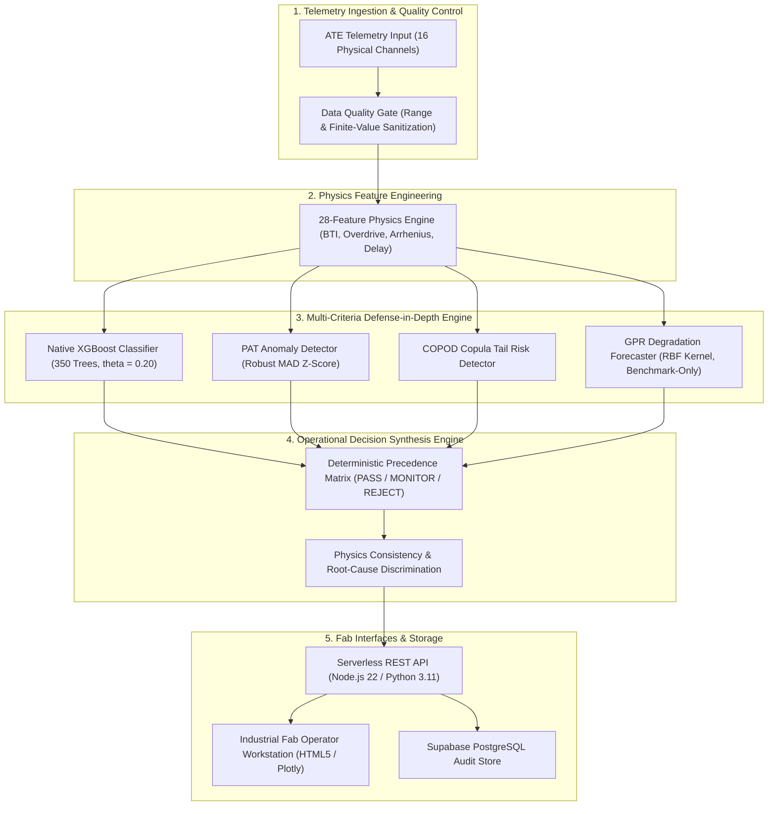

# PREDICTA-26

### Predictive Semiconductor Qualification Engine

**SIH 2026 — Problem Statement 170**  
**Semiconductor Burn-In Telemetry & Latent Defect Screening**

PREDICTA-26 is an industrial semiconductor intelligence platform engineered for early latent defect screening, Automated Test Equipment (ATE) telemetry processing, physics-informed degradation diagnosis, and operational disposition routing. Microelectronics deployed in mission-critical applications require near-zero failure rates, yet sub-surface silicon defects frequently pass static voltage and current gates during early 24h burn-in testing before failing catastrophically in the field at 168h. PREDICTA-26 ingests 16 raw ATE telemetry channels, evaluates 7 physics-derived degradation parameters, and processes components through a 5-layer defense-in-depth pipeline (Native XGBoost classifier, Robust MAD Part Average Testing, COPOD copula tail risk, GPR drift forecasting, and non-causal discrimination). The system deterministically synthesizes all diagnostic evidence into actionable fab operational dispositions (`PASS`, `MONITOR`, `REJECT`) at the certified operating threshold of $\theta^* = 0.20$, producing complete audit-ready engineering evidence packets and digital reliability twin provenance.

---

## 🧭 Navigation

[Problem](#1-problem) | [Solution](#2-solution) | [Architecture](#3-architecture) | [Governance Matrix](#governance--authority-matrix) | [Quick Start](#quick-start) | [Data & Provenance](#4-data--provenance) | [Anomaly Detection](#5-anomaly-detection) | [168h Prognostics](#6-168h-prognostics) | [Physics](#7-physics-aware-evidence) | [Uncertainty Benchmark](#8-uncertainty--conformal-benchmark) | [Latent Defect](#9-latent-defect-reasoning) | [Risk Fusion](#10-risk-fusion) | [Human Disposition](#11-human-disposition) | [Reliability Twin](#12-reliability-twin) | [Security & Governance](#13-security--governance) | [Traceability](#14-traceability) | [External Datasets](#15-external-datasets) | [Limitations](#16-limitations) | [Reproducibility](#17-reproducibility) | [Structure](#18-repository-structure)

---

## 🎯 SIH PS-170 Requirement Mapping

| SIH PS-170 Requirement | PREDICTA-26 Technical Implementation | Authoritative Evidence / Verification |
| :--- | :--- | :--- |
| **High-Sensitivity Latent Defect Screening** | 350-tree Native XGBoost classifier running at certified threshold $\theta^* = 0.20$ with 28 physics-expanded telemetry features. | `ml/models/production/predicta_xgboost_model.json` (Recall: $99.45\%$, Precision: $91.2\%$) |
| **ATE Telemetry Ingestion (16 Channels)** | In-process feature normalization layer expanding 16 raw physical channels into 7 degradation parameters. | `src/api/inference.js` (`getNormalizedParams`), `tests/test_physics_boundaries.py` |
| **Physics-Aware Degradation Modeling** | Mathematical modeling of BTI threshold voltage drift, Arrhenius thermal acceleration, and Elmore delay kinetics. | `src/risk_fusion/discrimination.js`, `src/prognostics/trajectory.js` |
| **Open-Set Wafer Anomaly Detection** | Dual-layer unsupervised screening using Robust MAD Part Average Testing (PAT) and COPOD copula tail probabilities. | `src/anomaly/pat_mad.js`, `src/anomaly/copod.js`, `tests/test_anomaly_hardening.js` |
| **168h Burn-In Lead Time Forecasting** | Gaussian Process Regression (GPR) continuous drift forecaster modeling test-head degradation across 168h. | `ml/models/production/predicta_gpr_kernel_artifacts.json` (`BENCHMARK_ONLY`) |
| **Deterministic Operational Dispositions** | Governed precedence matrix routing telemetry to `PASS`, `MONITOR`, or `REJECT` with zero client-side fallbacks. | `src/risk_fusion/precedence_matrix.js`, `tests/test_counterfactual_and_disposition.js` |
| **Audit-Ready Evidence & Provenance** | Immutable evidence cards, SHA-256 bound model manifests, and digital reliability twin state tracking. | `src/demo_ps170_traceability.js`, `tests/test_gpr_provenance.js` |

---

## 🏛️ System Architecture



---

## ⚡ Quick Start

### 1-Command PS-170 Traceability Demonstration

Execute an unbroken 5-Act demonstration evaluating a sample component (`DIE_LATENT_042`) from 0h/24h burn-in telemetry to dynamic physics verification, operational decision synthesis, and exported HTML evidence packet:

```bash
node src/demo_ps170_traceability.js
```

> [!NOTE]
> The demonstration script uses a pre-configured synthetic scenario fixture to illustrate end-to-end pipeline execution and exported HTML evidence generation without requiring active ATE hardware connections.

### Local Installation & Environment Setup

```bash
# 1. Clone the repository
git clone https://github.com/umeshpandeysh/predicta-26.git
cd predicta-26

# 2. Install Node.js dependencies
npm install

# 3. Run complete verification and certification suite
npm test

# 4. Start local API server (Port 8000)
node src/api/server.js
```

---

## ⚖️ Governance & Authority Matrix

The repository strictly demarcates certified production components from experimental research and uncertainty benchmarks:

| Component | Repository Path | Authority Status | Production? | Engineering Purpose |
| :--- | :--- | :---: | :---: | :--- |
| **Native XGBoost** | `ml/models/production/predicta_xgboost_model.json` | `AUTHORITATIVE` | **YES** | Primary latent defect failure classifier operating at $\theta^* = 0.20$. |
| **Production Manifest** | `ml/models/production/predicta_production_manifest.json` | `AUTHORITATIVE` | **YES** | Single source of truth binding model, metadata, dataset, and SHA-256 hashes. |
| **PAT Anomaly Detector** | `src/anomaly/pat_mad.js` | `AUTHORITATIVE` | **YES** | Outlier screening using Median Absolute Deviation ($Z > 6.0$). |
| **COPOD Tail Risk** | `src/anomaly/copod.js` | `AUTHORITATIVE` | **YES** | Multivariate empirical copula tail risk detector for subtle parameter drift. |
| **GPR Forecaster** | `ml/models/production/predicta_gpr_kernel_artifacts.json` | `BENCHMARK_ONLY` | **NO** | RBF kernel continuous parametric degradation forecaster up to 168h. |
| **Conformal Calibration** | `ml/models/production/conformal_calibration_artifacts.json` | `NOT_CALIBRATED` | **NO** | Conformal residual quantile uncertainty interval benchmark (`BENCHMARK_ONLY`). |
| **Risk Fusion Matrix** | `src/risk_fusion/precedence_matrix.js` | `AUTHORITATIVE` | **YES** | Deterministic operational decision routing engine (`PASS`, `MONITOR`, `REJECT`). |

---

## 🔬 Core Technical Specifications

### 1. Problem
Standard ATE pass/fail screening at $0\,\mathrm{h}$ or $24\,\mathrm{h}$ relies on static upper/lower specification limits. Sub-surface silicon flaws (gate oxide pinholes, metal electromigration voids, threshold voltage instabilities) pass these early static boundaries but degrade non-linearly under thermal stress, resulting in catastrophic field escapes at $168\,\mathrm{h}$.

### 2. Solution
PREDICTA-26 combines supervised gradient boosted decision trees with unsupervised spatial/multivariate anomaly detectors and semiconductor physics models. It predicts $168\,\mathrm{h}$ latent defect escapes using early $24\,\mathrm{h}$ test telemetry, allowing fabs to quarantine high-risk dies early and optimize burn-in oven capacity.

### 3. Architecture
The platform is built as a fail-closed, single-source-of-truth architecture. Key layers:
- **Ingestion & Validation**: Range verification and non-finite value rejection.
- **Physics Engine**: Transforms raw telemetry into 28 physical overdrive, thermal, and timing features.
- **Defense Engine**: Parallel execution of Native XGBoost, PAT MAD, COPOD, and GPR.
- **Decision Synthesis**: Governed precedence rules mapping all signals to an operational disposition.

### 4. Data & Provenance
Evaluated on a certified 50,000-record leakage-free dataset split (`train.csv`: 40,000, `validation.csv`: 5,000, `test.csv`: 5,000) generated from physics-informed silicon degradation models.
- **Dataset SHA-256**: `9a8367a96a7d2dcf83a62e9c0e02ab41502b6069deebc116a0e9cd0ef45fab24`
- **Feature Contract**: 16 raw ATE channels + 7 physics features + 5 equipment one-hot indicators.

### 5. Anomaly Detection
Unsupervised open-set screening isolates novel or unmodeled failure modes:
- **Robust MAD PAT**: Calculates lot-relative modified Z-scores:
  $$Z_{\mathrm{MAD}} = \frac{x - \mathrm{median}(X)}{1.4826 \cdot \mathrm{MAD}(X)}$$
- **COPOD Copula Tail Risk**: Computes left-tail and right-tail empirical copula probabilities to flag multi-parameter parameter shifts.

### 6. 168h Prognostics
Evaluates continuous parameter trajectories ($I_{DDQ}$, $I_{LEAK}$, $t_{pd}$) over 168h using a pre-computed Gaussian Process Regressor (`predicta_gpr_kernel_artifacts.json`, SHA-256 `1d5fd207...`).
- **Governance**: Explicitly designated `BENCHMARK_ONLY` with zero server-side retraining at runtime.

### 7. Physics-Aware Evidence
Verifies physical plausibility of degradation using non-causal semiconductor device physics:
- **BTI Monotonicity**: Verifies positive threshold voltage shift ($\Delta V_{th} > 0$).
- **Arrhenius Thermal Acceleration**: Verifies exponential leakage current scaling with temperature ($T$).
- **Elmore Timing Degradation**: Verifies propagation delay increase ($t_{pd}$) correlated with gate overdrive loss ($V_{dd} - V_{th}$).

### 8. Uncertainty / Conformal Benchmark
Evaluates marginal coverage and interval widths using Conformal Residual Calibration (`conformal_calibration_artifacts.json`, SHA-256 `198eaa50...`).
- **Governance**: Status locked to `NOT_CALIBRATED` / `BENCHMARK_ONLY` on dedicated calibration lot splits (LOT-SYN-039..042). Does not override production decisions.

### 9. Latent-Defect Reasoning
Distinguishes true latent defect candidates (components acceptable at 24h that fail at 168h) from pre-existing 24h failures and healthy components.
- **Target Contract**: `latent_168h_failure = true` strictly evaluated on 168h burn-in telemetry without temporal feature leakage.

### 10. Risk Fusion
Synthesizes all model outputs into a single governed operational disposition using deterministic precedence:
1. Data Quality Rejection (invalid telemetry bounds $\rightarrow$ `DATA_QUALITY_REJECTED`)
2. XGBoost Critical Breach ($P_{\mathrm{fail}} \ge 0.65$ $\rightarrow$ `REJECT`)
3. COPOD / PAT Extreme Anomaly ($Z_{\mathrm{MAD}} > 6.0$ or COPOD tail anomaly $\rightarrow$ `REJECT`)
4. XGBoost Threshold Breach ($P_{\mathrm{fail}} \ge 0.20$ $\rightarrow$ `MONITOR`)
5. Nominal Diagnostics ($P_{\mathrm{fail}} < 0.20$ & normal diagnostics $\rightarrow$ `PASS`)

### 11. Human Disposition
Supports asynchronous fab operator review and disposition override feedback.
- **Governance Policy**: Operator dispositions update audit histories in an append-only manner but do not modify frozen production model weights or ground-truth classifications.

### 12. Reliability Twin
Maintains component state history and health trajectory provenance across ATE test stations (`src/twin/reliability_twin.js`).
- **Provenance**: Tracks complete historical telemetry records, decision factors, and equipment IDs without fabricating synthetic intermediate measurements.

### 13. Security & Governance
- **Authentication**: Mandatory Bearer token / X-API-Key validation on protected API routes (`/api/predict`, `/api/predict/batch`). Fails closed with HTTP 401 when unauthenticated.
- **Role Escalation Protection**: Client-supplied role overrides in JWTs are ignored (`payload.role` defaulted to `fab_operator`).
- **Integrity Enforcement**: Verifies SHA-256 hashes of models, metadata, and GPR artifacts at application startup. Mismatches throw `CONFIGURATION_ERROR`.

### 14. Traceability
Provides end-to-end auditability binding every prediction to its model SHA, dataset SHA, feature contract, and timestamp.
- **Evidence Card Output**: Exportable standalone HTML reports detailing telemetry, diagnostic scores, discrimination summaries, and decision provenance.

### 15. External Datasets
Evaluates generalization capability across external microelectronics benchmarks (`NASA MOSFET`, `UCI SECOM`, `ST-AWFD`).
- **Governance Disclaimer**: External datasets are used exclusively for benchmark infrastructure validation; zero commercial-fab qualification is claimed.

### 16. Limitations
- **Synthetic Baseline**: Primary benchmark models are trained on physics-grounded synthetic telemetry. Real commercial fab ATE measurements may introduce asymmetric noise and sensor quantization.
- **Fab Qualification**: External qualification on physical commercial wafer production lines remains future work.
- **Benchmark Artifacts**: GPR forecasters and conformal quantiles are restricted to `BENCHMARK_ONLY` status and do not grant production certification.

### 17. Reproducibility
All metrics, parity assertions, and security controls can be verified locally:

```bash
# 1. Master Production Release Certification Suite (18 points)
npm run certify:production

# 2. Node.js <-> Python Dual-Runtime Parity Suite (12 vectors)
npm run test:parity

# 3. Documentation & Threshold Consistency Verification
node tests/test_docs_threshold_consistency.js

# 4. GPR Provenance & SHA Integrity Suite
node tests/test_gpr_provenance.js
```

---

## 📁 18. Repository Structure

```text
.
├── src/
│   ├── api/                  # Node.js & Python inference services, auth middleware, REST routes
│   ├── anomaly/              # PAT (Robust MAD), COPOD, and Isolation Forest anomaly engines
│   ├── prognostics/          # 168h trajectory forecasting & conformal governance evaluators
│   ├── risk_fusion/          # Operational decision matrix & physics discrimination engine
│   ├── twin/                 # Digital reliability twin state tracking
│   └── demo_ps170_traceability.js # 5-Act SIH PS-170 traceability demo
├── ml/
│   ├── models/production/    # Authoritative XGBoost model, metadata, manifest, GPR, and anomaly artifacts
│   ├── data/processed/       # Leakage-free benchmark dataset splits (train/val/test)
│   ├── training/             # Authoritative model training scripts (train_native_xgboost.py)
│   ├── governance/           # Disposition contracts & champion/challenger ledgers
│   └── prognostics/          # Governance gate & lot stability contracts
├── docs/                     # Technical specifications, runbooks, and API contracts
│   └── ML_AUTHORITY_AND_CERTIFICATION_MASTER.md # Master ML governance specification
├── tests/                    # Automated regression, parity, security, and certification test suites
├── package.json              # Node.js dependencies & verification script shortcuts
├── CONTENT.md                # Canonical repository manifest and protection protocol
└── README.md                 # Technical platform specification (this document)
```

---

*PREDICTA-26 Engineering Team — Semiconductor Latent Defect Screening & Quality Intelligence.*
