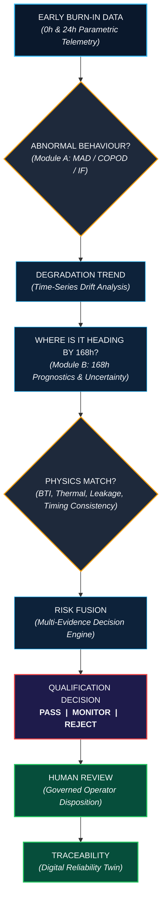
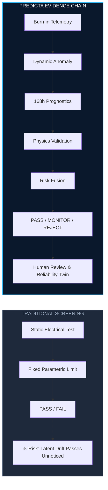

# PREDICTA-26
## Semiconductor Burn-In Telemetry & Latent Defect Screening

[](https://sih.gov.in)
[](https://github.com/umeshpandeysh/predicta-26)
[](https://python.org)
[](https://nodejs.org)
[](ml/models/production/predicta_xgboost_model.json)
[](tests/)
[](LICENSE)

> **PREDICTA addresses SIH 2026 Problem Statement 170 by combining burn-in telemetry, anomaly detection, degradation analysis, 168h prognostics, reliability evidence, and governed qualification decisions in one traceable workflow.**

> **About PREDICTA:** SIH PS-170 semiconductor burn-in qualification system combining telemetry analysis, anomaly detection, degradation prognostics, physics validation, risk fusion, and traceable disposition.

---

## 1. Main Project Workflow

The following flowchart illustrates the complete PREDICTA evaluation chain—from early burn-in telemetry ingestion to human disposition and digital twin traceability:



---

## 2. PREDICTA at a Glance

| Stage | Focus Area | Engine / Capability | Primary Output |
|---|---|---|---|
| **INPUT** | Telemetry Ingestion | Burn-in / ATE parametric streams (`Iddq`, `Leakage`, `Tpd`, `Vth`, `Temp`) | Cleaned 28-feature tensor |
| **ANALYSIS** | Signal Processing | Dynamic Anomaly (MAD/COPOD/IF) + 168h Degradation Prognostics | Anomaly score & 168h trajectory |
| **VALIDATION** | Physical Verification | Physics Consistency (BTI/Thermal/Leakage) + Uncertainty Analysis | Physical risk score & bounds |
| **OUTPUT** | Governed Disposition | Multi-Evidence Risk Fusion + Governed Threshold ($\theta^* = 0.20$) | **PASS / MONITOR / REJECT** |

---

## 3. Core Positioning

> [!IMPORTANT]
> **PREDICTA does not stop at predicting whether a component may fail; it builds a traceable, physics-aware evidence chain for deciding whether that component should be trusted, monitored, or rejected.**

---

## 4. Two Core ML Modules

### Module A — Dynamic Outlier Detection

> Detects components whose behaviour deviates from their population or temporal context, including cases that may still pass a static limit.

```
POPULATION DATA → Robust MAD / PAT → COPOD → Isolation Forest → LOT-RELATIVE OUTLIER DETECTED
```

- **Robust MAD / PAT:** Identifies dies that deviate from their local lot/wafer distribution using median absolute deviation.
- **COPOD:** Measures multivariate tail probabilities across joint parametric distributions.
- **Isolation Forest:** Captures non-linear feature interactions and high-dimensional anomalies.

---

### Module B — Time-Series Drift / 168h Prognostics

> Uses early observations (0h + 24h) to characterize how device behaviour may evolve through the 168h burn-in horizon.

```
0h + 24h TELEMETRY → Trajectory Projection → 168h Horizon → UNCERTAINTY ENVELOPE (±5% to ±25%)
```

- **Observed Window (0h–24h):** Captures early parametric baseline and initial stress response.
- **Forecast Horizon (24h–168h):** Projects future drift trajectory toward final burn-in completion.
- **Uncertainty Envelope:** Quantifies prediction error bands over the projected horizon.

---

## 5. Why PREDICTA is Different

### Point-in-Time Screening vs PREDICTA Evidence Chain



---

## 6. SIH Judge Remarks — What Makes PREDICTA Distinct

> **PREDICTA is not only an anomaly detector or a 168h predictor. It connects multiple reliability-evidence stages into one traceable qualification workflow.**

### 1. Latent-Defect Focus
Looks for abnormal behaviour and subtle parametric drift that emerge early in burn-in before a conventional point-in-time screen identifies a hard failure.

### 2. Physics-Aware Validation
Machine learning predictions are validated against semiconductor reliability mechanisms including **BTI (Bias Temperature Instability)**, **timing degradation**, **leakage current evolution**, and **thermal acceleration**.

### 3. Uncertainty-Aware Analysis
Forecast uncertainty envelopes are evaluated alongside projected trajectories. Supporting degradation (GPR) and uncertainty (conformal) analyses provide rich evaluation insights without superseding the production decision contract.

### 4. Multi-Evidence Decision Chain
The qualification disposition is never based on a single anomaly score alone. Evidence from telemetry, dynamic anomaly detection, 168h prognostics, physics consistency, and XGBoost v4 failure risk is merged in the risk fusion layer.

### 5. Explainable Screening
The system exposes model-level counterfactual explanations and feature attributions for any flagged device, enabling operators to understand which parameters caused attention.

### 6. Human-in-the-Loop
Flagged components enter a governed operator disposition workflow (PASS / MONITOR / REJECT) rather than treating ML models as autonomous final authorities.

### 7. Full Traceability
The **Digital Reliability Twin** preserves the complete progression from manufacturing observation through model evaluation, operator disposition, secondary testing, and final adjudication.

### 8. Engineering Governance
Built with enterprise-grade safeguards: protected production model artifacts (`XGBoost v4`), Platt probability calibration, SHA-256 artifact verification, strict API contracts, Node/Python parity enforcement, and an immutable decision threshold ($\theta^* = 0.20$).

---

## 7. Anomaly Detection vs Reliability Qualification

```
┌────────────────────────────────────────────────────────────────────────────────────────┐
│ ANOMALY DETECTION: "Something looks unusual."                                          │
└────────────────────────────────────────────────────────────────────────────────────────┘
                                           ↓
┌────────────────────────────────────────────────────────────────────────────────────────┐
│ PREDICTA QUALIFICATION: "Something looks unusual → where is it heading by 168h →     │
│                         is the behaviour physically consistent → how strong is the    │
│                         combined evidence → what should happen next?"                  │
└────────────────────────────────────────────────────────────────────────────────────────┘
```

---

## 8. System Architecture

```
DATA LAYER
├─ Burn-in / ATE telemetry streams (Iddq, Leakage, Tpd, Vth, Temp)
├─ Production Telemetry Dataset v4 (50,000 records, SHA-256 verified)
└─ Evaluation datasets (ST-AWFD, SECOM, AI4I, NASA PCoE IGBT #8)
        ↓
ML / ANALYTICS LAYER
├─ Dynamic Anomaly Engine (MAD / COPOD / Isolation Forest)
├─ Degradation Analysis & Trajectory Projection
├─ 168h Prognostics & Uncertainty Envelope
├─ XGBoost v4 Failure Risk Model + Platt Sigmoid Calibration
└─ Model Counterfactual Explainability
        ↓
RELIABILITY LAYER
├─ Physics Consistency Engine (BTI, Thermal, Leakage, Timing)
├─ Multi-Evidence Risk Fusion
└─ Latent-Defect Screening Matrix
        ↓
DECISION & GOVERNANCE LAYER
├─ Governed Qualification Decision (PASS / MONITOR / REJECT @ θ* = 0.20)
├─ Operator Disposition Workflow (Human-in-the-Loop)
└─ Digital Reliability Twin (10-stage lifecycle audit trail)
```

---

## 9. How PREDICTA Addresses SIH PS-170

| SIH PS-170 Requirement | PREDICTA Implementation & Capability | Status / Module |
|---|---|---|
| **Burn-in Telemetry Ingestion** | 28-feature input contract (`Iddq`, `Leakage`, `Tpd`, `Vth`, `Temp`) | Ingestion Engine |
| **Dynamic Outlier Detection** | Robust MAD / PAT, COPOD, and Isolation Forest population screening | Module A |
| **168h Reliability Prognostics** | Time-series drift analysis from early 0h+24h observations to 168h horizon | Module B |
| **Physical Reliability Evidence** | Physics consistency checks for BTI, thermal acceleration, leakage, and timing | Physics Engine |
| **Qualification Decision** | Risk fusion matrix outputting governed **PASS / MONITOR / REJECT** | Decision Engine |
| **Human Decision Workflow** | Governed operator review and secondary-test disposition interface | Operator UI |
| **Evidence Retention & Audit** | 10-stage Digital Reliability Twin logging complete device lifecycle | Traceability |

---

## 10. ML and Reliability Stack Details

| Component | Function / Role | Location |
|---|---|---|
| **XGBoost v4** | Primary automated failure-risk classifier | `ml/models/production/predicta_xgboost_model.json` |
| **Platt Calibration** | Sigmoid calibration ($A = -1.0412, B = 1.0037$) for accurate probabilities | `src/api/inference_service.py` |
| **Robust MAD / PAT** | Lot-relative univariate and bivariate anomaly detection | `src/anomaly_detection/` |
| **COPOD** | Copula-based multivariate tail anomaly estimation | `src/anomaly_detection/` |
| **Isolation Forest** | High-dimensional non-linear anomaly isolation | `src/anomaly_detection/` |
| **168h Trajectory Engine** | Extends early 0h+24h observations to 168h burn-in horizon | `src/prognostics/` |
| **GPR & Conformal** | Supporting continuous degradation and uncertainty analysis | `src/prognostics/` |
| **Physics Engine** | BTI, thermal, leakage, and timing physical consistency validation | `src/physics/` |
| **Risk Fusion** | Integrates independent evidence streams into operational disposition | `src/risk_fusion/` |
| **Counterfactual Engine** | Provides model-level feature change explanations for flagged devices | `src/explainability/` |
| **Reliability Twin** | Preserves 10-stage immutable audit trail across device lifecycle | `src/reliability_twin/` |

---

## 11. Protected Production Artifacts

| Artifact | File Location | SHA-256 Checksum |
|---|---|---|
| **Production Telemetry Dataset v4** | `ml/data/synthetic/predicta_dataset_v4_production.csv` | `9a8367a96a7d2dcf83a62e9c0e02ab41502b6069deebc116a0e9cd0ef45fab24` |
| **Production XGBoost v4 Model** | `ml/models/production/predicta_xgboost_model.json` | `91bb598ae91155674e40cb0a9f39d1e9bdeacd39875542db88b65e3668f29d98` |
| **GPR Kernel Artifact** | `ml/models/production/gpr_kernel_config.json` | `1d5fd207ecbd8fed31c09c9e0e8f4655b72f2596ba6c9faf421c7d54fd6a3fcf` |
| **Conformal Calibration Artifact** | `ml/models/production/conformal_bounds.json` | `198eaa50f5af96aa85721f168abc947a6cabfc02d91f77d1a032c343f85e7e7e` |
| **Dataset Split Manifest** | `ml/models/production/dataset_split_manifest.json` | `dbe10900c5adda3610e562551af504ee7aaf1b31104ce945e8a71ff2d063ce7c` |

---

## 12. Verification & Execution

### Core System Verification

```bash
# 1. Run Node.js & Pytest Governance Suites
npm test
python -m pytest tests/ -v

# 2. Verify Python / Node.js Parity
npm run test:parity

# 3. Certify Production Artifacts & Checksums
npm run certify:production
```

### PS-170 Traceability Demonstration

```bash
node src/demo_ps170_traceability.js
```

---

## 13. Project Structure

```
predicta-26/
├── src/
│   ├── api/                 Inference & REST API services
│   ├── anomaly_detection/   MAD, COPOD, Isolation Forest engines
│   ├── features/            Feature contract & validation rules
│   ├── physics/             BTI, Thermal, Leakage consistency checks
│   ├── prognostics/         168h trajectory & uncertainty analysis
│   ├── risk_fusion/         Multi-evidence fusion matrix
│   ├── decision_engine/     PASS / MONITOR / REJECT routing
│   ├── explainability/      Model counterfactual explanations
│   └── reliability_twin/    10-stage lifecycle audit trail
├── ml/
│   ├── data/                Primary, external, and evaluation datasets
│   ├── models/production/   SHA-256 protected model artifacts
│   └── research/            Supporting experimental scripts
├── docs/                    Architecture, API specs, and runbooks
├── frontend/                Operator-facing UI interface
├── tests/                   Automated test and security suites
└── index.html               Main demonstration application
```

---

**PREDICTA-26** · Semiconductor Burn-In Telemetry & Latent Defect Screening  
[GitHub Repository](https://github.com/umeshpandeysh/predicta-26)
