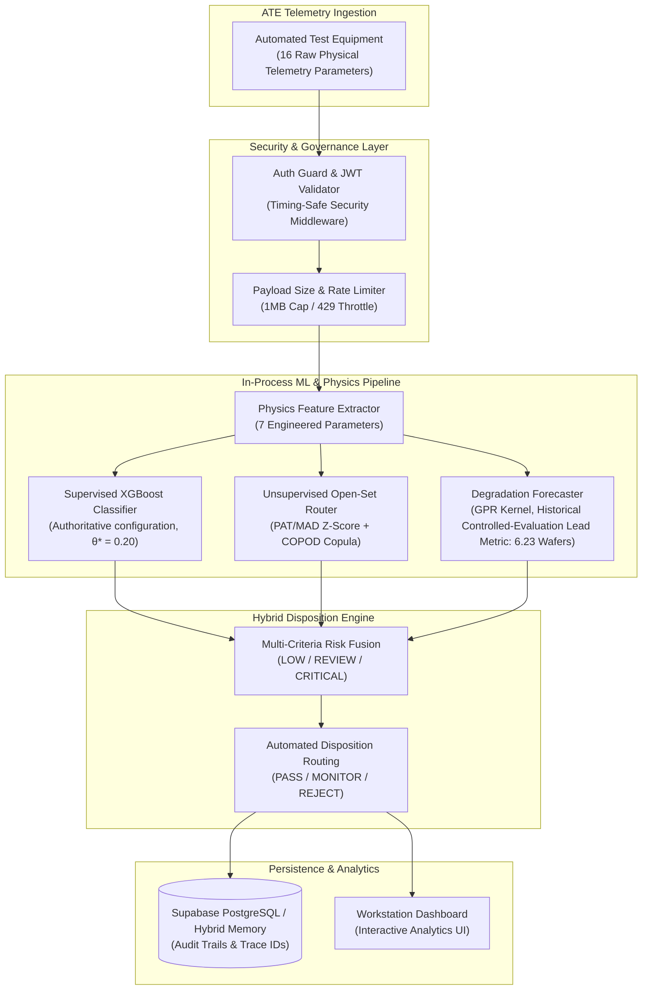

# PREDICTA
### Industrial Semiconductor Manufacturing Intelligence Platform


[](https://github.com/umeshpandeysh/predicta-26/actions/workflows/ci.yml)


---

## 🚀 Product Overview

**PREDICTA** is an industrial-grade semiconductor manufacturing intelligence platform designed for predictive quality control, parametric defect screening, physics-informed anomaly diagnosis, and equipment degradation forecasting.

Unlike traditional automated test equipment (ATE) pass/fail binning that relies strictly on static datasheet limits, PREDICTA integrates non-linear semiconductor device physics with supervised gradient boosting, unsupervised copula tail anomaly detection, and Gaussian Process Regression (GPR) degradation forecasting.

> **Data Provenance Notice:** PREDICTA models and benchmarks are evaluated on governed synthetic semiconductor burn-in datasets (`predicta_dataset_v4_production.csv`, SHA-256 `9a8367a9...`) and canonical defect scenario fixtures. No claims of proprietary real-fab deployment or universal domain generalization are made without external qualification.

---

## 🎯 SIH 2026 PS-170 Alignment & 1-Click Traceability Demo

PREDICTA-26 is fully aligned with **SIH 2026 Problem Statement PS-170 — Semiconductor Burn-In Telemetry & Latent Defect Screening**.

### 1-Click Traceability Demo
Run an unbroken, auditable 14-step trace of a single latent-defective component from raw 24h telemetry to full Engineering Evidence Card and Reliability Twin provenance:
```bash
# Node.js Demo
node src/demo_ps170_traceability.js

# Python Demo
python src/demo_ps170_traceability.py
```

### Complete Traceability Matrix & Governed Benchmarks
- **Traceability Matrix:** [`docs/PS170_TRACEABILITY_MATRIX.md`](docs/PS170_TRACEABILITY_MATRIX.md) & [`docs/ps170_traceability_matrix.json`](docs/ps170_traceability_matrix.json)
- **Latent Defect Scenario Benchmark:** `python ml/benchmarks/ps170_latent_escape_benchmark.py` (Governed Scenario Fixture Routing Benchmark)
- **Multi-Layer Stack Architectural Analysis:** `python ml/analysis/ps170_stack_ablation.py`
- **External Dataset Transfer Check:** `python ml/analysis/ps170_external_transfer_check.py` (Reality check on NASA MOSFET, UCI SECOM, ST-AWFD)
- **Early Screening Feature Static Audit:** `python ml/analysis/ps170_temporal_leakage_proof.py` (Zero future leakage verification)
- **Champion / Challenger Ledger:** [`ml/governance/champion_challenger_ledger.json`](ml/governance/champion_challenger_ledger.json)

---

## 🏭 Semiconductor Fab Problem & Objectives

High-reliability microelectronics (aerospace, automotive, defense, and medical devices) require near-zero failure rates. However, conventional Environmental Stress Screening (ESS) faces three critical industrial challenges:

1. **Latent Defect Escape:** Sub-surface silicon flaws often pass static datasheet voltage and current gates at early test points ($0\,\mathrm{h}$ and $24\,\mathrm{h}$), only to suffer non-linear degradation under thermal stress ($168\,\mathrm{h}$).
2. **High Testing & Oven Costs:** Subjecting 100% of manufactured dies to full $168\,\mathrm{h}$ thermal stress testing consumes massive energy, wastes oven capacity, and introduces severe production bottlenecks.
3. **Wafer Lot-to-Lot Drift:** Process variations across different wafer lots mask subtle parametric shifts when evaluated against global static thresholds.

---

## 🏗️ System Architecture



---

## 🧠 Physics-Informed ML Pipeline

PREDICTA processes 16 raw ATE telemetry parameters and generates 7 domain-engineered physical parameters derived from semiconductor device physics:

### Raw ATE Telemetry Inputs (16 Parameters)

`supply_voltage`, `output_voltage`, `current`, `leakage_current`, `resistance`, `capacitance`, `threshold_voltage`, `frequency`, `propagation_delay`, `setup_time`, `hold_time`, `timing_margin`, `temperature`, `dynamic_power`, `total_power`, `test_duration`.

### Physics-Informed Feature Engineering

**Voltage Headroom**

$$
V_{\mathrm{headroom}} = V_{\mathrm{supply}} - V_{\mathrm{threshold}}
$$

**Voltage Utilization**

$$
V_{\mathrm{utilization}} = \frac{V_{\mathrm{threshold}}}{V_{\mathrm{supply}}}
$$

**Leakage Fraction**

$$
F_{\mathrm{leak}} = \frac{I_{\mathrm{leak}} \times 10^{-3}}{I_{\mathrm{total}}}
$$

**Power per Current**

$$
P_{\mathrm{current}} = \frac{P_{\mathrm{dynamic}}}{I_{\mathrm{total}}}
$$

**Normalized Timing Margin**

$$
T_{\mathrm{normalized}} = \frac{T_{\mathrm{margin}}}{T_{\mathrm{propagation}}}
$$

**Frequency–Delay Product**

$$
F_{\mathrm{delay}} = f \cdot T_{\mathrm{propagation}}
$$

**Thermal Delta**

$$
\Delta T_{\mathrm{thermal}} = T_{\mathrm{measured}} - 25^\circ\mathrm{C}
$$

---

## 🛡️ Open-Set Anomaly Detection & Zero-Day Screening

To detect previously unobserved failure mechanisms (zero-day defects) without requiring labeled training data, PREDICTA incorporates a dual-layer unsupervised anomaly screening pipeline:

1. **Lot-Relative Part Average Testing (PAT / Robust MAD):** Standardizes parameter distributions relative to each wafer lot using Median Absolute Deviation (MAD), immunizing screening against lot-to-lot process shifts:

$$
Z_{\mathrm{MAD}} = \frac{x - \mathrm{median}(X)}{1.4826 \cdot \mathrm{MAD}(X)}
$$

2. **COPOD Copula Tail Anomaly Scoring:** Evaluates multivariate tail probabilities using empirical copulas to isolate subtle parameter correlations indicating early oxide breakdown, electromigration, or latch-up risks.

---

## 📈 Predictive Equipment Health & Degradation Forecasting

PREDICTA implements Gaussian Process Regression (GPR) kernel modeling calibrated with BTI (Bias Temperature Instability) degradation kinetics:

$$
\Delta V_{\mathrm{th}}(t) = A \cdot t^n \cdot \exp\left(-\frac{E_{\mathrm{a}}}{k_{\mathrm{B}} T}\right)
$$

* **Early Warning Lead Time (Historical Reference):** Demonstrated an average predictive warning of **6.23 wafers ahead of failure** in synthetic benchmark evaluations (*Historical controlled-evaluation result; not a production/fab performance claim*).

---

## 📊 Current Model Artifact Metrics

The active production artifact is trained on the **synthetic semiconductor dataset** at `ml/data/synthetic/predicta_dataset_v4_production.csv`. The values below are taken from the current production metadata and are not claims of external fab validation.

| Metric | Current Metadata Value |
|---|---:|
| ROC-AUC | **0.9939** |
| Log Loss | **0.0590** |
| Accuracy | **0.9639** |
| Operating Threshold | **0.20** |
| Feature Contract | **28 features** |
| Training Records | **50,000 synthetic records** |

**Production model SHA-256:** `91bb598ae91155674e40cb0a9f39d1e9bdeacd39875542db88b65e3668f29d98`

For additional performance claims such as recall, false-positive rate, PR-AUC, or real-fab lead time, the repository must provide a reproducible evaluation artifact before those values should be presented as certified benchmarks.

---

---

## 🔒 Reliability, Security & Fail-Fast Governance

## CI Verification Status

- **Local Verification:** `LOCAL_TESTS = PASS` (100% test pass rate across Node.js and Python test suites).
- **GitHub Actions Remote:** `GITHUB_ACTIONS = NOT_ESTABLISHED` (Requires repository-level Actions runner execution to be enabled in GitHub settings). Application code changes alone cannot enable remote Actions if workflow execution is disabled at repository level.

## Repository Authority & Hierarchy

For SIH production authority, release gates, and the distinction between production and research artifacts, see `docs/REPOSITORY_AUTHORITY.md`. The production manifest and metadata take precedence over experiments, notebooks, historical datasets, and legacy artifacts.

```text
REPOSITORY_AUTHORITY
└── 1. Production Manifest (ml/models/production/predicta_production_manifest.json)
    └── 2. Production Metadata (ml/models/production/predicta_xgboost_metadata.json)
        └── 3. Evaluation Artifacts (experiments/ & ml/reports/)
            └── 4. README Summary
```

* **Production Model Authority:** `ml/models/production/predicta_production_manifest.json` identifies the active production model, metadata, SHA-256 integrity value, and operating threshold (`0.20`). The executable model and metadata are separated under `ml/models/production/`.
* **Fail-Fast Configuration Guard:** If metadata is missing or corrupted, inference services fail fast with an explicit `CONFIGURATION_ERROR` instead of substituting arbitrary fallback thresholds.
* **Adversarial Protection:** Enforces 1 MB body size caps on API streams, timing-safe JWT verification (`crypto.timingSafeEqual`), IP rate limiting, and strict input type sanitization.
* **Supabase Offline Resilience:** In the event of network disconnection or database timeouts, the API seamlessly operates in hybrid in-memory storage mode (`persistence_mode: "SUPABASE_HYBRID_MEMORY"`).

---

## 📁 Repository Structure

```text
.
├── api/                   # Vercel serverless gateway entrypoint (index.js)
├── src/
│   └── api/              # Core inference service, auth guard, REST API server
├── frontend/              # Interactive Workstation Dashboard (HTML/CSS/JS)
├── ml/
│   ├── models/           # Production model, manifest, anomaly and GPR artifacts
│   │   └── production/    # Authoritative executable XGBoost model & metadata
│   ├── data/             # Processed train/val/test CSV splits (disjoint wafers)
│   └── experiments/      # Research challenger records (EXP-15A through EXP-15F)
├── docs/                  # Technical reports, system model cards, audit documentation
│   └── assets/           # Production graphics & telemetry visual assets
├── tests/                 # Master test suites (contract, parity, security, inference)
├── package.json           # Project manifests and test script entrypoints
└── README.md              # Public platform documentation
```

---

## 🧪 Reproducibility & Regression Verification

Run the master test suites to verify threshold contracts, inference determinism, cross-runtime parity, and security controls:

```bash
# Clone the repository
git clone https://github.com/umeshpandeysh/predicta-26.git
cd predicta-26

# Install Node.js dependencies
npm install

# Run automated master test suite
npm test
```

### Individual Test Suites
```bash
# 1. Threshold Contract Verification (0.19 -> PASS, 0.20 -> FAIL, 0.21 -> FAIL)
node tests/test_threshold_contract.js

# 2. Production Inference Contract Suite
node tests/test_inference.js

# 3. Node.js ↔ Python Cross-Runtime Parity Suite (12 Deterministic Vectors)
node tests/test_js_python_parity.js

# 4. Adversarial Security & Reliability Test Suite (15 Red-Team Scenarios)
node tests/test_adversarial_security.js

# 5. Live Production Deployment Verification Suite
node ml/training/run_exp11_deployment_verification.js
```

---

## ⚡ Quickstart — Local Deployment

```bash
# Start local production API server
node src/api/server.js
```
The REST API server will run at `http://localhost:8000`.

---

## ⚙️ Environment Configuration (.env.example)

Copy `.env.example` to `.env` for local runtime configuration:

```env
PORT=8000
NODE_ENV=production
SUPABASE_URL=https://your-supabase-url.supabase.co
SUPABASE_ANON_KEY=your-public-anon-key-here
SUPABASE_SERVICE_ROLE_KEY=your-backend-service-role-key-here

# Required for admin login and signed sessions
ADMIN_LOGIN_USER=your-admin-username
ADMIN_LOGIN_PASSWORD=your-strong-admin-password
JWT_SECRET=replace-with-a-long-random-secret
ALLOWED_ORIGIN=https://your-production-frontend.example
```

---

## 🔬 Scientific Limitations & Real-Fab Validation Plan

1. **Synthetic Telemetry Baseline:** All 50,000 dataset records originate from physics-informed synthetic generation (`generator.py`). While parameters are calibrated against physical device models ($E_{\mathrm{a}} = 0.55\,\mathrm{eV}$, Elmore delay), noise is modeled via zero-mean Gaussians. Real commercial fab ATE measurements may introduce asymmetric power-law noise and sensor quantization steps.
2. **Physical Silicon Validation:** Pilot validation on actual physical silicon wafers in a commercial semiconductor fabrication plant remains planned future work.

---

## 🛣️ Development Roadmap

- [x] Production XGBoost Model Baseline (350 trees, $\theta^* = 0.20$, SHA-256 Lock)
- [x] Dual-Layer Unsupervised Open-Set Anomaly Router (PAT/MAD + COPOD)
- [x] Gaussian Process Regression Degradation Lead Time Forecasting
- [x] Fail-Fast Single-Source-of-Truth Threshold Hardening
- [x] Node.js ↔ Python Cross-Runtime Parity Suite ($\le 10^{-6}$ Tolerance)
- [x] Adversarial API Security & Payload Size Cap Enforcement
- [ ] Commercial Semiconductor Fab ATE Hardware Pilot Integration
- [ ] Multi-Fab Federated Learning for Yield Protection Across Fabs

---

## 📄 License

Distributed under the **Apache 2.0 License**. See `LICENSE` for details.
