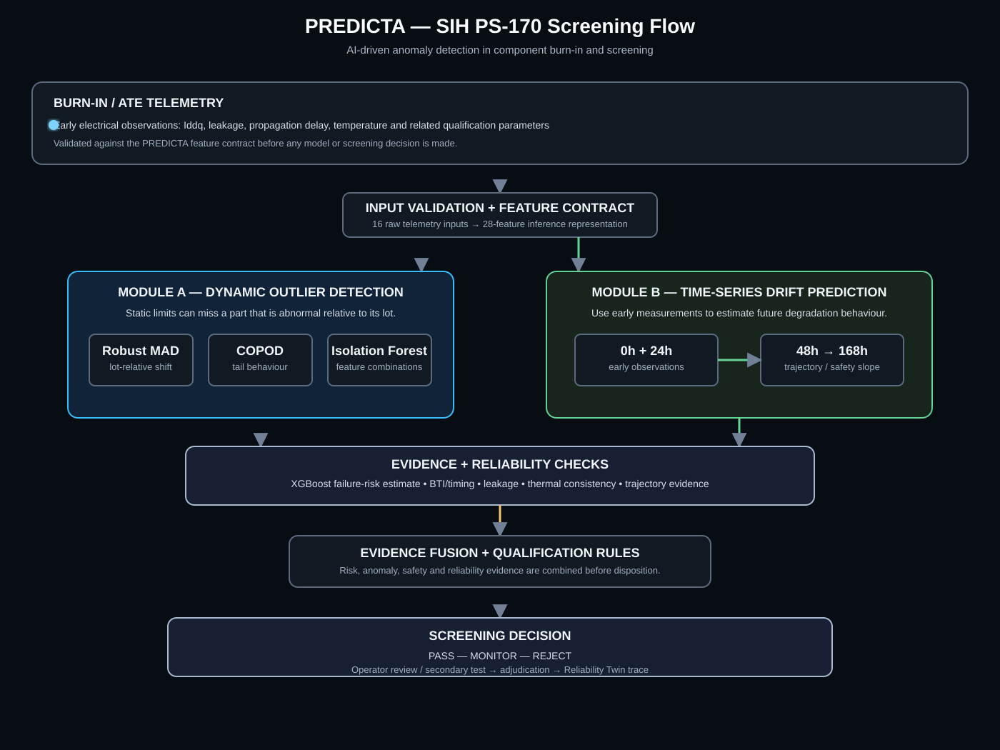

# PREDICTA-26
## Semiconductor Burn-In Telemetry & Latent Defect Screening

[](https://sih.gov.in)
[](https://github.com/umeshpandeysh/predicta-26)
[](https://python.org)
[](https://nodejs.org)
[](ml/models/production/predicta_xgboost_model.json)
[](tests/)
[](LICENSE)

> **PREDICTA watches what a semiconductor die is doing early in burn-in, looks for abnormal behaviour and degradation, checks the evidence against reliability physics, and turns that evidence into a qualification decision that can be traced later.**



---

## 1. PREDICTA in 60 seconds

### The problem

A die can look normal during an early electrical test and still develop a reliability problem later.

A simple **PASS / FAIL at one point in time** does not capture that changing behaviour.

### What PREDICTA does

PREDICTA takes early ATE/burn-in observations and builds an evidence chain:

**Telemetry → feature validation → anomaly detection → degradation analysis → physics checks → risk fusion → qualification decision → traceability**

The system is designed around one practical question:

> **Does this die only look healthy right now, or is its early behaviour already showing evidence of a future reliability problem?**

### What comes out

Every evaluation can end in:

- **PASS** — evidence is within the accepted operating region.
- **MONITOR** — the evidence needs additional attention or testing.
- **REJECT** — the evidence crosses a defined risk or safety condition.

The decision is accompanied by the evidence that led to it rather than being treated as an unexplained model output.

---

## 2. The SIH PS-170 problem — in simple words

**Official Problem Statement:** *AI-Driven Anomaly Detection in Component Burn-In & Screening.*

The SIH statement describes a high-reliability screening problem: components can pass fixed parametric limits while showing subtle drift during burn-in. The proposed system must analyse time-series parameters such as **Iddq, leakage current and propagation delay** at checkpoints such as **0h, 24h, 96h and 168h**. fileciteturn622file0L47-L50

### Module A — Dynamic Outlier Detection

Static limits can miss a component that is abnormal relative to its lot.

**SIH example:** if the lot average leakage is 10 µA and one part measures 45 µA, that part is a strong lot-relative anomaly even though a 50 µA absolute limit would still pass it. fileciteturn622file0L49-L50

PREDICTA implements this layer with:

**Robust MAD / PAT → COPOD → Isolation Forest → anomaly evidence**

### Module B — Time-Series Drift Predictor

The SIH problem asks for a predictive regression path that uses **Value_0h + Value_24h** to forecast **Value_168h**. If the predicted drift exceeds the calculated safety slope, the component is flagged for early rejection. fileciteturn622file0L49-L50

PREDICTA implements the corresponding reliability path as:

**0h + 24h evidence → trajectory analysis → 48h / 72h / 96h / 120h / 144h / 168h → safety evidence**

### What the evaluator should see

| SIH requirement | PREDICTA implementation |
|---|---|
| Module A: dynamic outlier detection | Robust MAD / PAT, COPOD and Isolation Forest |
| Module B: drift prediction | Early observations → future burn-in trajectory |
| Latent defects | Early abnormality + degradation evidence before a later failure |
| False-negative concern | Risk and anomaly evidence are retained through the decision path |
| Explainability | Evidence summary + model counterfactual |
| Human review | Operator disposition and secondary-test workflow |
| Traceability | 10-stage Reliability Twin evidence chain |

---

## 3. PREDICTA architecture

The single visual below is the project's architecture. It shows **Module A and Module B separately**, then shows where their evidence meets the reliability and qualification layers.


### PREDICTA in one sentence

**Read the component early → detect unusual behaviour → predict how it may drift → check the physical evidence → combine the evidence → screen the component → preserve the decision trail.**

### For a non-specialist judge

You do not need to understand every ML algorithm to understand the project:

1. **We measure the component during burn-in.**
2. **We ask whether it is behaving unusually compared with similar parts.**
3. **We ask whether its early measurements suggest unhealthy future drift.**
4. **We check whether the observed behaviour is consistent with reliability physics.**
5. **We combine those signals and produce PASS, MONITOR or REJECT.**
6. **We keep the evidence so the decision can be reviewed later.**

---

## 4. ML and reliability stack

PREDICTA is not one model. Each component has a defined job.

| Component | What it does | Where it fits |
|---|---|---|
| **XGBoost v4** | Estimates probability of failure from the 28-feature contract | Main automated failure-risk model |
| **Platt calibration** | Converts model output into the calibrated probability used by the decision contract | Probability calibration |
| **Multiclass XGBoost** | Provides defect-category attribution | Diagnostic information |
| **Robust MAD / PAT** | Finds dies unusual relative to their local population | Anomaly evidence |
| **COPOD** | Measures multivariate tail behaviour | Anomaly evidence |
| **Isolation Forest** | Detects unusual combinations of features | Anomaly evidence |
| **168h trajectory analysis** | Extends early observations toward later burn-in checkpoints | Reliability forecasting |
| **GPR** | Studies continuous degradation trajectories from early observations | Supporting reliability analysis |
| **Conformal calibration** | Studies uncertainty intervals around prediction errors | Supporting uncertainty analysis |
| **Physics engine** | Checks thermal, BTI, timing and leakage behaviour | Physical consistency |
| **Risk fusion** | Combines independent evidence into an operational disposition | Decision layer |
| **Counterfactual engine** | Shows model-level feature changes associated with a different outcome | Operator explanation |
| **Reliability Twin** | Records evidence and decisions over the device lifecycle | Traceability |

### One important separation

The **automated qualification path is centered on the governed XGBoost decision model, its calibration and the decision contract**.

GPR and conformal analysis remain useful for understanding degradation and uncertainty, but they are **not treated as additional automated decision authority**.

---

## 5. The main decision model

### XGBoost v4

Artifact: `ml/models/production/predicta_xgboost_model.json`

SHA-256: `91bb598ae91155674e40cb0a9f39d1e9bdeacd39875542db88b65e3668f29d98`

Operating threshold: **0.20**, protected by the decision contract.

Input:

- 16 raw telemetry features
- 7 engineered/reliability features
- 5 equipment indicators
- **28 features total**

Platt sigmoid calibration:

- (A = -1.041229)
- (B = 1.003718)

### Documented locked-test evaluation

The repository documents evaluation on **15,000 locked test dies**:

| Metric | Result |
|---|---:|
| Recall | **99.72%** |
| Precision | **96.43%** |
| F1 | **98.04%** |
| False-negative rate | **0.28%** |
| False-positive rate | **1.00%** |
| Brier score | **0.0058** |
| Expected calibration error | **0.0023** |

These are controlled repository evaluation results. They are **not a claim of performance on an external commercial fabrication line**.

---

## 6. Latent-defect screening

This is the central PS-170 idea.

A device may look acceptable at 24 hours while its parameters are already moving in an undesirable direction.

PREDICTA therefore separates:

**what the die looks like now**

from

**where the observed trajectory is heading.**

```
0h observation
     ↓
24h observation
     ↓
trajectory / degradation evidence
     ↓
48h → 72h → 96h → 120h → 144h → 168h
     ↓
combine with failure-risk + anomaly + physics evidence
     ↓
qualification decision
```

The trajectory layer adds temporal context to the qualification problem rather than replacing the primary failure-risk model.

---

## 7. Physics-aware reliability

Machine learning sees patterns. The physics layer asks whether those patterns make physical sense.

PREDICTA includes checks for:

- **BTI and timing** — implemented aging and timing-consistency relationships.
- **Leakage** — leakage behaviour as a reliability signal.
- **Thermal acceleration** — temperature-dependent degradation relationships.
- **Data-quality bounds** — physically implausible inputs are rejected instead of silently passed into the model.

The idea is:

**ML estimates risk → physics checks consistency → the decision layer combines the evidence.**

---

## 8. Anomaly detection

PREDICTA uses several complementary anomaly signals.

### Robust MAD / PAT

Compares a die with its relevant population using robust statistics that are less sensitive to extreme values.

### COPOD

Measures multivariate tail behaviour and identifies unusual observations across the joint feature distribution.

### Isolation Forest

Provides another view of unusual feature combinations.

Using several signals helps separate ordinary process variation from evidence that deserves additional investigation.

---

## 9. Decision and human review

The system does not stop at a probability.

```
ATE evidence
     ↓
ML + anomaly + physics + reliability evidence
     ↓
Risk fusion
     ↓
┌──────────┬────────────┬──────────┐
│   PASS   │  MONITOR   │  REJECT  │
└──────────┴────────────┴──────────┘
     ↓
operator / secondary test
     ↓
adjudication
     ↓
Reliability Twin
```

For a non-specialist:

> **PREDICTA does not ask the operator to trust a probability blindly. It shows the evidence behind the decision and preserves what happened afterwards.**

---

## 10. Explainability

The counterfactual engine provides model-level explanations for a selected decision.

It can answer:

> Which measured parameters would need to move, according to the model, for this input to cross the decision boundary?

The repository explicitly treats this as a **model counterfactual**, not proof that changing a parameter will physically cause the desired outcome.

---

## 11. Digital Reliability Twin

The Reliability Twin is the traceability layer.

A device can move through:

1. Manufacturing observation
2. ML evaluation
3. Anomaly evidence
4. Prognostic evidence
5. Physics evidence
6. Risk fusion
7. Operator disposition
8. Secondary test
9. Outcome evidence
10. Final adjudication

The purpose is straightforward:

**If someone asks later why a die was routed the way it was, the system should have a record of the evidence and the subsequent human action.**

Implementation: `src/reliability_twin/`

---

## 12. Data used by PREDICTA

PREDICTA was **not built around one 50,000-row file alone**.

The repository contains a broader data ecosystem. Each dataset has a specific role, and incompatible external measurements are not silently renamed into PREDICTA physical features.

| Dataset | Role in the project | Scale |
|---|---|---:|
| **PREDICTA Dataset v4** | Primary controlled semiconductor telemetry for the main classifier | 50,000 records |
| **ST-AWFD** | Wafer/e-test generalization and group-splitting study | 728,902 rows |
| **UCI SECOM** | Semiconductor sensor/outlier analysis | 1,567 samples |
| **UCI AI4I 2020** | Industrial maintenance/generalization study | 10,000 records |
| **NASA PCoE IGBT #8** | Accelerated degradation analysis | 6 physical devices |
| **NASA MOSFET / capacitor / UPC registries** | Additional reliability-data sources and controlled registry paths | Source dependent |

### Data discipline

- External schemas stay separate from PREDICTA's physical feature contract.
- Group-aware splitting is used where the source contains lot/material grouping.
- Target-leakage checks are applied to external loaders.
- Dataset provenance is retained.
- The primary model and dataset are protected by SHA-256.

Primary dataset:

`ml/data/synthetic/predicta_dataset_v4_production.csv`

SHA-256:

`9a8367a96a7d2dcf83a62e9c0e02ab41502b6069deebc116a0e9cd0ef45fab24`

The primary dataset is physics-informed synthetic telemetry. The controlled metrics therefore should not be read as commercial-fab validation.

---

## 13. Security and integrity

The repository includes protections around the path from API input to stored evidence:

- physical and schema validation
- invalid numeric payload rejection
- path traversal protection
- threshold mutation protection
- rate limiting
- authentication and authorization controls
- database row-level security
- production artifact hash verification
- Node/Python parity checks

Relevant areas:

`src/api/` · `src/governance/` · `src/security/` · `tests/`

---

## 14. Protected artifacts

| Artifact | SHA-256 |
|---|---|
| Production dataset v4 | `9a8367a96a7d2dcf83a62e9c0e02ab41502b6069deebc116a0e9cd0ef45fab24` |
| Production XGBoost model | `91bb598ae91155674e40cb0a9f39d1e9bdeacd39875542db88b65e3668f29d98` |
| GPR kernel artifact | `1d5fd207ecbd8fed31c09c9e0e8f4655b72f2596ba6c9faf421c7d54fd6a3fcf` |
| Conformal artifact | `198eaa50f5af96aa85721f168abc947a6cabfc02d91f77d1a032c343f85e7e7e` |
| Split manifest | `dbe10900c5adda3610e562551af504ee7aaf1b31104ce945e8a71ff2d063ce7c` |

---

## 15. Run the project

### Core verification

```bash
npm test
npm run test:parity
npm run certify:production
python -m pytest tests/ -v
```

### PS-170 traceability demonstration

```bash
node src/demo_ps170_traceability.js
```

### Main entry points

| Area | Location |
|---|---|
| API / inference | `src/api/` |
| Anomaly detection | `src/anomaly_detection/` |
| Feature engineering | `src/features/` |
| Physics | `src/physics/` |
| Prognostics | `src/prognostics/` |
| Risk fusion | `src/risk_fusion/` |
| Decisions | `src/decision_engine/` |
| Explainability | `src/explainability/` |
| Reliability Twin | `src/reliability_twin/` |
| Models | `ml/models/production/` |
| Data | `ml/data/` |
| Tests | `tests/` |
| Operator UI | `index.html` / `frontend/` |

---

## 16. Repository map

```
predicta-26/
├── src/
│   ├── api/                 inference and API services
│   ├── anomaly_detection/  MAD, COPOD, Isolation Forest
│   ├── features/           validation and engineered features
│   ├── physics/             reliability consistency checks
│   ├── prognostics/         trajectory and uncertainty analysis
│   ├── risk_fusion/         evidence fusion
│   ├── decision_engine/     PASS / MONITOR / REJECT routing
│   ├── explainability/      counterfactual explanations
│   └── reliability_twin/   evidence-chain implementation
├── ml/
│   ├── data/               primary, external and evaluation data
│   ├── models/production/  protected model artifacts
│   └── research/           supporting analysis
├── docs/                   architecture, contracts and visual assets
├── frontend/               operator-facing UI assets
├── tests/                  automated verification
└── index.html              main demonstration interface
```

---

## 17. The three paths through PREDICTA

### Decision path

**Input validation → feature contract → XGBoost probability → evidence → risk fusion → PASS / MONITOR / REJECT**

### Reliability path

**Early telemetry → anomaly behaviour → degradation trajectory → physics evidence → operator review → outcome**

### Traceability path

**Manufacturing observation → model evidence → decision → human action → secondary test → final adjudication**

These paths meet in the Reliability Twin.

---

## 18. Current limitations

PREDICTA is an engineering prototype and evaluation system, not a claim of completed commercial-fab qualification.

1. The primary telemetry dataset is synthetic.
2. Commercial deployment requires integration with real ATE/SECS-GEM equipment interfaces.
3. External datasets have different schemas and physical targets; they are used only where their evidence is compatible with the intended study.
4. Supporting degradation and uncertainty analyses require fab-specific validation before receiving additional automated decision authority.
5. Operator feedback and future retraining require controlled production data and governance.

---

## 19. The project in one picture

**Telemetry**

→ **Find abnormal behaviour**

→ **Understand degradation**

→ **Check reliability physics**

→ **Estimate failure risk**

→ **Combine evidence**

→ **PASS / MONITOR / REJECT**

→ **Human review**

→ **Reliability Twin**

That is the system PREDICTA-26 implements for **Smart India Hackathon 2026 · Problem Statement 170**.

---

**PREDICTA-26** · Semiconductor Burn-In Telemetry & Latent Defect Screening  
[GitHub repository](https://github.com/umeshpandeysh/predicta-26)
