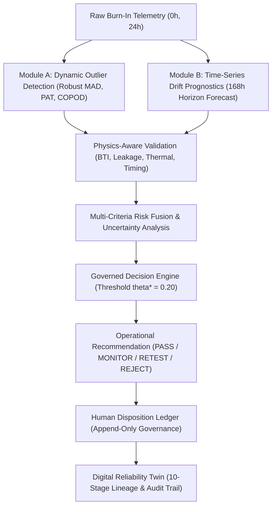
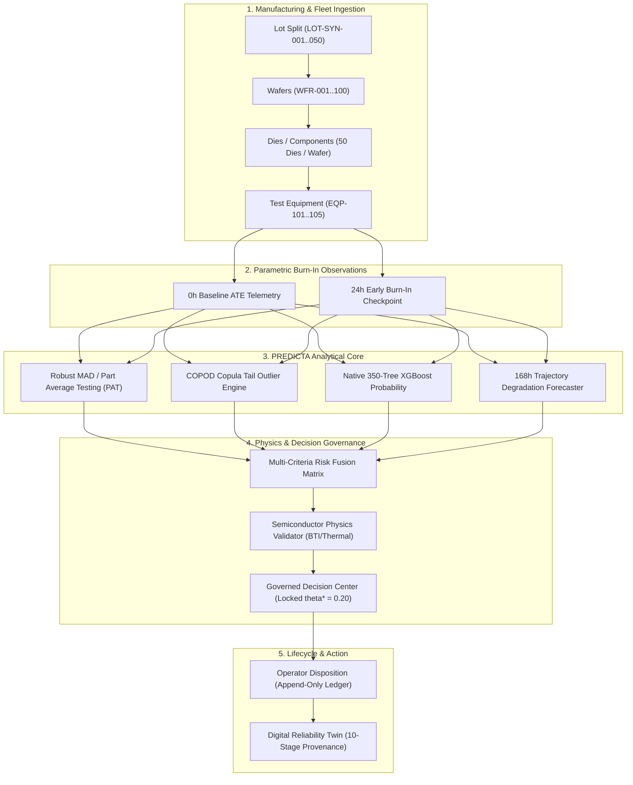
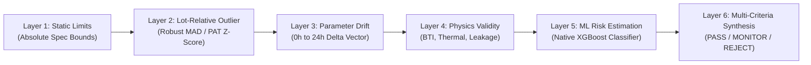
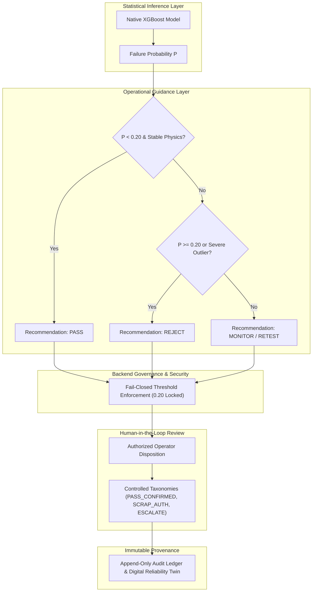
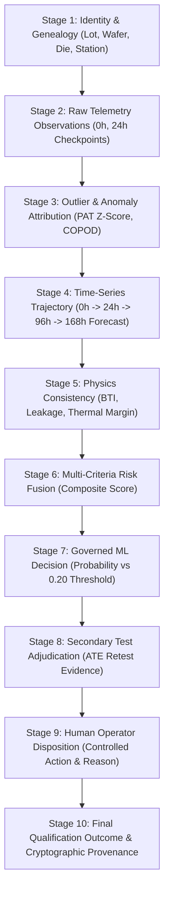

# PREDICTA-26
## AI-Driven Semiconductor Burn-In Telemetry & Latent Defect Screening

[](https://sih.gov.in)
[](https://github.com/umeshpandeysh/predicta-26)
[](https://python.org)
[](https://nodejs.org)
[](ml/models/production/predicta_xgboost_model.json)
[](tests/)
[](ml/reliability_twin/reliability_twin_contract.json)
[](LICENSE)

---

### Quick Navigation for SIH Judges
[Judge Overview](#judge-overview) • [Judge Quick Start](#judge-quick-start) • [Demonstration Cases](#demonstration-cases) • [System Architecture](#system-architecture) • [Multi-Layer Evidence](#multi-layer-evidence-pipeline) • [Digital Reliability Twin](#digital-reliability-twin--traceability) • [Scientific Rigor & Boundaries](#scientific-rigor--governance-boundaries) • [Repository Map](#repository-map) • [Test Suite](#automated-verification--test-execution)

---

# Judge Overview

### What is Smart India Hackathon Problem Statement 170?
In aerospace, defense, and high-reliability semiconductor manufacturing (ISRO / Department of Space), integrated circuits undergo rigorous **burn-in thermal and electrical stress testing**. Conventional screening relies heavily on static, point-in-time limit checking (e.g., ATE pass/fail at 0h or 24h). 

This introduces two severe failure modes:
1. **Latent-Defect Escapes:** Marginal dies with internal gate-oxide or metallization flaws pass static limits at 0h/24h, but degrade over operational lifetime, leading to catastrophic mission failures.
2. **False Alarms & Wasteful Scrap:** Normal batch-to-batch process variations cause benign shifts that violate tight static limits, causing expensive, flight-qualified silicon to be scrapped unnecessarily.

### What does PREDICTA solve?
**PREDICTA-26** provides an end-to-end, physics-informed semiconductor qualification engine that combines:
* **Module A (Dynamic Outlier Detection):** Lot-relative statistical anomaly detection (Robust MAD/PAT, COPOD, Isolation Forest) to catch dies deviating from their manufacturing cohort.
* **Module B (Time-Series Drift Prognostics):** Trajectory forecasting from early 0h+24h telemetry checkpoints through the **168h Burn-In Evaluation Horizon** to project parameter degradation before packaging.
* **Physics & Risk Fusion:** Consistency checking against semiconductor failure physics (BTI, thermal acceleration, gate leakage, timing margin) and multi-criteria risk synthesis.
* **Governed Decision & Human Disposition:** Fail-closed operational decision center ($\theta^* = 0.20$) with append-only human disposition audit ledgers.
* **10-Stage Digital Reliability Twin:** Immutable provenance ledger from wafer fabrication down to trace-level test history.



---

# Judge Quick Start

### 1. Launch Backend API Server
```bash
# Start authoritative REST & Inference Gateway (Port 3000)
node src/api/server.js
```

### 2. Open Workstation in Browser
Open `http://localhost:3000` or double-click `index.html` directly.

### 3. Guided Walkthrough Entry Points in the UI:
1. **Judge Journey Stepper:** Click **⚡ Judge Journey** in the top navigation bar or view `#judge-journey-dashboard` on the Home screen to step through all 10 evaluation stages.
2. **Fleet Monitoring:** Scroll to `#fleet-monitoring-dashboard` on Home to filter 50 manufacturing lots, 100 wafers, and 5,000 component dies across 5 test equipment stations.
3. **Canonical Demonstration Cases:** Click **Decision Center** in top navigation to inspect the three authoritative test cases (`NORMAL`, `LATENT_DEFECT`, `FALSE_ALARM`).
4. **Component Reliability Card:** Scroll to `#component-reliability-card` in Decision Center to inspect the 10-stage Digital Reliability Twin read model.

```mermaid
flowchart LR
    S1["1. SIH Problem (PS-170)"] --> S2["2. Manufacturing Context"]
    S2 --> S3["3. Fleet Overview (50 Lots / 100 Wafers)"]
    S3 --> S4["4. Canonical Case Selection"]
    S4 --> S5["5. Reliability Twin (10-Stage Ledger)"]
    S5 --> S6["6. 168h Evidence Timeline"]
    S6 --> S7["7. Why Flagged (Multi-Layer Attribution)"]
    S7 --> S8["8. Governed Decision (0.20 Lock)"]
    S8 --> S9["9. Human Disposition"]
    S9 --> S10["10. Cryptographic Traceability"]
```



---

# Demonstration Cases

PREDICTA-26 provides three authoritative, reproducible canonical cases derived directly from [`src/governance/canonical_demo_data.json`](src/governance/canonical_demo_data.json).

| Canonical Case | ID & Trace | Telemetry Profile | Detection & Evidence | Governed Decision | Operational Meaning |
| :--- | :--- | :--- | :--- | :---: | :--- |
| **Case A: NORMAL** | `COMP-NORMAL`<br>`TR-NORMAL-2026` | $I_{\text{leak}} = 111.7\,\mu\text{A}$<br>$V_{\text{th}} = 0.45\,\text{V}$<br>$T = 28.6\,^\circ\text{C}$ | ML Probability $P = 0.0048$<br>Anomaly Score $= 0.1095$<br>168h Forecast $= 145.2\,\mu\text{A}$ | **PASS**<br>`ACCEPT` | Nominal baseline device operating safely within all static, lot-relative, and physical drift bounds. |
| **Case B: LATENT DEFECT** | `COMP-LATENT_DEFECT`<br>`TR-LATENT-2026` | $I_{\text{leak}} = 145.0\,\mu\text{A}$<br>*(Passes static $250\,\mu\text{A}$ limit)* | PAT Z-Score $= 6.08 > 3.0$<br>168h Forecast $= 278.4\,\mu\text{A}$<br>ML Probability $P = 0.0840$ | **REJECT**<br>`CRITICAL` | **Static Limit Escape:** Device passes single-point limits but lot-relative outlier score and 168h drift trajectory reveal severe latent degradation. |
| **Case C: FALSE ALARM** | `COMP-FALSE_ALARM`<br>`TR-FALSE-2026` | $T_{\text{pd}} = 11.89\,\text{ns}$<br>$I_{\text{leak}} = 108.2\,\mu\text{A}$ | Timing shift triggers PAT Monitor,<br>but ML Risk $P = 0.0048$<br>Physics = Stable | **MONITOR**<br>`HOLD` | **Scrap Avoidance:** Benign process shift flagged for non-destructive retest/monitoring without discarding healthy flight silicon. |

---

# System Architecture & Manufacturing Data Flow

PREDICTA operates directly on manufacturing telemetry captured across burn-in test cycles:



---

# Multi-Layer Evidence Pipeline

Rather than relying on an opaque single-model prediction, PREDICTA constructs a 6-layer evidence stack for every screening disposition:



1. **Static Parametric Limits:** Verifies basic datasheet tolerances ($V_{\text{dd}}$, $I_{\text{leak}}$, $T_{\text{pd}}$, $V_{\text{th}}$).
2. **Lot-Relative Outlier Scoring:** Evaluates Part Average Testing (PAT) and COPOD scores relative to the current lot cohort.
3. **Time-Series Parameter Drift:** Measures 0h $\to$ 24h degradation rate ($\Delta I_{\text{ddq}} / \Delta t$, $\Delta T_{\text{pd}} / \Delta t$).
4. **Physical Degradation Consistency:** Evaluates kinetic plausibility against Bias Temperature Instability (BTI) and Arrhenius thermal acceleration.
5. **Machine Learning Risk Estimation:** Evaluates native XGBoost failure probability calibrated via Platt scaling against operating threshold $\theta^* = 0.20$.
6. **Multi-Criteria Synthesis:** Produces final operational routing (`PASS`, `MONITOR`, `RETEST`, `REJECT`).

---

# Governed Decision & Disposition Architecture

PREDICTA strictly decouples raw statistical inference from operational manufacturing actions:



---

# Digital Reliability Twin & Traceability

Every component die is assigned a deterministic Digital Reliability Twin read model maintaining 10 immutable stages of evidence:



---

# Scientific Rigor & Governance Boundaries

PREDICTA adheres to strict scientific honesty and integrity standards:

1. **Evaluation Horizon Disclaimer:**
   > `168H_EVALUATION_HORIZON_NOT_FAILURE_TIME`  
   > 168 hours represents the standard semiconductor burn-in evaluation horizon, **not** a physical time-to-failure or Mean Time Between Failures (MTBF) claim.
2. **Model Attribution vs. Causality:**
   > `MODEL ATTRIBUTION — NOT A CAUSAL CLAIM`  
   > Feature contribution scores represent statistical model attribution within the trained feature space, not physical root-cause assertions.
3. **Synthetic / Qualification Data Transparency:**
   The production dataset (`predicta_dataset_v3_50000.csv`) and split manifest (`split_manifest.json`) are synthetic qualification cohorts modeled after standard JEDEC burn-in profiles. They are explicitly labeled and cryptographically verified.
4. **Read-Only Reliability Twin:**
   The Digital Reliability Twin is an authoritative **read model**. Requesting a twin record never triggers hidden background ML inference or mutates ground-truth datasets.
5. **Fail-Closed Security:**
   Missing fields, out-of-bounds telemetry, corrupted manifests, or unregistered lot/component queries fail closed safely without fabricating defaults.
6. **Protected Artifact Cryptographic Lock:**
   * **Production XGBoost Model:** `91bb598ae91155674e40cb0a9f39d1e9bdeacd39875542db88b65e3668f29d98`
   * **Production Dataset:** `48e718643b6fe99bc410421f5b48715c294f1c4c2edabf10870935afdb820a06`
   * **Authoritative Operating Threshold:** `0.20`

---

# Technical Stack

* **Machine Learning & Analytics:** Native Python XGBoost (`xgboost==2.0.3`), NumPy, SciPy, Scikit-Learn.
* **Backend API Gateway:** Node.js HTTP REST Gateway, Express, crypto SHA-256 validation engines.
* **Physics & Degradation Models:** Custom BTI kinetic, Poole-Frenkel leakage, and Arrhenius thermal evaluators.
* **Frontend Workstation:** Pure HTML5/ES6 architecture with exact byte parity across root and `frontend/` mirrors (Zero build-step dependency, zero third-party CDNs).
* **Test & Verification Framework:** Pytest 9.x, Node test runners, Ruff linter, multi-runtime parity test suites.

---

# Repository Map

```text
predicta-26/
├── src/
│   ├── api/                 Inference service, REST routes, schemas, server.js
│   ├── anomaly_detection/   MAD, PAT, COPOD, and statistical outlier engines
│   ├── features/            Feature contract, normalization, and bounds
│   ├── fleet/               Authoritative FleetManager (Python & Node.js)
│   ├── governance/          Disposition manager, taxonomies, canonical_demo_data.json
│   ├── physics/             BTI, thermal acceleration, and leakage consistency
│   ├── prognostics/         168h trajectory forecaster and governance gates
│   ├── reliability_twin/    10-stage Digital Reliability Twin read model
│   └── risk_fusion/         Multi-criteria risk fusion matrix
├── ml/
│   ├── data/                50k production dataset & 50-lot split manifest
│   ├── models/production/   Protected XGBoost model and calibration artifacts
│   ├── reliability_twin/    Reliability twin immutability contract
│   └── training/            Native XGBoost training & validation scripts
├── frontend/                100% byte-identical client mirror (index.html, script.js, api.js)
├── tests/                   700+ automated unit, integration, parity, and adversarial test suites
├── docs/                    API specifications, mathematical proofs, and runbooks
├── index.html               Main demonstration application & Judge Journey
├── script.js                Frontend workstation application script
├── api.js                   REST API client library
└── style.css                Workstation styling & design system
```

---

# Automated Verification & Test Execution

```bash
# 1. Run Complete Python Test Suite (700+ Tests)
python -m pytest tests/ -v

# 2. Run Phase 19.3 Judge Journey Test Suite
python -m pytest tests/test_phase19_judge_journey.py -v
node tests/test_phase19_judge_journey.js

# 3. Run Phase 19.2 Fleet Monitoring Test Suite
python -m pytest tests/test_phase19_fleet.py -v
node tests/test_phase19_fleet.js

# 4. Run Cross-Runtime Parity & Production Certification Stack
npm test

# 5. Run Static Analysis & Linter
python -m ruff check src tests
```

---

**PREDICTA-26** · Smart India Hackathon 2026 · Problem Statement 170  
[GitHub Repository](https://github.com/umeshpandeysh/predicta-26)
