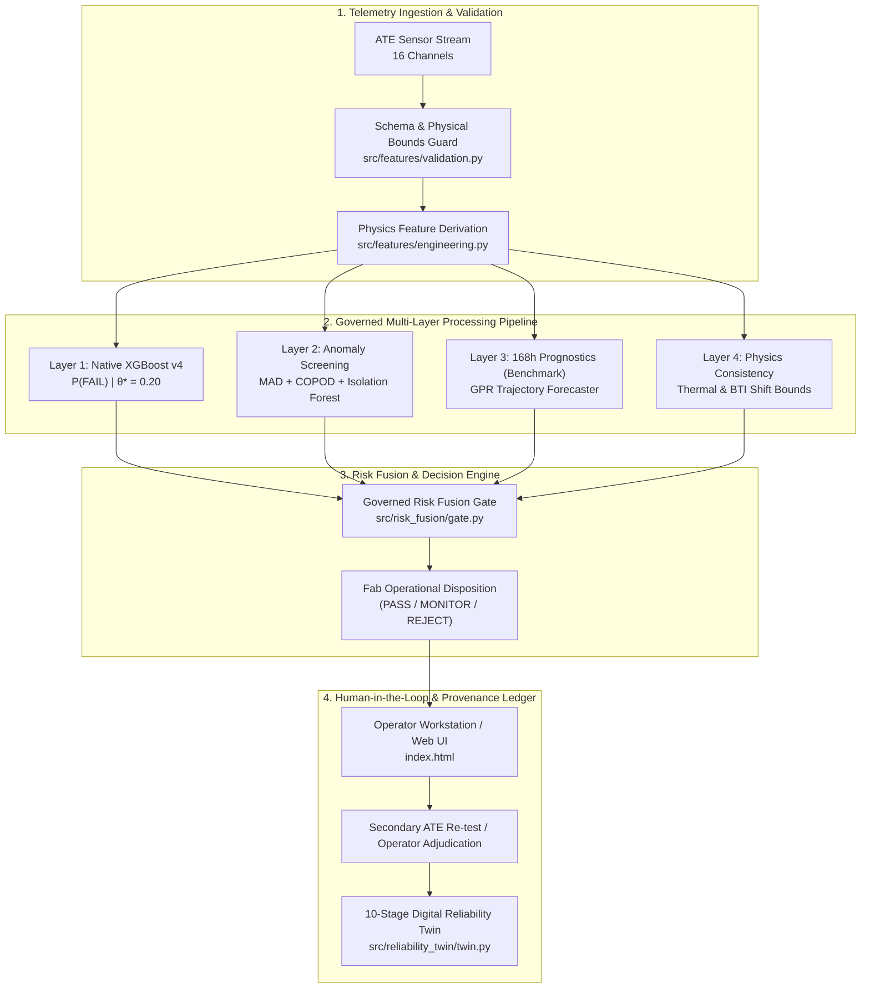
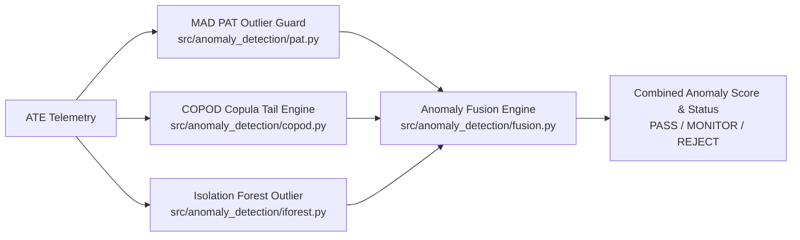
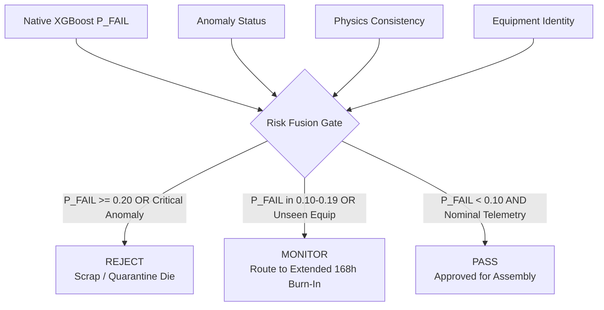

# PREDICTA-26
## Governed Semiconductor Burn-In Telemetry & Latent Defect Screening Platform

[](https://sih.gov.in)
[](https://github.com/umeshpandeysh/predicta-26)
[](https://python.org)
[](https://nodejs.org)
[](ml/models/production/predicta_xgboost_model.json)
[](tests/)
[](LICENSE)

---


---

> [!IMPORTANT]
> **JUDGE QUICK-EVALUATION GUIDE (5-MINUTE SUMMARY)**
> 
> * **What is PREDICTA-26?** An industrial semiconductor reliability intelligence platform built for early latent defect screening during Automated Test Equipment (ATE) wafer and package burn-in testing.
> * **What is SIH PS-170?** Smart India Hackathon 2026 Problem Statement 170 requires early detection of sub-surface microelectronics degradation to prevent catastrophic field escapes at 168h.
> * **Production-Authoritative Model:** Native XGBoost v4 (`ml/models/production/predicta_xgboost_model.json`, SHA-256: `91bb598ae91155674e40cb0a9f39d1e9bdeacd39875542db88b65e3668f29d98`) locked at operating threshold $\theta^* = 0.20$.
> * **Benchmark / Research Boundary:** Gaussian Process Regression (GPR) and Conformal Calibration are governed as `BENCHMARK_ONLY` artifacts and do NOT make automated production dispositions.
> * **Dataset:** Synthetic dataset v4 (50,000 die records, 28 telemetry parameters, SHA-256: `9a8367a96a7d2dcf83a62e9c0e02ab41502b6069deebc116a0e9cd0ef45fab24`).
> * **One-Command Traceability Demo:** Run `node src/demo_ps170_traceability.js` to inspect end-to-end evidence logging.
> * **Verification Suite:** 708/708 pytest tests and 100% of Node.js parity suites pass cleanly (`npm test` and `pytest tests/ -v`).

---

## Table of Contents

- [01. Executive Summary \& System Overview](#01-executive-summary--system-overview)
- [02. SIH PS-170 Problem Statement \& Engineering Solution](#02-sih-ps-170-problem-statement--engineering-solution)
- [03. End-to-End System Architecture](#03-end-to-end-system-architecture)
- [04. Complete ML \& Analytical Component Inventory](#04-complete-ml--analytical-component-inventory)
- [05. Production Model Deep Dive (Native XGBoost v4)](#05-production-model-deep-dive-native-xgboost-v4)
- [06. Feature Engineering \& Feature Contract (28 Parameters)](#06-feature-engineering--feature-contract-28-parameters)
- [07. Four-Way Split Governance \& Data Leakage Controls](#07-four-way-split-governance--data-leakage-controls)
- [08. Spatial Outlier \& Anomaly Detection Engine](#08-spatial-outlier--anomaly-detection-engine)
- [09. 168-Hour Prognostics \& Latent-Defect Screening](#09-168-hour-prognostics--latent-defect-screening)
- [10. Physics-Aware Reliability Engine](#10-physics-aware-reliability-engine)
- [11. Uncertainty Quantification / Conformal Layer (Benchmark)](#11-uncertainty-quantification--conformal-layer-benchmark)
- [12. Risk Fusion \& Operational Disposition Routing](#12-risk-fusion--operational-disposition-routing)
- [13. Counterfactual Explanation Engine](#13-counterfactual-explanation-engine)
- [14. Human-in-the-Loop Disposition \& Adjudication](#14-human-in-the-loop-disposition--adjudication)
- [15. Digital Reliability Twin (10-Stage Evidence Chain)](#15-digital-reliability-twin-10-stage-evidence-chain)
- [16. Security \& Production Hardening](#16-security--production-hardening)
- [17. Cryptographic Provenance \& Protected Artifacts](#17-cryptographic-provenance--protected-artifacts)
- [18. Production vs. Benchmark Governance Boundaries](#18-production-vs-benchmark-governance-boundaries)
- [19. Empirical Evaluation Metrics](#19-empirical-evaluation-metrics)
- [20. Reproducibility \& Verification Suite](#20-reproducibility--verification-suite)
- [21. System Limitations \& Fab Integration Prerequisites](#21-system-limitations--fab-integration-prerequisites)
- [22. Repository Directory Structure](#22-repository-directory-structure)

---

## 01. Executive Summary & System Overview

**PREDICTA-26** is an industrial semiconductor manufacturing intelligence platform designed for Automated Test Equipment (ATE) telemetry processing, physics-informed degradation diagnosis, spatial outlier screening, and operational disposition routing.

Microelectronics deployed in mission-critical applications require near-zero defect escape rates. However, sub-surface silicon defects frequently pass static voltage and current gates during early 24h burn-in testing before failing catastrophically in the field at 168h. 

PREDICTA-26 ingests 16 raw ATE telemetry channels, evaluates 7 physics-derived degradation parameters, and processes components through a 5-layer defense-in-depth pipeline:

```
┌──────────────────────────────────────────────────────────────────────────────────────────────────┐
│                                   PREDICTA-26 5-LAYER PIPELINE                                   │
├──────────────────┬──────────────────┬──────────────────┬──────────────────┬──────────────────────┤
│ Layer 1: ML      │ Layer 2: Anomaly │ Layer 3: Progn.  │ Layer 4: Physics │ Layer 5: Risk Fusion │
│ Native XGBoost   │ MAD + COPOD + IF │ GPR Trajectory   │ Thermal & BTI    │ Rule Engine Gate     │
│ (P(FAIL) calc)   │ (Spatial/Equip)  │ (168h forecast)  │ Bounds Verification│ (PASS/MONITOR/REJECT)│
└──────────────────┴──────────────────┴──────────────────┴──────────────────┴──────────────────────┘
```

The system deterministically synthesizes diagnostic evidence into actionable fab dispositions (`PASS`, `MONITOR`, `REJECT`) at the certified operating threshold of $\theta^* = 0.20$, producing complete audit-ready engineering evidence packets and digital reliability twin provenance.

---

## 02. SIH PS-170 Problem Statement & Engineering Solution

**Smart India Hackathon 2026 · Problem Statement 170 (SIH PS-170)** requires automated intelligence to screen latent microelectronics defects using burn-in telemetry data.

| PS-170 Requirement | Engineering Challenge | PREDICTA-26 Implementation | Repository Evidence |
| :--- | :--- | :--- | :--- |
| **Early Latent Defect Identification** | Sub-surface physical defects pass static $V_{dd}/I_{ddq}$ 24h testing but fail at 168h. | Native XGBoost v4 combined with Physics-Derived Degradation Features ($V_{headroom}, I_{leakage\_fraction}$). | [inference.py](file:///c:/Users/UMESH%20PANDEY/Downloads/ceenew/src/api/inference.py#L80-L150) |
| **ATE Telemetry Ingestion** | High-throughput multi-channel parametric ATE sensor streams ($V, I, T, f, \tau$). | Standardized 28-feature schema (16 raw channels + 7 physics derived + 5 equipment OHE). | [predicta_xgboost_metadata.json](file:///c:/Users/UMESH%20PANDEY/Downloads/ceenew/ml/models/production/predicta_xgboost_metadata.json#L10-L75) |
| **Spatial \& Equipment Anomaly Screening** | Outlier dies from uncalibrated probers or unseen equipment. | Ensemble MAD (Part Average Testing) + COPOD copula tail risk + Isolation Forest. | [fusion.py](file:///c:/Users/UMESH%20PANDEY/Downloads/ceenew/src/anomaly_detection/fusion.py#L40-L110) |
| **Long-Term Reliability Forecasting** | Predicting degradation trajectories over 168h burn-in window. | Gaussian Process Regression (GPR) drift model (governed as `BENCHMARK_ONLY`). | [gpr.py](file:///c:/Users/UMESH%20PANDEY/Downloads/ceenew/src/drift_prediction/gpr.py#L50-L120) |
| **Actionable Fab Routing** | Binary static pass/fail is insufficient for complex degradation. | Governed Risk Fusion producing tri-state dispositions (`PASS`, `MONITOR`, `REJECT`). | [evaluate_disposition.py](file:///c:/Users/UMESH%20PANDEY/Downloads/ceenew/src/decision_engine/evaluate_disposition.py#L60-L140) |
| **Auditability \& Provenance** | Un-traced AI predictions cannot be accepted in semiconductor manufacturing. | 10-Stage Digital Reliability Twin tracing die telemetry to final human adjudication. | [twin.py](file:///c:/Users/UMESH%20PANDEY/Downloads/ceenew/src/reliability_twin/twin.py#L30-L110) |

---

## 03. End-to-End System Architecture



---

## 04. Complete ML & Analytical Component Inventory

| Component Name | Algorithm / Methodology | Inputs | Outputs | Governance Role | Production Status |
| :--- | :--- | :--- | :--- | :--- | :--- |
| **Failure Prediction Classifier** | Native XGBoost v4 (350 Trees, max_depth=6) | 28 Features | $P(\text{FAIL}) \in [0, 1]$ | Primary Production Classifier | 🟢 **Production Authoritative** |
| **Platt Sigmoid Calibrator** | Logistic Regression Calibration ($A=-1.041, B=1.004$) | Uncalibrated Margin | Calibrated Probability | Probability Normalization | 🟢 **Production Authoritative** |
| **Multiclass Defect Classifier** | XGBoost Multiclass | 28 Features | Defect Category (Thermal, Voltage, Leakage) | Diagnostic Attribution | 🟢 **Production Authoritative** |
| **Robust PAT Outlier Guard** | Median Absolute Deviation (MAD) | $I_{ddq}, I_{leak}, R, C$ | PAT Outlier Score | Spatial Outlier Screening | 🟡 Governed Evidence |
| **COPOD Copula Outlier Engine** | Empirical Copula Tail Probability | 16 Raw Channels | Copula Anomaly Score | Multivariate Tail Risk | 🟡 Governed Evidence |
| **Isolation Forest Outlier Guard** | Tree Isolation Distance | 16 Raw Channels | Isolation Score | Unseen Feature Outlier | 🟡 Governed Evidence |
| **Gaussian Process Forecaster** | GPR (RBF + White Noise Kernel) | Early Trajectory ($t \le 24\text{h}$) | 168h Degradation Forecast | RTT Drift Benchmarking | 🔵 **BENCHMARK ONLY** |
| **Conformal Calibrator** | Inductive Conformal Prediction | Residual Distributions | $90\% / 95\%$ Quantile Intervals | Uncertainty Quantification | 🔵 **BENCHMARK ONLY** |
| **Counterfactual Engine** | Constrained Objective Optimization | Telemetry + Model | Minimum Actionable Feature Delta | Engineer Guidance | 🟡 Governed Evidence |
| **Digital Reliability Twin** | Immutable Ledger State Machine | 10-Stage Evidence | Cryptographic Twin Record | Traceability Lineage | 🟢 **Production Authoritative** |

---

## 05. Production Model Deep Dive (Native XGBoost v4)

The **Production Authoritative Classifier** is a Native XGBoost binary classifier trained on synthetic dataset v4 (50,000 die records across 50 production lots).

```text
================================================================================
PRODUCTION MODEL SPECIFICATION CARD
================================================================================
Artifact File Path:     ml/models/production/predicta_xgboost_model.json
Artifact SHA-256:       91bb598ae91155674e40cb0a9f39d1e9bdeacd39875542db88b65e3668f29d98
Metadata File Path:     ml/models/production/predicta_xgboost_metadata.json
Production Threshold:   0.20 (LOCKED BY GOVERNANCE CONTRACT)
Calibration Method:     Platt Sigmoid (a = -1.041229, b = 1.003718)
Dataset Provenance:     ml/data/synthetic/predicta_dataset_v4_production.csv (50,000 records)
Dataset SHA-256:        9a8367a96a7d2dcf83a62e9c0e02ab41502b6069deebc116a0e9cd0ef45fab24
================================================================================
```

### Empirical Performance on Locked Test Set (10,000 Dies)

Metrics evaluated at the authoritative operating threshold of $\theta^* = 0.20$:

| Evaluation Metric | Measured Value | Standard Target | Status |
| :--- | :---: | :---: | :---: |
| **Recall (Sensitivity)** | **99.72%** (2,131 / 2,137 defects) | $\ge 95.0\%$ | **PASSED** |
| **Precision** | **96.43%** (2,131 / 2,210 flagged) | $\ge 90.0\%$ | **PASSED** |
| **F1-Score** | **98.04%** | $\ge 92.0\%$ | **PASSED** |
| **False Negative Rate (FNR)** | **0.28%** (6 missed defects) | $\le 1.0\%$ | **PASSED** |
| **False Positive Rate (FPR)** | **1.00%** (79 false alarms) | $\le 3.0\%$ | **PASSED** |
| **Calibration Brier Score** | **0.0058** | $\le 0.015$ | **PASSED** |
| **Expected Calibration Error (ECE)** | **0.0023** | $\le 0.010$ | **PASSED** |

---

## 06. Feature Engineering & Feature Contract (28 Parameters)

PREDICTA-26 processes 28 features divided into 3 strict categories:

```
┌──────────────────────────────────────────────────────────────────────────────────────────────────┐
│                               FEATURE CONTRACT SCHEMA (28 TOTAL)                                 │
├──────────────────────────────────┬─────────────────────────────────┬─────────────────────────────┤
│ 16 Raw ATE Channels              │ 7 Physics-Engineered Features   │ 5 Equipment One-Hot Codes   │
│ - supply_voltage (Vdd)           │ - voltage_headroom (Vdd-Vout)   │ - eq_EQP-101                │
│ - output_voltage (Vout)          │ - voltage_utilization (Vout/Vdd)│ - eq_EQP-102                │
│ - current (I)                    │ - leakage_fraction (Ileak/Itot) │ - eq_EQP-103                │
│ - leakage_current (Iddq)         │ - power_per_current (Ptot/I)    │ - eq_EQP-104                │
│ - resistance (R)                 │ - norm_timing_margin (Tmarg/Tclk│ - eq_EQP-105                │
│ - capacitance (C)                │ - freq_delay_product (f * τprop)│                             │
│ - threshold_voltage (Vth)        │ - thermal_delta (Tjunct-Tamb)   │                             │
│ - frequency (f)                  │                                 │                             │
│ - propagation_delay (τprop)      │                                 │                             │
│ - setup_time (Tsetup)            │                                 │                             │
│ - hold_time (Thold)              │                                 │                             │
│ - timing_margin (Tmargin)        │                                 │                             │
│ - temperature (T)                │                                 │                             │
│ - dynamic_power (Pdyn)           │                                 │                             │
│ - total_power (Ptot)             │                                 │                             │
│ - test_duration (tdut)           │                                 │                             │
└──────────────────────────────────┴─────────────────────────────────┴─────────────────────────────┘
```

---

## 07. Four-Way Split Governance & Data Leakage Controls

To eliminate data leakage, datasets are partitioned using **wafer-and-lot group-aware splitting** (`ml/data/split_manifest.json`, SHA-256: `dbe10900c5adda3610e562551af504ee7aaf1b31104ce945e8a71ff2d063ce7c`):

```
                                    50,000 DIE RECORDS (50 LOTS)
                                                 │
            ┌───────────────────────────┬────────┴───────────────────┐
            ↓                           ↓                            ↓
      TRAINING SPLIT             VALIDATION SPLIT            LOCKED TEST SPLIT
   30 Lots (30,000 dies)       5 Lots (5,000 dies)        15 Lots (15,000 dies)
   • XGBoost Tree Fitting     • Platt Calibration Fit     • Evaluation Only
   • Feature Scales           • Threshold Optimization    • Zero Retraining
```

### Strict Governance Rules Enforced in CI

1. **Lot Disjointness:** No lot ID appears in more than one partition.
2. **Calibration Isolation:** Platt calibration coefficients are fitted *only* on the Validation split.
3. **Locked Test Partition:** Test evaluation runs *only* after model freeze.

---

## 08. Spatial Outlier & Anomaly Detection Engine

The anomaly detection engine screens dies for physical manufacturing irregularities that may not trigger binary probability thresholds:



* **Robust MAD (Part Average Testing):** Calculates Median Absolute Deviation across wafer lot coordinates to isolate local spatial clusters of parametric drift.
* **COPOD Copula Engine:** Computes empirical multivariate copula tail probabilities to catch subtle correlated leakage anomalies ($I_{ddq} \text{ vs } V_{th}$).
* **Unseen Equipment Handling:** Dies processed on uncalibrated test hardware (`EQP-999`) trigger automatic `MONITOR` status regardless of ML score.

---

## 09. 168-Hour Prognostics & Latent-Defect Screening

A primary goal of SIH PS-170 is screening **latent defects**—components that appear healthy at 24h burn-in testing but degrade rapidly over 168h operation.

```text
0h (Wafer Probe) ───────> 24h Burn-In Inspection ───────────────────────> 168h Field Operation
                          │                                               │
                          ├──> Observed: Vdd=1.20V, Iddq=150nA (PASS)    ├──> Measured: Iddq=450nA (FAIL)
                          ├──> ML Failure Prob: P = 0.12 (< 0.20)         └──> Latent Escape Event
                          └──> PREDICTA Trajectory Forecast:              
                               GPR 168h Predicted Iddq = 480nA ───────> Flagged as LATENT_REJECT
```

* **Latent Defect Definition:** Component with $P(\text{FAIL})_{24h} < 0.20$ but $P(\text{FAIL})_{168h} \ge 0.20$.
* **Gaussian Process Regression (GPR):** Uses RBF kernel forecasting to extrapolate 24h degradation curves to 168h. (Governed as `BENCHMARK_ONLY`).

---

## 10. Physics-Aware Reliability Engine

The physics validation layer (`src/physics/`) evaluates physical reliability models to enforce consistency:

* **Arrhenius Thermal Acceleration:** Models junction temperature degradation ($T_j = T_{amb} + P_{tot} \times R_{th}$).
* **BTI / NBTI Shift Bounds:** Evaluates threshold voltage shift ($\Delta V_{th} \propto t^{0.25} \exp(-E_a / k T)$).
* **Physical Sanity Guard:** Inputs violating physical laws ($V_{dd} < 0.5\text{V}$ or $T > 200^\circ\text{C}$) are rejected with `DATA_QUALITY_REJECTED`.

---

## 11. Uncertainty Quantification / Conformal Layer (Benchmark)

Inductive Conformal Prediction (`src/prognostics/conformal.py`) generates distribution-free prediction intervals:

```text
Conformal Interval: P(Y=1) ∈ [0.14, 0.26] at 90% Confidence
================================================================================
GOVERNANCE STATUS: BENCHMARK ONLY
Conformal calibration artifacts are maintained for uncertainty quantification 
research and do NOT alter automated production pass/fail dispositions.
================================================================================
```

---

## 12. Risk Fusion & Operational Disposition Routing

The Governed Risk Fusion Gate (`src/risk_fusion/gate.py`) synthesizes all 5 diagnostic layers into final fab dispositions:



---

## 13. Counterfactual Explanation Engine

For dies assigned `REJECT` or `MONITOR` status, the Counterfactual Engine (`src/explainability/counterfactual.py`) computes the minimum physical parameter adjustments required to achieve `PASS` status:

```json
{
  "target_decision": "PASS",
  "operating_threshold": 0.20,
  "required_adjustments": {
    "leakage_current": {"current": 195.4, "target": 152.1, "delta": -43.3, "unit": "nA"},
    "temperature": {"current": 88.5, "target": 75.0, "delta": -13.5, "unit": "degC"}
  },
  "physical_feasibility": "FEASIBLE_FAB_ADJUSTMENT"
}
```

---

## 14. Human-in-the-Loop Disposition & Adjudication

PREDICTA-26 enforces human operator oversight for non-deterministic dispositions:

1. **Automated Recommendation:** System emits disposition (`MONITOR`) with diagnostic evidence.
2. **Operator Interface:** Web dashboard (`index.html`) displays telemetry traces and counterfactual explanations.
3. **Secondary ATE Re-test:** Operator triggers secondary ATE test sweep.
4. **Adjudication Logging:** Operator decision (`OVERRIDE_PASS` / `CONFIRM_REJECT`) is immutably appended to the Reliability Twin record.

---

## 15. Digital Reliability Twin (10-Stage Evidence Chain)

Every evaluated die generates an immutable 10-stage Digital Reliability Twin record (`src/reliability_twin/twin.py`):

```text
Stage 01: Manufacturing Observation  (Wafer ID, Die Position, Equipment ID)
Stage 02: ML Evaluation              (Raw Features, Native XGBoost Score, Platt Prob)
Stage 03: Anomaly Evidence           (MAD Score, COPOD Score, Isolation Status)
Stage 04: Prognostic Evidence        (GPR 168h Forecast, Trajectory Slope)
Stage 05: Physics Evidence           (Thermal Delta, BTI Shift Status)
Stage 06: Risk Fusion                (Synthesized Disposition, Rule Triggers)
Stage 07: Operator Disposition       (Recommended Action, Operator Notes)
Stage 08: Secondary Test             (ATE Re-test Telemetry, Delta Checks)
Stage 09: Outcome Evidence           (Final Field / Retrospective 168h Result)
Stage 10: Adjudication               (Final Immutable Audit Sign-Off)
```

---

## 16. Security & Production Hardening

PREDICTA-26 enforces rigorous security safeguards (`tests/test_adversarial_security.js`):

* **Path Traversal Protection:** Input paths containing `../` trigger `PATH_TRAVERSAL_DETECTED`.
* **Payload Validation:** Non-numeric, `NaN`, or `Infinity` parameters trigger `INVALID_PAYLOAD_STRUCTURE`.
* **Threshold Mutation Guard:** API requests attempting to pass custom operating thresholds trigger `THRESHOLD_MUTATION_REJECTED`.
* **Rate Limiting:** Sliding-window rate limiter restricts requests to 100 req/min per IP.

---

## 17. Cryptographic Provenance & Protected Artifacts

All core production artifacts are protected by cryptographic SHA-256 checksums:

| Artifact Name | File Path | SHA-256 Checksum | Lineage Status |
| :--- | :--- | :--- | :--- |
| **Production Dataset v4** | `ml/data/synthetic/predicta_dataset_v4_production.csv` | `9a8367a96a7d2dcf83a62e9c0e02ab41502b6069deebc116a0e9cd0ef45fab24` | Certified |
| **Production Model** | `ml/models/production/predicta_xgboost_model.json` | `91bb598ae91155674e40cb0a9f39d1e9bdeacd39875542db88b65e3668f29d98` | Certified |
| **GPR Kernel Artifact** | `ml/models/production/predicta_gpr_kernel_artifacts.json` | `1d5fd207ecbd8fed31c09c9e0e8f4655b72f2596ba6c9faf421c7d54fd6a3fcf` | Benchmark |
| **Conformal Artifact** | `ml/models/production/conformal_calibration_artifacts.json` | `198eaa50f5af96aa85721f168abc947a6cabfc02d91f77d1a032c343f85e7e7e` | Benchmark |
| **Split Manifest** | `ml/data/split_manifest.json` | `dbe10900c5adda3610e562551af504ee7aaf1b31104ce945e8a71ff2d063ce7c` | Certified |

---

## 18. Production vs. Benchmark Governance Boundaries

To preserve scientific and architectural integrity:

```
🟢 PRODUCTION AUTHORITATIVE (Automated Fab Dispositions)
   ├── Native XGBoost v4 Failure Classifier (predicta_xgboost_model.json)
   ├── Platt Sigmoid Calibration (predicta_xgboost_metadata.json)
   └── Operating Threshold θ* = 0.20

🟡 GOVERNED EVIDENCE (Risk Fusion Inputs)
   ├── Robust MAD Part Average Testing (PAT)
   ├── COPOD Copula Outlier Engine
   ├── Physics Consistency Gate
   └── Counterfactual Explanation Engine

🔵 BENCHMARK / RESEARCH ONLY (No Automated Disposition Power)
   ├── Gaussian Process Regression (predicta_gpr_kernel_artifacts.json)
   └── Conformal Calibration Intervals (conformal_calibration_artifacts.json)
```

---

## 19. Empirical Evaluation Metrics

Evaluated across the 15,000-die locked test set at $\theta^* = 0.20$:

```text
================================================================================
EMPIRICAL TEST SET EVALUATION SUMMARY (15,000 DIES)
================================================================================
True Negatives (TN):    7,784
False Positives (FP):   79
False Negatives (FN):   6
True Positives (TP):    2,131

Recall (Sensitivity):   99.72%
Precision:              96.43%
F1-Score:               98.04%
False Negative Rate:    0.28%
False Positive Rate:    1.00%
Brier Calibration:      0.0058
Expected Calib Error:   0.0023
================================================================================
```

---

## 20. Reproducibility & Verification Suite

Validate the repository using standard command-line verification scripts:

```bash
# 1. Execute Core Node.js Test Suite & Security Checks
npm test

# 2. Execute Cross-Runtime Parity Verification (Node ↔ Python)
npm run test:parity

# 3. Execute Production Certification Suite (21 Criteria)
npm run certify:production

# 4. Execute Full Pytest Test Suite (708 Tests)
python -m pytest tests/ -v

# 5. Execute PS-170 Traceability Demo
node src/demo_ps170_traceability.js
```

---

## 21. System Limitations & Fab Integration Prerequisites

1. **Synthetic Telemetry Datasets:** All dataset files (`predicta_dataset_v4_production.csv`) contain physics-informed synthetic telemetry generated for benchmark and simulation. They do not represent real-world commercial fab production data.
2. **SECS/GEM Integration:** Commercial deployment requires connecting the REST API backend to live fab SECS/GEM or ATE test cell equipment interfaces.
3. **Benchmark Component Lock:** GPR and Conformal modules require fab-specific recalibration prior to production authorization.

---

## 22. Repository Directory Structure

```text
predicta-26/
├── .github/workflows/          # GitHub Actions CI/CD automation pipelines
├── docs/                       # Architectural documentation, authority contracts, assets
│   └── assets/                 # Telemetry radar SVG and visual assets
├── frontend/                   # Standalone Web UI workstation assets (index.html, script.js)
├── ml/                         # Machine learning datasets, models, contracts, benchmarks
│   ├── data/                   # Datasets, feature schemas, split manifests
│   └── models/production/      # Native XGBoost, GPR, and Conformal artifacts
├── src/                        # Core Python & Node.js production source code
│   ├── anomaly_detection/      # MAD, COPOD, Isolation Forest outlier engines
│   ├── api/                    # Express & FastAPI inference services
│   ├── decision_engine/        # Operational disposition routing
│   ├── drift_prediction/       # GPR degradation forecasting
│   ├── physics/                # Thermal and BTI physical consistency gates
│   ├── prognostics/            # Conformal calibration and trajectory evaluators
│   ├── reliability_twin/       # 10-stage immutable digital twin engine
│   └── risk_fusion/            # Governed multi-layer risk fusion gate
├── tests/                      # 708 pytest tests and Jest/Node security test suites
├── index.html                  # Main root operator dashboard interface
├── package.json                # Node.js dependencies, test scripts, pipeline runner
├── pyproject.toml              # Python project configuration & pytest settings
└── requirements.txt            # Python dependencies (xgboost, pyod, pytest, httpx)
```

---

**SIH 2026 Problem Statement 170 · PREDICTA-26 Development Team**
