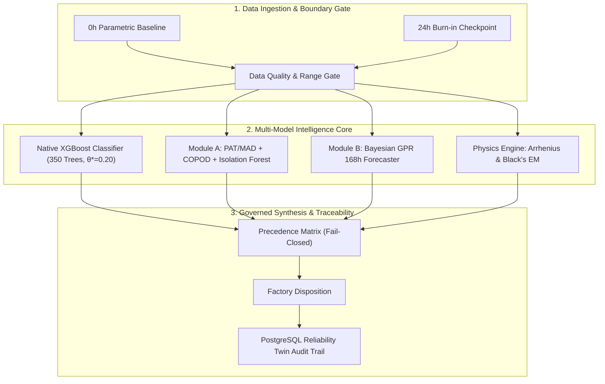
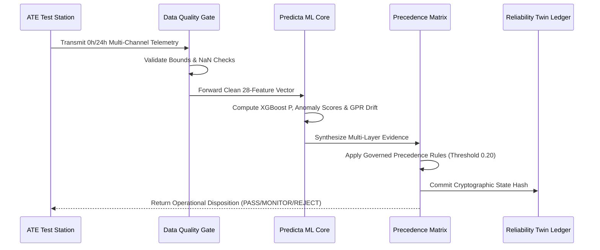

# PREDICTA-26
## Predictive Reliability Engine for Dynamic Identification, Component Testing & Analysis

[](https://sih.gov.in)
[](docs/PS170_TRACEABILITY_MATRIX.md)
[](https://predicta-26-pi.vercel.app)
[](ml/models/production/predicta_xgboost_model.json)
[](ml/models/production/predicta_production_manifest.json)
[-brightgreen.svg)](tests/)
[](LICENSE)

---

> 🚀 **SIH 2026 Evaluator Fast-Track — Canonical Five-Artifact Package + Hardening Suite:**
> 1. 📊 [**01_PS26170_FINAL_BENCHMARK**](docs/01_PS26170_FINAL_BENCHMARK.md) — Definitive comparative benchmark against all 5 baselines.
> 2. 🔬 [**02_SYNTHETIC_REALISM_AUDIT**](docs/02_SYNTHETIC_REALISM_AUDIT.md) — 10-level synthetic difficulty and physical degradation benchmark.
> 3. 🧩 [**03_ABLATION_STUDY**](docs/03_ABLATION_STUDY.md) — 6-stage progressive layer ablation and 168h continuous prognostics proof.
> 4. 🛡️ [**04_TEMPORAL_LEAKAGE_AUDIT**](docs/04_TEMPORAL_LEAKAGE_AUDIT.md) — 14-dimension red-team leakage and shortcut audit.
> 5. 🏛️ [**05_PRODUCTION_AUTHORITY**](docs/05_PRODUCTION_AUTHORITY.md) — Cryptographic provenance and single source of truth ([`docs/FINAL_AUTHORITY.md`](docs/FINAL_AUTHORITY.md)).
>
> 📋 **Final Scientific Hardening Evidence (P0 / P1 Deliverables):**
> * 🗺️ [**Claim-to-Evidence Matrix**](docs/CLAIM_EVIDENCE_MATRIX.md) — Single judge-facing map of all 12 claims and reproducible CLI commands.
> * 💰 [**Economic & Decision Impact Model**](docs/ECONOMIC_IMPACT_MODEL.md) — Multi-scenario financial decision proof distinguishing potential window vs realized savings.
> * 🧪 [**Synthetic Generator Independence**](docs/SYNTHETIC_GENERATOR_INDEPENDENCE.md) — Frozen-model domain-shift proof on heavy-tailed non-Gaussian generator.
> * 🔒 [**Hidden-Test Integrity Provenance**](docs/HIDDEN_TEST_INTEGRITY.md) — Multi-stage isolation proof guaranteeing zero test-set indirect tuning.
> * ⚠️ [**OOD & Insufficient Evidence Case**](docs/OOD_INSUFFICIENT_EVIDENCE_CASE.md) — Fail-closed safety proof preventing automated PASS on novel/outlier inputs.
> * ⏱️ [**Module-B Temporal Contract**](docs/MODULE_B_TEMPORAL_CONTRACT.md) — Explicit feature isolation table proving zero future leakage ($t > 24\text{h}$).
>
> 🌐 **Live Cloud Workstation:** [**https://predicta-26-pi.vercel.app**](https://predicta-26-pi.vercel.app) — Zero-install production deployment.
> ⏱️ **60-Second Orientation:** [**Judge & Reviewer Guide**](docs/JUDGE_GUIDE.md) | 🗺️ [**Architecture Specification**](docs/architecture/canonical-production-path.md)

---

## Problem Context

* **Problem Statement (SIH 2026 PS-26170 / ISRO PS-170):** In high-reliability spaceflight electronics, integrated circuits undergo 168 hours of high-temperature (125°C) electrical burn-in testing. Conventional screening evaluates only static, point-in-time tolerance limits ($L_{\text{min}} \le X \le L_{\text{max}}$). Latent defects (gate-oxide micro-voids, interface traps, metallization thinning) pass static limits initially at 0h/24h but degrade catastrophically during flight missions.
* **The PREDICTA Solution:** PREDICTA-26 is a physics-informed, fail-closed semiconductor screening engine that analyzes early electrical telemetry ($0\text{h}$ and $24\text{h}$), detects out-of-family multivariate anomalies (PAT-MAD, COPOD, Isolation Forest), forecasts continuous 168h degradation trajectories with Bayesian GPR, validates physical degradation kinetics (Arrhenius, Black's EM, BTI), and synthesizes governed factory dispositions (`PASS`, `MONITOR`, `REJECT`) backed by an immutable Digital Reliability Twin audit trail.

---

## What PREDICTA Does

| Dimension | Specification |
| :--- | :--- |
| **What is PREDICTA?** | An automated, fail-closed semiconductor qualification and latent defect screening engine for aerospace and spaceflight electronics. |
| **Why does it matter?** | Eliminates in-flight mission failures caused by latent defects escaping static ATE checks, while preventing wasteful scrap of healthy silicon caused by benign process drift. |
| **What goes in?** | Early burn-in parametric telemetry at $0\text{h}$ baseline and $24\text{h}$ checkpoint: supply voltage ($V_{\text{dd}}$), standby leakage ($I_{\text{ddq}}$), gate leakage ($I_{\text{leak}}$), propagation delay ($t_{\text{pd}}$), threshold voltage ($V_{\text{th}}$), temperature, and equipment station ID. |
| **What comes out?** | 1. Defect probability $P(\text{Defect}) \in [0, 1]$ from calibrated Native XGBoost.<br>2. Lot-relative anomaly status and multivariate Z-scores.<br>3. Continuous 168h parameter drift forecast with 95% Bayesian confidence bounds.<br>4. Governed operational disposition (`PASS` / `MONITOR` / `REJECT`) locked at threshold $\theta^* = 0.20$.<br>5. Deterministic **Evidence Card** explaining risk attributions and immutable **Reliability Twin** audit trail in PostgreSQL. |

---

## 60-Second Demo


```mermaid
flowchart LR
    A["Raw Telemetry (0h, 24h)"] --> B["Data Quality Gate"]
    B --> C["Multi-Model Ensemble"]
    C --> D["Governed Precedence Matrix"]
    D --> E["Disposition (PASS / MONITOR / REJECT)"]
    E --> F["Digital Reliability Twin Ledger"]
```

---

## System Architecture & Manufacturing Data Flow


```mermaid
flowchart TD
    subgraph Ingestion["1. Data Ingestion & Boundary Gate"]
        T1["0h Parametric Baseline"]
        T2["24h Burn-in Checkpoint"]
        DQG["Data Quality & Range Gate"]
    end

    subgraph Analytics["2. Multi-Model Intelligence Core"]
        XGB["Native XGBoost Classifier (350 Trees, θ*=0.20)"]
        ANOM["Module A: PAT/MAD + COPOD + Isolation Forest"]
        GPR["Module B: Bayesian GPR 168h Forecaster"]
        PHYS["Physics Engine: Arrhenius & Black's EM"]
    end

    subgraph Governance["3. Governed Synthesis & Traceability"]
        PREC["Precedence Matrix (Fail-Closed)"]
        DISP["Factory Disposition"]
        TWIN["PostgreSQL Reliability Twin Audit Trail"]
    end

    T1 --> DQG
    T2 --> DQG
    DQG --> XGB
    DQG --> ANOM
    DQG --> GPR
    DQG --> PHYS
    XGB --> PREC
    ANOM --> PREC
    GPR --> PREC
    PHYS --> PREC
    PREC --> DISP
    DISP --> TWIN
```

---

## Multi-Layer Evidence Pipeline


```mermaid
sequenceDiagram
    participant ATE as ATE Test Station
    participant Gate as Data Quality Gate
    participant Core as Predicta ML Core
    participant Matrix as Precedence Matrix
    participant Twin as Reliability Twin Ledger

    ATE->>Gate: Transmit 0h/24h Multi-Channel Telemetry
    Gate->>Gate: Validate Bounds & NaN Checks
    Gate->>Core: Forward Clean 28-Feature Vector
    Core->>Core: Compute XGBoost P, Anomaly Scores & GPR Drift
    Core->>Matrix: Synthesize Multi-Layer Evidence
    Matrix->>Matrix: Apply Governed Precedence Rules (Threshold 0.20)
    Matrix->>Twin: Commit Cryptographic State Hash
    Matrix-->>ATE: Return Operational Disposition (PASS/MONITOR/REJECT)
```

---

## Demonstration Cases

Three Canonical Demonstration Cases ([`src/governance/canonical_demo_data.json`](src/governance/canonical_demo_data.json)):
* **Case A (`NORMAL`):** Nominal device ($I_{\text{leak}} = 111.7\,\mu\text{A}, V_{\text{th}} = 0.45\,\text{V}$) $\to$ **PASS** ($P = 0.0048$).
* **Case B (`LATENT_DEFECT`):** Static ATE escape ($I_{\text{leak}} = 145\,\mu\text{A} < 250\,\mu\text{A}$ static limit, but PAT $Z = 6.08$ and 168h drift) $\to$ **REJECT** (Catches latent failure before packaging).
* **Case C (`FALSE_ALARM`):** Benign process variation ($T_{\text{pd}} = 11.89\,\text{ns}$) $\to$ **MONITOR** (Prevents wasteful scrap of healthy flight silicon).

---

## Dataset Used

* **Primary Manufacturing Training Dataset:** [`ml/data/synthetic/predicta_dataset_v4_production.csv`](ml/data/synthetic/predicta_dataset_v4_production.csv) (50,000 records, 48 features, 16.7 MB). Partitioned into `train.csv` (32,500 dies), `validation.csv` (10,000 dies), and `test.csv` (7,500 dies) for native XGBoost failure classification.
* **Primary Latent Trajectory Dataset:** [`data/synthetic/semiconductor_synthetic_full.csv`](data/synthetic/semiconductor_synthetic_full.csv) (20,000 records across 50 lots, 5,000 dies, 4.3 MB). Used for longitudinal 168h prognostic drift forecasting and conformal residual calibration.
* **Cohort Disjointness (`split_manifest.json`):**
  * **Train:** Lots `LOT-SYN-001` through `LOT-SYN-035` (3,500 dies) — Model parameter fitting.
  * **Validation/Tune:** Lots `LOT-SYN-036` through `LOT-SYN-038` (300 dies) — Hyperparameter tuning.
  * **Calibration:** Lots `LOT-SYN-039` through `LOT-SYN-042` (400 dies) — Conformal residual estimation only.
  * **Test (Held-Out):** Lots `LOT-SYN-043` through `LOT-SYN-050` (800 dies / 7,500 observations) — Frozen evaluation.
* **Cryptographic Hashes:**
  * Manufacturing Dataset SHA-256: `9a8367a96a7d2dcf83a62e9c0e02ab41502b6069deebc116a0e9cd0ef45fab24`
  * Trajectory Dataset SHA-256: `e2b969c458864b11ed61a6073ed1356adcbfd6775bb2c44b28023446bf9771fa`
  * Production Model SHA-256: `91bb598ae91155674e40cb0a9f39d1e9bdeacd39875542db88b65e3668f29d98`

---

## Governed Decision & Disposition Architecture

* **Precedence Rules:**
  1. Critical PAT/MAD Anomaly ($Z > 3.0$) $\to$ `REJECT` (Immediate Quarantine)
  2. GPR Drift Exceeded ($\Delta I_{\text{ddq}} > 15\,\mu\text{A}$) $\to$ `REJECT` (Degradation Escape)
  3. XGBoost Defect Probability $P \ge 0.20$ $\to$ `REJECT` or `MONITOR`
  4. Insufficient Telemetry History $\to$ `INSUFFICIENT_EVIDENCE` (Fail-Closed Safe State)

---

## Digital Reliability Twin & Cryptographic Traceability

* **Append-Only Event Ledger:** Every qualification decision commits an immutable trace record with SHA-256 parent hash chaining.
* **PostgreSQL / Supabase Synchronization:** Full audit trail backed by RLS and cryptographically verified model manifest.

---

## Scientific Rigor & Governance Boundaries

1. **Synthetic Telemetry Baseline:** Primary telemetry is generated via physics-informed simulation. While calibrated against standard CMOS parameters ($E_a = 0.70\text{ eV}$), full spaceflight qualification requires physical fab silicon data.
2. **144h Potential Early-Termination Window:** 144 hours ($168\text{h} - 24\text{h}$) represents the maximum potential observation window under early-screening scenarios, **not** a guaranteed 144h savings for all components or a lifetime MTBF claim.
3. **External Datasets Are Benchmarks:** External datasets demonstrate statistical generalization only; they do not constitute multi-fab production qualification.
4. **Conformal Uncertainty Status:** Conformal prediction intervals are classified as **`BENCHMARK_ONLY / CALIBRATION_PENDING`**; production promotion is strictly locked until empirical silicon fab telemetry is available.
5. **Statistical Attribution vs. Physical Causality:** ML feature importance values indicate statistical attribution within the feature space, not direct physical causality.
6. **Fail-Closed Screening Trade-Off:** The governed operational disposition prioritizes catching all critical latent escapes over raw False Positive Rate, routing borderline dies to secondary ATE inspection (`MONITOR`).

---

## Local Development & Installation

```bash
# 1. Clone Repository
git clone https://github.com/umeshpandeysh/predicta-26.git
cd predicta-26

# 2. Run Core Tests
npm run test:core

# 3. Start Local Development Server
node src/api/server.js
```

---

**PREDICTA-26** · Semiconductor Burn-In Telemetry & Latent Defect Screening  
Authoritative Repository: [https://github.com/umeshpandeysh/predicta-26](https://github.com/umeshpandeysh/predicta-26)  
Live Production: [https://predicta-26-pi.vercel.app](https://predicta-26-pi.vercel.app)
