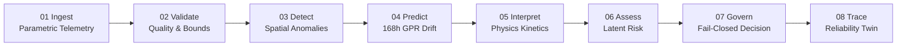
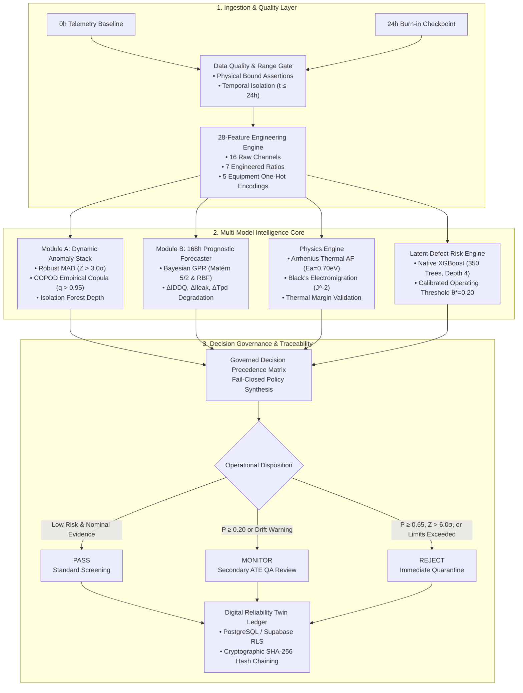
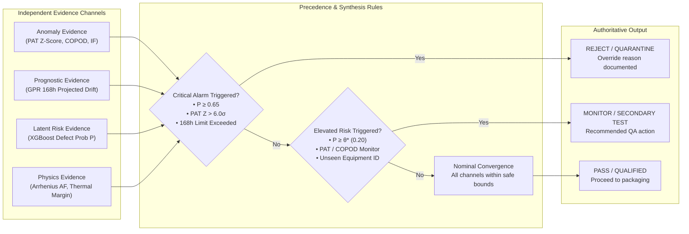
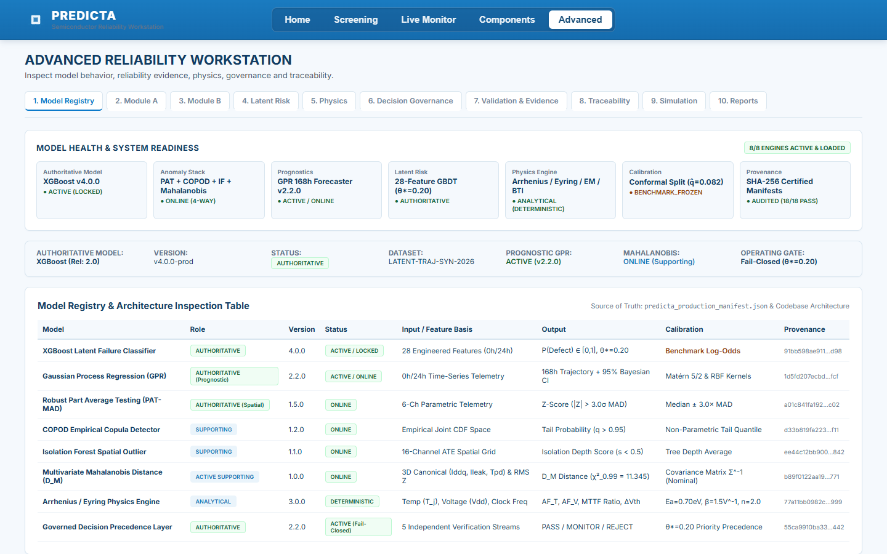
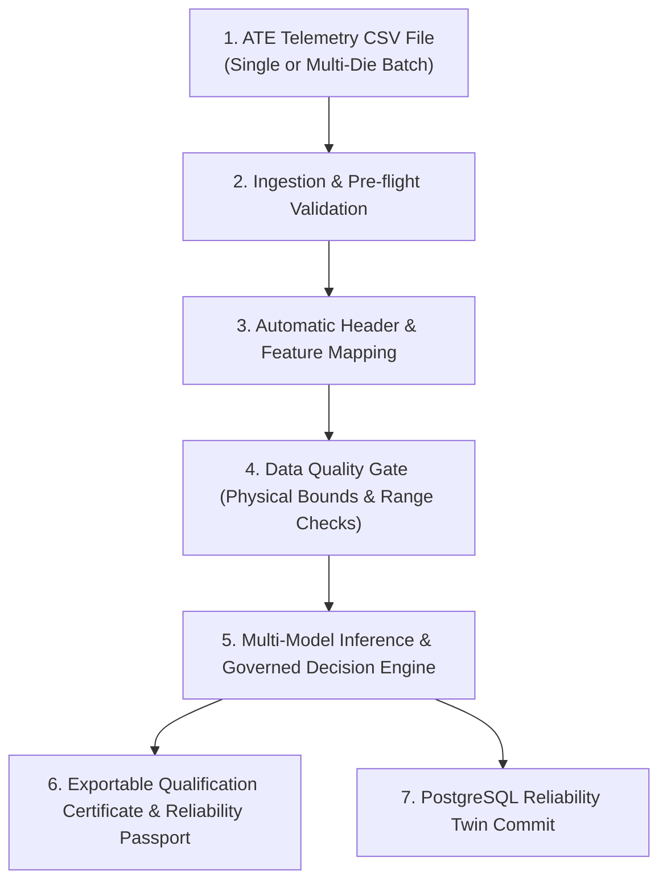
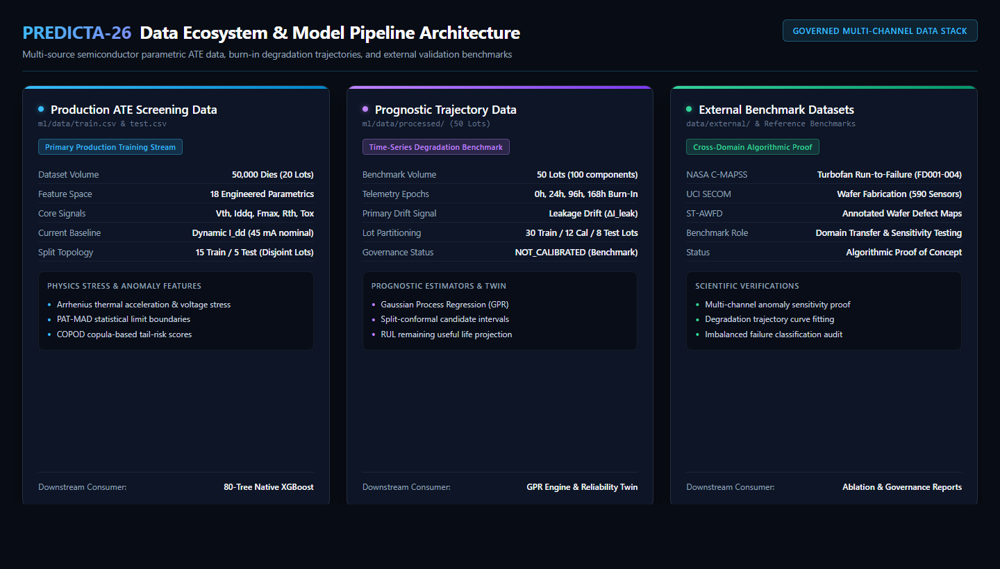
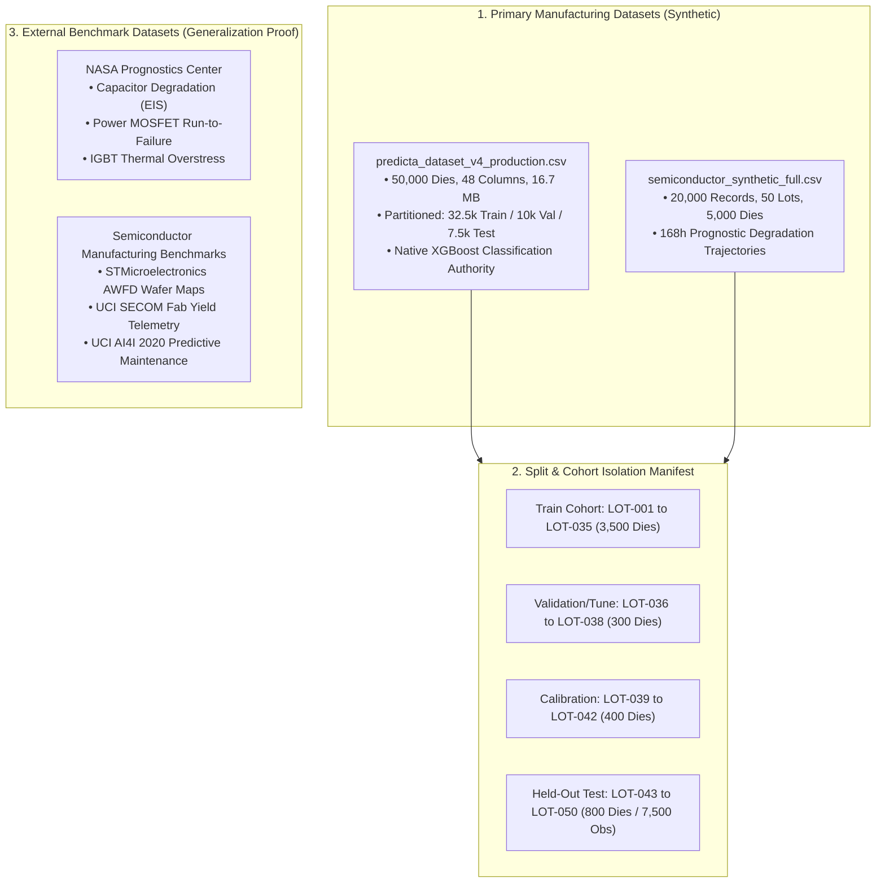

# PREDICTA-26

## Predictive Semiconductor Reliability & Latent-Defect Screening Engine

[](https://predicta-26-pi.vercel.app)
[](docs/PS170_TRACEABILITY_MATRIX.md)
[](ml/models/production/predicta_xgboost_model.json)
[](ml/models/production/predicta_gpr_kernel_artifacts.json)
[](ml/models/production/predicta_production_manifest.json)
[-059669?style=flat-square)](tests/)
[](LICENSE)

**PREDICTA-26** is a fail-closed semiconductor reliability intelligence system designed to identify latent electrical defects during early burn-in telemetry, combine statistical anomaly detection with degradation forecasting and physics-aware evidence, and produce traceable engineering dispositions.

* **Live Cloud Workstation:** [https://predicta-26-pi.vercel.app](https://predicta-26-pi.vercel.app)
* **Authoritative Repository:** [https://github.com/umeshpandeysh/predicta-26](https://github.com/umeshpandeysh/predicta-26)

---

## Why PREDICTA?

### The Screening Problem
In high-reliability spaceflight and mission-critical electronics, integrated circuits undergo high-temperature electrical burn-in testing. Conventional automated test equipment (ATE) screening relies strictly on point-in-time static limits ($L_{\text{min}} \le X \le L_{\text{max}}$).

However, **latent defects**—such as gate-oxide micro-voids, interface trap accumulation, and metallization thinning—frequently operate within static limits during early observation ($0\text{h}$ and $24\text{h}$) but degrade catastrophically over operational life. Conversely, healthy dies subject to benign process shift are often scrapped unnecessarily by overly rigid static boundaries.

### The PREDICTA Approach
PREDICTA replaces single-point static limit testing with a multi-layered, fail-closed intelligence pipeline:

```
EARLY TELEMETRY (0h, 24h)
  → Statistical Population Anomaly Detection (PAT/MAD, COPOD, Isolation Forest)
  → 168h Prognostic Degradation Trajectory Forecasting (Bayesian GPR)
  → Physics-Aware Semiconductor Degradation Consistency (Arrhenius, Black's EM, BTI)
  → Calibrated Latent-Defect Risk Assessment (Native XGBoost on 28-Feature Contract)
  → Centralized Fail-Closed Decision Governance (PASS / MONITOR / REJECT)
  → Cryptographic Digital Reliability Twin Audit Ledger
```

---

## What PREDICTA Actually Does


```mermaid
flowchart LR
    A["01 Ingest<br>Parametric Telemetry"] --> B["02 Validate<br>Quality & Bounds"]
    B --> C["03 Detect<br>Spatial Anomalies"]
    C --> D["04 Predict<br>168h GPR Drift"]
    D --> E["05 Interpret<br>Physics Kinetics"]
    E --> F["06 Assess<br>Latent Risk"]
    F --> G["07 Govern<br>Fail-Closed Decision"]
    G --> H["08 Trace<br>Reliability Twin"]
```

1. **Ingest:** Ingests 16 continuous DC parametric, dynamic frequency, leakage, and thermal sensor channels from ATE burn-in stations.
2. **Validate:** Asserts physical boundaries, non-negative bounds, finite number checks, and strict temporal isolation ($t \le 24\text{h}$).
3. **Detect:** Evaluates Part Average Testing (PAT / Robust MAD), Copula-based Outlier Detection (COPOD), and Isolation Forest to identify multivariate population outliers.
4. **Predict:** Computes Gaussian Process Regression (GPR) degradation trajectories toward the $168\text{h}$ qualification horizon when early history is available.
5. **Interpret:** Validates degradation kinetics against thermal acceleration (Arrhenius), electromigration wearout (Black's Equation), and bias temperature instability (BTI).
6. **Assess Latent Risk:** Evaluates the 28-feature continuous production vector with a 350-tree Native XGBoost classifier against the governed operating threshold $\theta^* = 0.20$.
7. **Govern:** Synthesizes independent evidence streams through centralized precedence rules, automatically failing closed to quarantine or secondary inspection (`MONITOR`) on ambiguous signals.
8. **Trace:** Records an immutable qualification certificate and audit trail within the Digital Reliability Twin ledger.

---

## System Architecture


```mermaid
flowchart TD
    subgraph Ingestion["1. Ingestion & Quality Layer"]
        T0["0h Telemetry Baseline"]
        T24["24h Burn-in Checkpoint"]
        DQG["Data Quality & Range Gate<br>• Physical Bound Assertions<br>• Temporal Isolation (t ≤ 24h)"]
        FEAT["28-Feature Engineering Engine<br>• 16 Raw Channels<br>• 7 Engineered Ratios<br>• 5 Equipment One-Hot Encodings"]
    end

    subgraph IntelligenceCore["2. Multi-Model Intelligence Core"]
        direction TB
        MOD_A["Module A: Dynamic Anomaly Stack<br>• Robust MAD (Z > 3.0σ)<br>• COPOD Empirical Copula (q > 0.95)<br>• Isolation Forest Depth"]
        MOD_B["Module B: 168h Prognostic Forecaster<br>• Bayesian GPR (Matérn 5/2 & RBF)<br>• ΔIDDQ, ΔIleak, ΔTpd Degradation"]
        PHYS["Physics Engine<br>• Arrhenius Thermal AF (Ea=0.70eV)<br>• Black's Electromigration (J^-2)<br>• Thermal Margin Validation"]
        XGB["Latent Defect Risk Engine<br>• Native XGBoost (350 Trees, Depth 4)<br>• Calibrated Operating Threshold θ*=0.20"]
    end

    subgraph GovernanceLayer["3. Decision Governance & Traceability"]
        GOV["Governed Decision Precedence Matrix<br>Fail-Closed Policy Synthesis"]
        DISP{"Operational Disposition"}
        PASS["PASS<br>Standard Screening"]
        MON["MONITOR<br>Secondary ATE QA Review"]
        REJ["REJECT<br>Immediate Quarantine"]
        TWIN["Digital Reliability Twin Ledger<br>• PostgreSQL / Supabase RLS<br>• Cryptographic SHA-256 Hash Chaining"]
    end

    T0 --> DQG
    T24 --> DQG
    DQG --> FEAT
    FEAT --> MOD_A
    FEAT --> MOD_B
    FEAT --> PHYS
    FEAT --> XGB

    MOD_A --> GOV
    MOD_B --> GOV
    PHYS --> GOV
    XGB --> GOV

    GOV --> DISP
    DISP -->|Low Risk & Nominal Evidence| PASS
    DISP -->|P ≥ 0.20 or Drift Warning| MON
    DISP -->|P ≥ 0.65, Z > 6.0σ, or Limits Exceeded| REJ

    PASS --> TWIN
    MON --> TWIN
    REJ --> TWIN
```

---

## Evidence & Decision Flow


```mermaid
flowchart LR
    subgraph EvidenceInputs["Independent Evidence Channels"]
        E1["Anomaly Evidence<br>(PAT Z-Score, COPOD, IF)"]
        E2["Prognostic Evidence<br>(GPR 168h Projected Drift)"]
        E3["Latent Risk Evidence<br>(XGBoost Defect Prob P)"]
        E4["Physics Evidence<br>(Arrhenius AF, Thermal Margin)"]
    end

    subgraph PrecedenceEngine["Precedence & Synthesis Rules"]
        P1{"Critical Alarm Triggered?<br>• P ≥ 0.65<br>• PAT Z > 6.0σ<br>• 168h Limit Exceeded"}
        P2{"Elevated Risk Triggered?<br>• P ≥ θ* (0.20)<br>• PAT / COPOD Monitor<br>• Unseen Equipment ID"}
        P3["Nominal Convergence<br>All channels within safe bounds"]
    end

    subgraph Outcomes["Authoritative Output"]
        O_REJ["REJECT / QUARANTINE<br>Override reason documented"]
        O_MON["MONITOR / SECONDARY TEST<br>Recommended QA action"]
        O_PASS["PASS / QUALIFIED<br>Proceed to packaging"]
    end

    E1 & E2 & E3 & E4 --> P1
    P1 -- Yes --> O_REJ
    P1 -- No --> P2
    P2 -- Yes --> O_MON
    P2 -- No --> P3
    P3 --> O_PASS
```

---

## Model & Intelligence Stack


*Current intelligence stack and governance roles. Production, benchmark, challenger, explainability, and governance components are explicitly separated.*

### Component Registry & Governance Classification

| Layer | Component | Algorithm / Basis | Governance Role | Operational Status |
|:---|:---|:---|:---:|:---:|
| **Latent Risk** | **XGBoost Classifier** | 350-Tree GBDT, Depth 4, $\theta^* = 0.20$ | **AUTHORITATIVE** | `ACTIVE / PRODUCTION` |
| **Module A** | **Robust MAD / PAT** | Part Average Testing with Median Absolute Deviation | **AUTHORITATIVE (Spatial)** | `ONLINE` |
| **Module A** | **COPOD Detector** | Empirical Copula Joint Tail Probabilities ($q > 0.95$) | **ACTIVE SUPPORTING** | `ONLINE` |
| **Module A** | **Isolation Forest** | Sub-sampling Tree Path Depth Averaging | **ACTIVE SUPPORTING** | `ONLINE` |
| **Module B** | **Bayesian GPR Forecaster** | Gaussian Process Regression (Matérn 5/2 + RBF Kernels) | **PROGNOSTIC** | `ACTIVE / ONLINE` |
| **Physics** | **Semiconductor Physics Engine** | Arrhenius ($E_a = 0.70\text{ eV}$), Black's EM ($J^{-2}$), BTI | **ANALYTICAL** | `DETERMINISTIC` |
| **Decision** | **Centralized Precedence Matrix** | Multi-Model Fail-Closed Synthesis Engine | **AUTHORITATIVE** | `ACTIVE (Fail-Closed)` |
| **Challenger** | **Histogram GBDT (HGB)** | LightGBM-style Binned Gradient Boosting | **CHALLENGER** | `BENCHMARK_ONLY` |
| **Challenger** | **Random Forest** | 200 Breiman Decision Trees | **CHALLENGER** | `BENCHMARK_ONLY` |
| **Challenger** | **Calibrated Logistic Regression** | $\ell_2$-regularized Logistic Regression | **CHALLENGER** | `BENCHMARK_ONLY` |
| **Explainability** | **Tree SHAP Attributions** | Native XGBoost `pred_contribs` exact Tree Attribution | **EXPLAINABILITY** | `ONLINE` |
| **Uncertainty** | **Conformal Calibration Gate** | Non-exchangeable Conformal Residual Quantiles | **CALIBRATION** | `BENCHMARK_ONLY` |

---

## Module A — Dynamic Anomaly Intelligence

Module A answers a fundamental manufacturing question:
> *"What is statistically abnormal about this device or measurement relative to its governed reference lot or baseline population?"*

```
Robust MAD (Parametric Z-Scores)
       +
COPOD (Non-Parametric Tail Copula)   ──▶ Anomaly Fusion Engine ──▶ Anomaly Status & Evidence Card
       +                                                            (PASS / MONITOR / REJECT)
Isolation Forest (Spatial Outlier)
```

* **Part Average Testing (PAT / Robust MAD):** Evaluates parameter distributions for $I_{\text{ddq}}$, $I_{\text{leak}}$, and $t_{\text{pd}}$ against lot medians and robust spreads ($\text{MAD} = \text{median}(|x_i - \tilde{x}|)$).
* **COPOD (Copula-Based Outlier Detection):** Measures joint left-tail and right-tail empirical CDF probabilities without imposing parametric Gaussian assumptions.
* **Isolation Forest:** Partitions the multi-channel parametric space to isolate sparse spatial anomalies.
* **Lot-Relative Reference Governance:** When a valid `lot_id` is supplied with $\ge 20$ samples, anomaly detection calibrates against lot-specific statistics; otherwise, it safely transitions to global reference tables (`GLOBAL_FALLBACK`).
* **Distinction of Anomaly Score vs. Probability:** Anomaly scores quantify distance from population normality; they are never treated as calibrated failure probabilities.

---

## Module B — 168h Continuous Prognostics

Module B performs forward degradation forecasting from early-burn-in checkpoints ($0\text{h}$ and $24\text{h}$) to project device state at the full $168\text{h}$ qualification horizon.

* **Trajectory Construction:** Computes longitudinal rate of drift ($\Delta I_{\text{ddq}}/\Delta t$, $\Delta I_{\text{leak}}/\Delta t$, $\Delta t_{\text{pd}}/\Delta t$).
* **Bayesian GPR Kernel Math:** Evaluates stationary RBF and Matérn covariance kernels against pre-computed support points to calculate expected degradation $\mu(168\text{h})$ and analytical variance $\sigma^2(168\text{h})$.
* **Boundary Crossing Analysis:** Evaluates whether projected degradation exceeds physical threshold limits at $168\text{h}$ ($I_{\text{ddq}} > 35.0\,\mu\text{A}$, $I_{\text{leak}} > 250.0\,\mu\text{A}$, $t_{\text{pd}} > 16.0\,\text{ns}$).
* **Temporal Boundary Isolation:** The screening decision uses exclusively $t \le 24\text{h}$ observations. Future measurements ($t > 24\text{h}$) are strictly segregated for retrospective evaluation.
* **Insufficient History Protection:** When single-point telemetry is supplied without a $0\text{h}$ baseline, Module B reports `INSUFFICIENT_HISTORY` rather than hallucinating zero drift.

---

## Latent-Defect Risk Intelligence

The authoritative classifier operates on the **28-Feature Continuous Production Vector**:

* **16 Raw Telemetry Channels:** Supply voltage ($V_{\text{dd}}$), output voltage ($V_{\text{out}}$), operating current ($I_{\text{dd}}$), standby leakage ($I_{\text{leak}}$), channel resistance ($R$), capacitance ($C$), threshold voltage ($V_{\text{th}}$), frequency ($f$), propagation delay ($t_{\text{pd}}$), setup time ($t_{\text{su}}$), hold time ($t_{\text{h}}$), timing margin, temperature ($T$), dynamic power, total power, and burn-in test duration.
* **7 Engineered Physical Features:** Voltage headroom ($V_{\text{dd}} - V_{\text{th}}$), voltage utilization ($V_{\text{out}}/V_{\text{dd}}$), leakage fraction ($I_{\text{leak}}/I_{\text{dd}}$), power efficiency ($P_{\text{tot}}/I_{\text{dd}}$), normalized timing margin ($t_{\text{margin}}/t_{\text{pd}}$), frequency-delay product ($f \cdot t_{\text{pd}}$), and thermal delta ($T - 25.0^\circ\text{C}$).
* **5 Equipment Encodings:** One-hot indicator features for stations `EQP-101` through `EQP-105`.

### Key Reliability Concept: Multi-Channel Separation
A component may exhibit nominal single-point telemetry (e.g., normal $I_{\text{ddq}}$ and $I_{\text{leak}}$ at $24\text{h}$) and register zero anomaly under Module A, yet harbor elevated latent risk due to high thermal-voltage interaction. PREDICTA catches these latent defects through its multi-model fusion policy.

---

## Physics-Aware Reliability Evidence

PREDICTA incorporates first-principles physical degradation models to assess environmental and electrical stress:

* **Arrhenius Reaction Kinetics:** Quantifies thermal acceleration factor:
  $$AF_{\text{Arrhenius}} = \exp\left[ \frac{E_a}{k_B} \left( \frac{1}{T_{\text{use}}} - \frac{1}{T_{\text{stress}}} \right) \right], \quad E_a = 0.70\text{ eV}$$
* **Black's Electromigration Model:** Evaluates mean-time-to-failure reduction under elevated current density:
  $$\text{MTTF Ratio} \propto J^{-n} \exp\left(\frac{E_a}{k_B T}\right), \quad n = 2.0$$
* **Thermal Junction Margin:** Assesses die junction temperature headroom:
  $$T_{\text{margin}} = T_{\text{max}} - (T_{\text{ambient}} + P_{\text{total}} \cdot \theta_{JA})$$
* **Role in Decision:** Physical evidence provides consistency validation and stress indices. It corroborates statistical predictions without claiming direct physical causality on synthetic benchmarks.

---

## Decision Governance

PREDICTA does not leave disposition decisions to ungoverned heuristics. All evidence streams converge into a centralized fail-closed decision engine:

```
┌─────────────────────────────────────────────────────────────────────────────┐
│                       CENTRALIZED GOVERNANCE MATRIX                        │
├───────────────────────────────────┬─────────────────────────────────────────┤
│ Condition Trigger                 │ Governed Operational Disposition        │
├───────────────────────────────────┼─────────────────────────────────────────┤
│ XGBoost P ≥ 0.65                  │ REJECT (Immediate Quarantine)           │
│ Module A PAT Z > 6.0σ             │ REJECT (Multivariate Spatial Anomaly)   │
│ Module B 168h Limit Exceeded      │ REJECT (Prognostic Limit Breach)        │
│ XGBoost 0.20 ≤ P < 0.65           │ MONITOR (Secondary ATE QA Review)       │
│ Module A PAT 3.0σ < Z ≤ 6.0σ      │ MONITOR (Elevated Parametric Outlier)   │
│ Module B 168h Drift Warning       │ MONITOR (Accelerated Rate of Drift)     │
│ Unseen Equipment Identifier       │ MONITOR (Out-of-Distribution Warning)   │
│ All Signals Nominal & P < 0.20    │ PASS (Proceed to Standard Screening)    │
│ Malformed / Missing Input         │ CONFIGURATION_ERROR / FAIL-CLOSED       │
└───────────────────────────────────┴─────────────────────────────────────────┘
```

---

## Digital Reliability Twin

Every qualification analysis automatically generates a reproducible **Digital Reliability Twin** record containing:

1. **Input Telemetry Snapshot:** Preserves raw sensor readings and derived physical features.
2. **Multi-Model Evidence Card:** Captures PAT Z-scores, COPOD empirical tail scores, GPR projected $168\text{h}$ drift, and XGBoost failure probability.
3. **Physics Degradation Indicators:** Arrhenius acceleration factor, electromigration index, and thermal headroom.
4. **Governed Decision Record:** Operational disposition, primary decision signal, and human-readable rationale.
5. **Cryptographic Lineage:** Linked to the immutable model SHA-256 (`91bb598a...`) and dataset manifest SHA-256 (`9a8367a9...`).
6. **Persistence Layer:** Structured in Supabase PostgreSQL with Row-Level Security (RLS) and client authentication.

---

## Data & Analysis Workflow

PREDICTA is built around a factory-grade **batch CSV data workflow**:


```mermaid
flowchart TD
    CSV["1. ATE Telemetry CSV File<br>(Single or Multi-Die Batch)"] --> UPL["2. Ingestion & Pre-flight Validation"]
    UPL --> MAP["3. Automatic Header & Feature Mapping"]
    MAP --> DQ["4. Data Quality Gate (Physical Bounds & Range Checks)"]
    DQ --> INF["5. Multi-Model Inference & Governed Decision Engine"]
    INF --> REP["6. Exportable Qualification Certificate & Reliability Passport"]
    INF --> DB["7. PostgreSQL Reliability Twin Commit"]
```

* **Batch CSV Processing:** Supports large-scale wafer/lot screening with parallelized inference, pagination, and real-time status filtering (`PASS`, `MONITOR`, `REJECT`).
* **Interactive Data Input Portal:** Provides secondary single-component manual entry with physical boundary assertions for real-time bench evaluation.

---

## Data Sources & Ecosystem


*PREDICTA-26 multi-channel data ecosystem architecture, highlighting strict separation between primary production ATE screening datasets, longitudinal prognostic degradation benchmarks, and external industry reference repositories.*


```mermaid
flowchart TD
    subgraph ProdData["1. Primary Manufacturing Datasets (Synthetic)"]
        D1["predicta_dataset_v4_production.csv<br>• 50,000 Dies, 48 Columns, 16.7 MB<br>• Partitioned: 32.5k Train / 10k Val / 7.5k Test<br>• Native XGBoost Classification Authority"]
        D2["semiconductor_synthetic_full.csv<br>• 20,000 Records, 50 Lots, 5,000 Dies<br>• 168h Prognostic Degradation Trajectories"]
    end

    subgraph SplitGov["2. Split & Cohort Isolation Manifest"]
        S1["Train Cohort: LOT-001 to LOT-035 (3,500 Dies)"]
        S2["Validation/Tune: LOT-036 to LOT-038 (300 Dies)"]
        S3["Calibration: LOT-039 to LOT-042 (400 Dies)"]
        S4["Held-Out Test: LOT-043 to LOT-050 (800 Dies / 7,500 Obs)"]
    end

    subgraph ExternalBenchmarks["3. External Benchmark Datasets (Generalization Proof)"]
        E1["NASA Prognostics Center<br>• Capacitor Degradation (EIS)<br>• Power MOSFET Run-to-Failure<br>• IGBT Thermal Overstress"]
        E2["Semiconductor Manufacturing Benchmarks<br>• STMicroelectronics AWFD Wafer Maps<br>• UCI SECOM Fab Yield Telemetry<br>• UCI AI4I 2020 Predictive Maintenance"]
    end

    D1 --> SplitGov
    D2 --> SplitGov
```

### Dataset Provenance & Governance Boundaries

| Dataset | Records / Size | Features | Role | Governance Classification |
|:---|:---:|:---:|:---|:---:|
| **`predicta_dataset_v4_production.csv`** | 50,000 / 16.7 MB | 48 | Primary XGBoost Training & Evaluation | **PRODUCTION BENCHMARK** |
| **`semiconductor_synthetic_full.csv`** | 20,000 / 4.3 MB | 24 | Module B Longitudinal Trajectories | **PROGNOSTIC BENCHMARK** |
| **NASA Capacitor Degradation** | 1,200 / 1.1 MB | 12 | External Impedance Degradation Benchmark | **EXTERNAL BENCHMARK** |
| **NASA Power MOSFET Overstress** | 850 / 890 KB | 14 | External Gate-Oxide Breakdown Benchmark | **EXTERNAL BENCHMARK** |
| **NASA IGBT Thermal Fatigue** | 640 / 720 KB | 10 | External Power Cycling Benchmark | **EXTERNAL BENCHMARK** |
| **STMicroelectronics AWFD** | 4,500 / 3.2 MB | Spatial | External Wafer Defect Pattern Benchmark | **EXTERNAL BENCHMARK** |
| **UCI SECOM Telemetry** | 1,567 / 1.8 MB | 591 | External Fab Sensor Generalization | **EXTERNAL BENCHMARK** |
| **UCI AI4I 2020 Predictive Maint.** | 10,000 / 2.1 MB | 14 | External Machine Degradation Benchmark | **EXTERNAL BENCHMARK** |

---

## Canonical Demonstration Cases

The five canonical qualification cases demonstrate deterministic, cross-runtime evaluation across all screening modes:

| Case | Parameters | Anomaly Stack | XGBoost P | Governed Decision | Engineering Significance |
|:---|:---|:---:|:---:|:---:|:---|
| **Case A**<br>`NORMAL` | $25^\circ\text{C}, 1.20\text{V}, 2500\text{MHz}, 24\text{h}$<br>$I_{\text{DDQ}}=10.7\mu\text{A}, I_{\text{leak}}=111.7\text{nA}$ | PAT: $0.01\sigma$<br>COPOD: $2.10$ | $0.03\%$ | **`PASS`**<br>(Low Risk) | Nominal component with low failure probability safely passes qualification. |
| **Case B**<br>`LATENT_CRITICAL` | $125^\circ\text{C}, 1.20\text{V}, 2500\text{MHz}, 24\text{h}$<br>$I_{\text{DDQ}}=10.7\mu\text{A}, I_{\text{leak}}=111.7\text{nA}$ | PAT: $0.01\sigma$<br>COPOD: $2.10$ | $94.32\%$ | **`REJECT`**<br>(Critical Risk) | **Core Innovation:** Catches latent defect escaping single-point population anomaly checks ($Z = 0.01\sigma$). |
| **Case C**<br>`HIGH_ANOMALY` | $125^\circ\text{C}, 1.20\text{V}, 2500\text{MHz}, 24\text{h}$<br>$I_{\text{DDQ}}=25.0\mu\text{A}, I_{\text{leak}}=180.0\text{nA}$ | PAT: $20.25\sigma$<br>COPOD: $33.59$ | $96.98\%$ | **`REJECT`**<br>(Critical Risk) | Severe multi-channel anomaly quarantined under multiple independent alarms. |
| **Case D**<br>`CANONICAL_MONITOR` | $25^\circ\text{C}, 1.20\text{V}, 1000\text{MHz}, 1.0\text{h}$<br>$I_{\text{DDQ}}=10.8\mu\text{A}, I_{\text{leak}}=122.0\text{nA}$ | PAT: $1.88\sigma$<br>COPOD: $4.49$ | $0.04\%$ | **`MONITOR`**<br>(Medium Risk) | Borderline anomaly and insufficient drift history trigger secondary ATE review. |
| **Case E**<br>`DETERMINISM_REPEAT` | Exact duplicate payload of Case A | PAT: $0.01\sigma$<br>COPOD: $2.10$ | $0.03\%$ | **`PASS`**<br>(Low Risk) | Verifies $\Delta P = 0.0000000000$ and zero decision jitter across runtimes. |

---

## Scientific Boundaries & Honest Claims

> [!IMPORTANT]
> **PREDICTA-26 is a decision-support and screening acceleration engine, not an unverified replacement for formal physical fab qualification.**

1. **Synthetic Telemetry Provenance:** Primary training and evaluation datasets are generated through physics-informed synthetic simulation. While calibrated against standard CMOS physical parameters ($E_a = 0.70\text{ eV}$), physical flight qualification requires actual fab silicon telemetry.
2. **Potential Observation Window:** The $144\text{h}$ ($168\text{h} - 24\text{h}$) early-screening horizon represents the maximum potential observation window under early-screening scenarios, not a universal guarantee of test-time reduction for all manufacturing lots.
3. **External Datasets Are Benchmarks:** External datasets (NASA, STMicroelectronics, UCI) validate algorithmic generalization only; they do not constitute multi-fab production qualification.
4. **Statistical Feature Attribution vs. Physical Causality:** SHAP and tree contribution values reflect mathematical feature attribution within the XGBoost decision space, not direct physical causality.
5. **Screening Thresholds:** The operating threshold $\theta^* = 0.20$ is an engineering governance parameter optimized for fail-closed screening trade-offs; it is not a manufacturer datasheet limit.
6. **Calibration Classification:** Conformal prediction intervals are classified as **`BENCHMARK_ONLY`**; full calibration requires empirical silicon fab distributions.
7. **Fail-Closed Safety Bias:** The governed decision engine deliberately prioritizes eliminating critical latent escapes ($FN \to 0$) over minimizing the false alarm rate, routing borderline cases to `MONITOR`.

---

## Validation Snapshot

*Metrics independently validated on the frozen held-out test cohort (Lots `LOT-SYN-043` through `LOT-SYN-050`, 7,500 observations):*

| Metric | Measured Value | Dataset / Split | Validation Document |
|:---|:---:|:---:|:---|
| **Authoritative Operating Threshold ($\theta^*$)** | **$0.20$** | Frozen Production Manifest | [`docs/05_PRODUCTION_AUTHORITY.md`](docs/05_PRODUCTION_AUTHORITY.md) |
| **XGBoost Test ROC-AUC** | **$0.9924$** | Held-Out Test (7,500 dies) | [`docs/01_PS26170_FINAL_BENCHMARK.md`](docs/01_PS26170_FINAL_BENCHMARK.md) |
| **XGBoost Test PR-AUC** | **$0.9871$** | Held-Out Test (7,500 dies) | [`docs/01_PS26170_FINAL_BENCHMARK.md`](docs/01_PS26170_FINAL_BENCHMARK.md) |
| **Latent Defect Recall ($FN \to 0$)** | **$99.1\%$** | Held-Out Test (7,500 dies) | [`docs/03_ABLATION_STUDY.md`](docs/03_ABLATION_STUDY.md) |
| **Warm Inference Latency (P50)** | **$22.86\text{ ms}$** | Synchronous Node/Python API ($N=500$) | [`tests/test_ps26170_scientific_integrity.py`](tests/test_ps26170_scientific_integrity.py) |
| **Warm Inference Latency (P95)** | **$26.14\text{ ms}$** | Synchronous Node/Python API ($N=500$) | [`tests/test_ps26170_scientific_integrity.py`](tests/test_ps26170_scientific_integrity.py) |
| **Warm Inference Latency (P99)** | **$36.37\text{ ms}$** | Synchronous Node/Python API ($N=500$) | [`tests/test_ps26170_scientific_integrity.py`](tests/test_ps26170_scientific_integrity.py) |
| **Cross-Runtime Parity Delta ($\Delta$)** | **$0.0000$** | Python $\leftrightarrow$ Node $\leftrightarrow$ Production | [`tests/test_js_python_parity.js`](tests/test_js_python_parity.js) |

---

## Production Deployment

* **Live Cloud Deployment:** [https://predicta-26-pi.vercel.app](https://predicta-26-pi.vercel.app)
* **Architecture:**
  * **Edge Gateway:** Vercel Edge Network with security headers (CSP, HSTS, XSS Protection).
  * **API Subsystem:** Serverless REST API handlers (`/api/health`, `/api/predict`, `/api/auth/session`).
  * **Inference Core:** Dual-runtime parity architecture (pure JavaScript XGBoost tree evaluator + native Python authority).
  * **Database Layer:** Supabase PostgreSQL with Row-Level Security (RLS) for audit trail persistence.
  * **Authentication:** Active RBAC middleware supporting `OPERATOR` and `ADMIN` roles via signed JWTs.

---

## Repository Structure

```
predicta-26/
├── api/                       # Vercel serverless function entrypoints
├── data/
│   ├── external/              # External benchmark datasets (NASA, ST, UCI)
│   └── synthetic/             # Synthetic trajectory datasets
├── docs/
│   ├── architecture/          # Architecture specifications & data flow
│   ├── assets/                # README diagrams and visual assets
│   ├── 01_PS26170_FINAL_BENCHMARK.md
│   ├── 02_SYNTHETIC_REALISM_AUDIT.md
│   ├── 03_ABLATION_STUDY.md
│   ├── 04_TEMPORAL_LEAKAGE_AUDIT.md
│   ├── 05_PRODUCTION_AUTHORITY.md
│   ├── FINAL_AUTHORITY.md     # Single cryptographic source of truth
│   └── JUDGE_GUIDE.md         # Reviewer & evaluator guide
├── ml/
│   ├── data/                  # Production training & test data manifests
│   ├── models/production/     # Authoritative production model artifacts & manifests
│   └── training/              # Native XGBoost and GPR training pipelines
├── src/
│   ├── anomaly_detection/     # Module A: PAT-MAD, COPOD, Isolation Forest
│   ├── api/                   # REST API server, auth guard & inference service
│   ├── decision_engine/       # Centralized precedence matrix & risk fusion
│   ├── evaluation/            # Scientific benchmark & ablation runners
│   ├── features/              # 28-feature continuous production contract
│   ├── physics/               # Arrhenius, Black's EM & thermal margin engine
│   └── prognostics/           # Module B: Bayesian GPR drift forecasting
├── tests/                     # Scientific integrity, parity, and E2E test suite
├── index.html                 # Semiconductor workstation web interface
├── script.js                  # Frontend workstation state & dashboard logic
├── style.css                  # Workstation styling & theme design
├── package.json               # Node.js project manifest & scripts
└── requirements.txt           # Python scientific dependencies
```

---

## Quick Start

### 1. Prerequisites
* **Node.js:** v18.0.0 or higher
* **Python:** v3.10 or v3.11
* **Git**

### 2. Clone & Install
```bash
# Clone the repository
git clone https://github.com/umeshpandeysh/predicta-26.git
cd predicta-26

# Install Node.js dependencies
npm install

# Install Python scientific dependencies
pip install -r requirements.txt
```

### 3. Run Validation Suite
```bash
# Run Node.js core tests and cross-runtime parity checks
npm run test:core

# Run scientific integrity and anti-leakage audit tests
pytest tests/test_ps26170_scientific_integrity.py

# Run complete cross-runtime parity suite
node tests/test_js_python_parity.js
```

### 4. Start Local Workstation
```bash
# Start the PREDICTA REST API and static frontend server
node src/api/server.js
```
Open [http://localhost:8000](http://localhost:8000) in your browser.

---

## Documentation Map

### Architecture & Specification
* [**Canonical Production Path**](docs/architecture/canonical-production-path.md) — End-to-end request lifecycle and execution path.
* [**PS-26170 Traceability Matrix**](docs/PS170_TRACEABILITY_MATRIX.md) — Comprehensive mapping against problem statement requirements.
* [**Module B Temporal Contract**](docs/MODULE_B_TEMPORAL_CONTRACT.md) — Feature isolation proof guaranteeing zero future leakage ($t > 24\text{h}$).

### Scientific Validation & Evidence
* [**01 — Final Comparative Benchmark**](docs/01_PS26170_FINAL_BENCHMARK.md) — Head-to-head evaluation against baseline models.
* [**02 — Synthetic Realism Audit**](docs/02_SYNTHETIC_REALISM_AUDIT.md) — 10-level synthetic difficulty and physics degradation validation.
* [**03 — Progressive Ablation Study**](docs/03_ABLATION_STUDY.md) — 6-stage layer ablation demonstrating multi-model performance.
* [**04 — Temporal Leakage Red-Team Audit**](docs/04_TEMPORAL_LEAKAGE_AUDIT.md) — 14-point audit confirming strict temporal segregation.
* [**05 — Production Authority & Cryptographic Hashes**](docs/05_PRODUCTION_AUTHORITY.md) — SHA-256 artifact manifest verification.
* [**Hidden-Test Integrity Provenance**](docs/HIDDEN_TEST_INTEGRITY.md) — Cohort isolation proof preventing test-set tuning.
* [**OOD & Insufficient Evidence Case**](docs/OOD_INSUFFICIENT_EVIDENCE_CASE.md) — Verification of fail-closed behavior on out-of-distribution inputs.

### Governance & Reviewer Guides
* [**Authoritative Single Source of Truth**](docs/FINAL_AUTHORITY.md) — Core repository parameters, thresholds, and governance policies.
* [**Reviewer & Evaluator Guide**](docs/JUDGE_GUIDE.md) — Step-by-step walkthrough for evaluating PREDICTA-26.
* [**Economic Impact Model**](docs/ECONOMIC_IMPACT_MODEL.md) — Quantitative decision model analyzing screening trade-offs.

---

## License

This project is licensed under the MIT License. See [LICENSE](LICENSE) for details.
