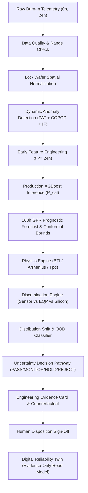

# PREDICTA-26 — PS-170 TRACEABILITY MATRIX

**Problem Statement:** Smart India Hackathon (SIH 2026) PS-170 — Semiconductor Burn-In Telemetry & Latent Defect Screening  
**Repository:** `umeshpandeysh/predicta-26`  
**Authoritative Production Model SHA-256:** `91bb598ae91155674e40cb0a9f39d1e9bdeacd39875542db88b65e3668f29d98`  
**Operating Decision Threshold:** `0.20` (Strictly Locked)  
**Model Version:** `4.0.0_authoritative`  

---

## 1. Traceability Architecture

The PREDICTA-26 system enforces an unbroken 14-step evidence chain from raw telemetry to final twin disposition:

---

## 2. Requirement-to-Code Mapping Matrix

| Req ID | PS-170 Requirement | Implementation (JS / Python) | Test Suite | Verification / Benchmark Script | Evidence Artifact |
| :--- | :--- | :--- | :--- | :--- | :--- |
| **PS170-01** | **0h/24h Early Screening & Zero Leakage** | `src/api/inference.js` `src/api/inference_service.py` | `tests/test_ps170_intelligence.js` `tests/test_ps170_intelligence.py` | `ml/analysis/ps170_temporal_leakage_proof.py` | `ml/reports/ps170_temporal_leakage_audit.json` |
| **PS170-02** | **Dynamic Outlier Screening (PAT/COPOD)** | `src/api/inference.js` `src/api/inference_service.py` | `tests/test_js_python_parity.js` `tests/test_inference.py` | `ml/analysis/run_anomaly_benchmark.py` | `experiments/anomaly_evaluation/anomaly_benchmark_report.json` |
| **PS170-03** | **Calibrated XGBoost Defect Scoring** | `src/api/inference.js` `src/api/inference_service.py` | `tests/test_release_certification.js` `tests/test_conformal_calibration.py` | `ml/benchmarks/ps170_latent_escape_benchmark.py` | `ml/reports/ps170_latent_escape_report.json` |
| **PS170-04** | **168h Prognostics & Uncertainty** | `src/prognostics/trajectory.js` `src/prognostics/trajectory.py` | `tests/test_lot_conformal_stability.js` `tests/test_lot_conformal_stability.py` | `src/prognostics/evaluate_lot_stability.py` | `experiments/prognostics/multi_lot_conformal_stability_report.json` |
| **PS170-05** | **Physics Consistency Engine** | `src/api/inference.js` `src/physics/reliability_engine.py` | `tests/test_physics_boundaries.py` `tests/test_physics_reliability_engine.py` | `ml/training/run_exp05_physics_fusion.js` | `ml/reports/ps170_layer_ablation_report.json` |
| **PS170-06** | **Sensor vs EQP vs Silicon Discrimination** | `src/governance/discrimination_engine.js` `src/governance/discrimination_engine.py` | `tests/test_ps170_intelligence.js` `tests/test_ps170_intelligence.py` | `ml/benchmarks/ps170_latent_escape_benchmark.py` | `ml/reports/ps170_latent_escape_report.json` |
| **PS170-07** | **Distribution Shift & OOD Classifier** | `src/governance/ood_classifier.js` `src/governance/ood_classifier.py` | `tests/test_ps170_intelligence.js` `tests/test_ps170_intelligence.py` | `ml/analysis/run_robustness_suite.py` | `ml/reports/ps170_latent_escape_report.json` |
| **PS170-08** | **Governed Uncertainty Decision (HOLD->96h)** | `src/decision_engine/uncertainty_decision_pathway.js` `src/decision_engine/uncertainty_decision_pathway.py` | `tests/test_ps170_intelligence.js` `tests/test_ps170_intelligence.py` | `ml/analysis/ps170_stack_ablation.py` | `ml/reports/ps170_layer_ablation_report.json` |
| **PS170-09** | **Engineering Evidence Card & HTML Export** | `src/governance/evidence_card.js` `src/governance/evidence_card.py` | `tests/test_ps170_intelligence.js` `tests/test_ps170_intelligence.py` | `src/demo_ps170_traceability.js` | `docs/demo_evidence_packet.html` |
| **PS170-10** | **Digital Twin Immutable Provenance** | `src/reliability_twin/reliability_twin.js` `src/reliability_twin/reliability_twin.py` | `tests/test_reliability_twin.js` `tests/test_reliability_twin.py` | `tests/test_release_certification.js` | `ml/reliability_twin/reliability_twin_contract.json` |
| **PS170-11** | **Multi-Layer Stack Architectural Analysis** | `src/api/inference.js` `src/api/inference_service.py` | `tests/test_ps170_intelligence.js` `tests/test_ps170_intelligence.py` | `ml/analysis/ps170_stack_ablation.py` | `ml/reports/ps170_layer_ablation_report.json` |
| **PS170-12** | **Quantitative External Transfer Experiment** | `src/governance/discrimination_engine.js` `src/governance/discrimination_engine.py` | `tests/test_ps170_intelligence.js` `tests/test_ps170_intelligence.py` | `ml/analysis/ps170_external_transfer_experiment.py` | `ml/reports/ps170_external_transfer_experiment_report.json` |
| **PS170-13** | **20-Attack Adversarial Reliability Benchmark** | `src/governance/discrimination_engine.js` `src/governance/discrimination_engine.py` | `tests/test_ps170_adversarial_reliability.js` `tests/test_ps170_adversarial_reliability.py` | `ml/benchmarks/ps170_adversarial_reliability_benchmark.py` | `ml/reports/ps170_adversarial_reliability_report.json` |
| **PS170-14** | **Chronological Temporal Replay Engine** | `src/governance/temporal_replay.js` `src/governance/temporal_replay.py` | `tests/test_ps170_intelligence.js` `tests/test_ps170_intelligence.py` | `ml/analysis/ps170_temporal_replay.py` | `ml/reports/ps170_temporal_replay_report.json` |
| **PS170-15** | **Champion vs Challenger Governance Harness** | `src/api/inference.js` `src/api/inference_service.py` | `tests/test_release_certification.js` `tests/test_ps170_intelligence.py` | `ml/analysis/ps170_champion_challenger_harness.py` | `ml/reports/ps170_champion_challenger_report.json` |

---

## 3. One-Click Verification Commands

- **Run Traceability Demo (Node.js):** `node src/demo_ps170_traceability.js`
- **Run Traceability Demo (Python):** `python src/demo_ps170_traceability.py`
- **Run Multi-Layer Stack Architectural Analysis:** `python ml/analysis/ps170_stack_ablation.py`
- **Run Quantitative External Transfer Experiment:** `python ml/analysis/ps170_external_transfer_experiment.py`
- **Run Adversarial Reliability Benchmark (20 Attacks):** `python ml/benchmarks/ps170_adversarial_reliability_benchmark.py`
- **Run Chronological Temporal Replay Lab:** `python ml/analysis/ps170_temporal_replay.py`
- **Run Champion vs Challenger Governance Harness:** `python ml/analysis/ps170_champion_challenger_harness.py`
- **Run Full Intelligence Test Suite (Node.js):** `node tests/test_ps170_intelligence.js`
- **Run Adversarial Reliability Suite (Node.js):** `node tests/test_ps170_adversarial_reliability.js`
- **Run Full Intelligence Test Suite (Python):** `pytest tests/test_ps170_intelligence.py -v`
- **Run Adversarial Reliability Suite (Python):** `pytest tests/test_ps170_adversarial_reliability.py -v`
