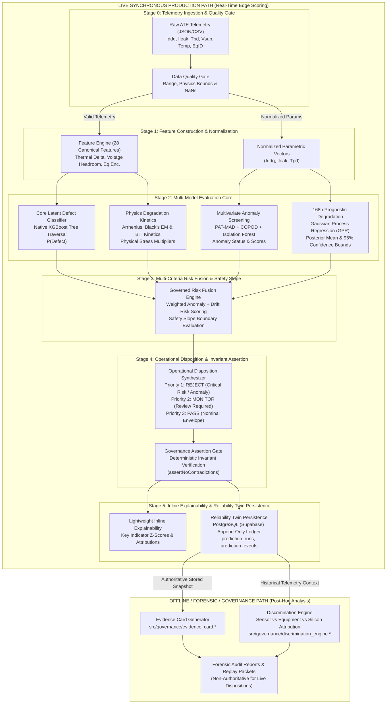

# PREDICTA — Canonical Production Path & Architecture Specification

**Status:** Authoritative Production Reference  
**Domain:** SIH 2026 Problem Statement 170 / 26170 (ISRO) — Semiconductor Burn-In Telemetry & Latent Defect Screening  
**Implementation Entrypoint:** [`src/api/server.js`](../../src/api/server.js) · [`src/api/inference.js`](../../src/api/inference.js) (Node.js Edge) · [`src/api/inference_service.py`](../../src/api/inference_service.py) (Python Service)

---

## 1. Executive Purpose

PREDICTA is a **fail-closed semiconductor reliability intelligence engine** designed for space-grade component screening (e.g. at 125°C burn-in). Traditional Automated Test Equipment (ATE) screening evaluates only static datasheet limits ($L_{\text{lower}} \le X \le L_{\text{upper}}$). Components with latent physical flaws (gate oxide thinning, sub-surface dislocation, micro-void electromigration) often pass static limits at 0h/24h but catastrophically degrade before mission completion.

The **Canonical Production Path** ingests early burn-in parametric telemetry, verifies physical validity, scores multi-parameter distributional anomalies, forecasts continuous 168h degradation trajectories with Bayesian uncertainty, evaluates physical degradation kinetics, and synthesizes an immutable, governed disposition (`PASS`, `MONITOR`, or `REJECT`) backed by a persistent audit trail.

---

## 2. Canonical Architecture Diagram

---

## 3. Pipeline Stages in Detail

### Live Synchronous Production Stages

| Stage | Subsystem | Inputs | Method & Code Location | Output | Operational Consequence | Production Status |
| :--- | :--- | :--- | :--- | :--- | :--- | :--- |
| **0** | **Data Quality Gate** | Raw JSON / CSV telemetry record | Strict range & physical plausibility checks in [`src/ingestion/data_quality_gate.js`](../../src/ingestion/data_quality_gate.js) | Validated telemetry or `DATA_QUALITY_REJECTED` | Rejects corrupted, non-numeric, or unphysical sensor readings | **PRODUCTION** |
| **1** | **Feature Engineering** | Validated parameters + Equipment ID | 28-feature deterministic transform (`voltage_headroom`, `leakage_fraction`, `thermal_delta`) in [`src/api/inference.js`](../../src/api/inference.js#L268-L295) | 28-dimensional dense numerical feature vector | Feeds exact feature contract expected by native XGBoost trees | **PRODUCTION** |
| **2A** | **Core Defect Classification** | 28-feature vector | Native tree traversal of calibrated XGBoost ensemble (`ml/models/production/predicta_xgboost_model.json`) | Defect probability $P \in [0.0, 1.0]$ | $P \ge 0.65 \implies \text{REJECT}$; $P \ge 0.20 \implies \text{MONITOR}$; $P < 0.20 \implies \text{PASS}$ | **PRODUCTION** |
| **2B** | **Multivariate Anomaly Detection** | Canonical $(I_{\text{ddq}}, I_{\text{leak}}, t_{\text{pd}})$ | Tri-detector fusion: PAT-MAD ([`robust_mad.js`](../../src/anomaly_detection/robust_mad.js)), COPOD ([`copod.js`](../../src/anomaly_detection/copod.js)), Isolation Forest ([`isolation_forest.js`](../../src/anomaly_detection/isolation_forest.js)) | Anomaly status (`PASS` / `MONITOR` / `REJECT`), tail scores | Outlier die flagged even if XGBoost score is low | **PRODUCTION** |
| **2C** | **168h Prognostic Forecasting** | Baseline $0\text{h}$ & early $24\text{h}$ telemetry | Bayesian Gaussian Process Regression (RBF + WhiteNoise kernel) in [`src/drift_prediction/`](../../src/drift_prediction/) | Predicted mean $\hat{y}_{168}$ and $95\%$ CI $[\mu - 1.96\sigma, \mu + 1.96\sigma]$ | Determines whether component will breach end-of-test limits at 168h | **PRODUCTION** |
| **2D** | **Physics Engine Evaluation** | Temperature, bias, current density | Semiconductor kinetics: Arrhenius ($E_a=0.7\text{eV}$), Black's Electromigration, BTI in [`src/physics/`](../../src/physics/) | Acceleration factor $AF$, MTTF estimate, kinetic thermal multiplier | Prevents unphysical predictions; guides root-cause attribution | **PRODUCTION** |
| **3** | **Risk Fusion & Safety Slope** | $P$, anomaly evidence, drift bounds | Multi-criteria risk aggregator + boundary rate evaluator ($\Delta / \Delta t$) in [`src/risk_fusion/risk_fusion.js`](../../src/risk_fusion/risk_fusion.js) | Fused risk score $(0\text{--}100)$, boundary status (`WITHIN`, `WARNING`, `EXCEEDED`) | Overrides single-model optimism if multi-criteria risk is high | **PRODUCTION** |
| **4** | **Operational Disposition** | Fused risk state & individual signals | Hierarchical priority rule engine + fail-closed assertions in [`src/api/inference.js`](../../src/api/inference.js#L1004-L1147) | Definitive disposition (`PASS`, `MONITOR`, `REJECT`) & recommended action | Drives automated factory routing / QA quarantine binning | **PRODUCTION** |
| **5** | **Explainability & Reliability Twin** | Complete evaluation snapshot | Inline attribution generator + PostgreSQL relational persistence in [`src/reliability_twin/`](../../src/reliability_twin/) | Structured prediction snapshot + durable database record | Immutable audit trail for spaceflight qualification documentation | **PRODUCTION** |

### Offline / Forensic / Governance Subsystems

| Subsystem | Primary Purpose | Code Location | Input Source | Governance Authority |
| :--- | :--- | :--- | :--- | :--- |
| **Evidence Card Generator** | Formats multi-layer evidence into structured JSON/Markdown reports for engineering review | [`src/governance/evidence_card.*`](../../src/governance/evidence_card.js) | Stored prediction snapshot | **OFFLINE FORENSIC ONLY** (Does not execute in live `predictSingle()` loop; does not alter factory disposition) |
| **Discrimination Engine** | Classifies anomalies into Sensor, Equipment/Chamber, or Silicon root categories | [`src/governance/discrimination_engine.*`](../../src/governance/discrimination_engine.js) | Historical telemetry & lot context | **OFFLINE FORENSIC ONLY** (Tagged with `NON_CAUSAL_DISCLAIMER`; non-authoritative for live decisions) |
| **OOD / Shift Classifier** | Screens telemetry against heuristic baseline bounds | [`src/governance/ood_classifier.*`](../../src/governance/ood_classifier.js) | 24h telemetry vector | **BENCHMARK SCREENING ONLY** (`NOT_EMPIRICALLY_CALIBRATED`; non-authoritative) |

---

## 4. End-to-End Walkthrough Example

Consider a die undergoing early burn-in screening:

1. **Telemetry Input:**
   At $t = 24\text{h}$, ATE measures $I_{\text{leak}} = 192\,\mu\text{A}$ ($0\text{h}$ baseline: $110\,\mu\text{A}$), $t_{\text{pd}} = 14.1\,\text{ns}$, $T = 125^\circ\text{C}$ on `EQP-101`.
2. **Quality Gate:**
   Verified finite, non-null, within valid physical bounds $\to$ `VALIDATED`.
3. **Anomaly Screening:**
   - PAT-MAD: Parameter $Z$-score on leakage current $Z = 6.42 > 6.0 \to \text{REJECT}$.
   - COPOD: Empirical tail score $= 9.81 > 9.5 \to \text{REJECT}$.
4. **Prognostic Forecasting:**
   - GPR 168h predicted leakage: $\hat{y}_{168} = 485\,\mu\text{A}$ ($95\%\text{ CI: } [430, 540]\,\mu\text{A}$).
   - Upper confidence bound exceeds project screening limit ($500\,\mu\text{A}$) $\to \text{EXCEEDED}$.
5. **Physics Kinetics:**
   - Thermal acceleration factor $AF \approx 38.4\times$ at $125^\circ\text{C}$ relative to $25^\circ\text{C}$ junction nominal.
6. **Core Model Score:**
   - Native XGBoost calculates $P(\text{Defect}) = 0.9956 \to \text{HIGH RISK}$.
7. **Risk Fusion:**
   - Multi-criteria risk score $= 98.5 / 100 \to \text{AT RISK}$.
8. **Operational Disposition:**
   - Synthesizer evaluates Priority 1 criteria $\to \text{REJECT}$ (Quarantine).
   - Invariant assertion verifies contract consistency.
9. **Inline Explainability & Reliability Twin Persistence:**
   - Live inference logs key indicators (`CRITICAL_ILEAK_PAT_ANOMALY (Z=6.42)`, `GPR_ILEAK_LIMIT_EXCEEDED (Upper95=540µA)`).
   - Immutable record persisted in Supabase table `predictions` with trace ID `PRED-2026-X89A1`.
   - Post-hoc forensic review can subsequently generate the full human-readable Evidence Card via `src/governance/evidence_card.js`.

---

## 5. What is NOT in the Production Path

To ensure zero ambiguity during evaluation, the following items are strictly isolated from the production decision loop:

| Component / Artifact | Nature / Purpose | Current Status | Why It Is Excluded From Production Loop |
| :--- | :--- | :--- | :--- |
| **Evidence Card Generator** | Markdown/JSON forensic evidence report generator | `OFFLINE_FORENSIC` | Post-hoc reporting utility; live inference computes lightweight inline attributions to maintain sub-millisecond edge latency. |
| **Discrimination Engine** | Root anomaly discriminator (Sensor vs Equipment vs Silicon) | `OFFLINE_FORENSIC` | Operates on historical/lot context with explicit `NON_CAUSAL_DISCLAIMER`; zero authority over live `predictSingle()` dispositions. |
| **OOD / Shift Classifier** | Heuristic distribution shift screening | `BENCHMARK_ONLY` | Heuristic baseline specification; explicitly non-authoritative to prevent uncalibrated overrides of production ML. |
| **Research V2 Shadow Model** | Linear experimental heuristic in `inference.js` | `RESEARCH_ONLY` (Shadow mode) | Runs asynchronously; output is recorded for telemetry comparison only; zero influence on disposition. |
| **Split-Conformal Quantiles** | Non-conformity calibration table in `conformal_calibration_artifacts.json` | `BENCHMARK_ONLY` (`NOT_CALIBRATED`) | Pending physical fab/space qualification data; explicitly declared uncalibrated to maintain scientific integrity. |
| **HistGradientBoosting (HGB)** | Alternative tree model in `phase16_ablation_study.py` | `BENCHMARK` | Used solely in offline scientific ablation studies to prove XGBoost superiority. |
| **Latent Trajectory Retrospective Evaluator** | Post-hoc oracle validator in `latent_trajectory.py` | `VALIDATION_ONLY` | Requires future 168h ground truth; used only during offline benchmark validation and test suite evaluation. |
| **Standalone Counterfactual Explorer** | What-if feature perturbation generator in `counterfactual.js` | `DECISION_SUPPORT` | Ad-hoc interactive analysis tool for QA engineers; does not modify stored production decisions. |
| **Historical Phase Reports** | Audits in `docs/phase-reports/` | `HISTORICAL_RECORD` | Sealed historical documentation of iterative development milestones. |
