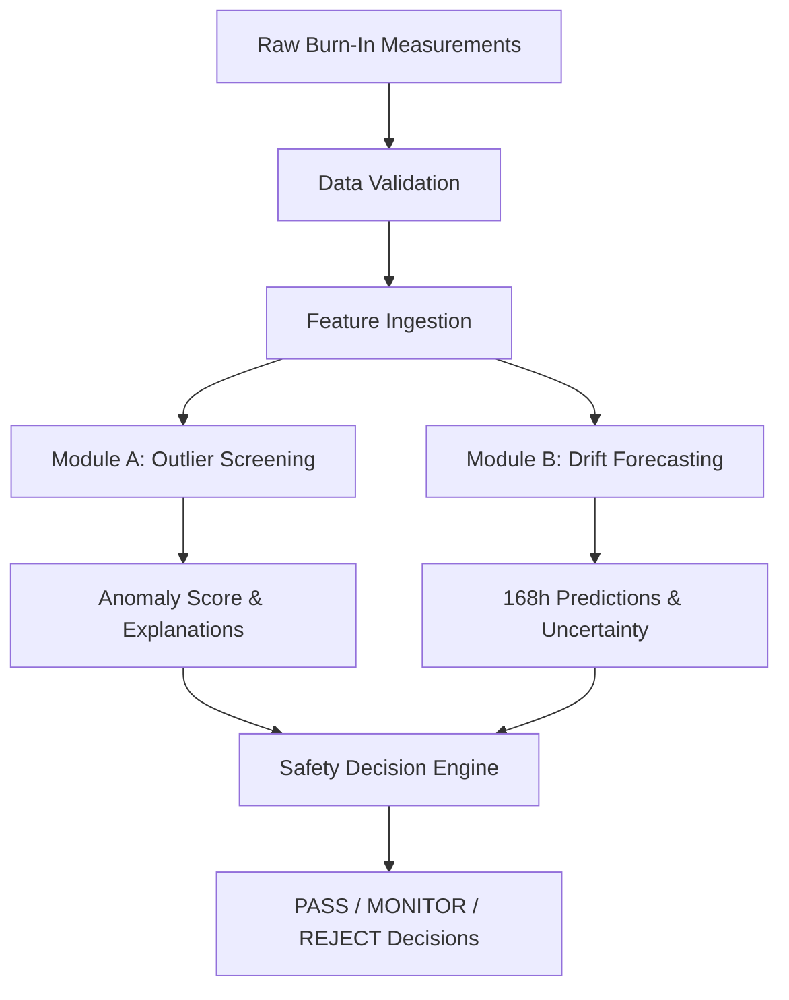

# Technical Architecture & Pipeline

This document describes the end-to-end processing pipeline of the AI-Driven Anomaly Detection and Screening system.

## Architectural Stages
1.  **Data Ingestion & Normalization:** Converts units to standard forms (µA, ns) and normalizes manufacturing wafer cohorts relative to their lot Median and MAD.
2.  **Module A Outlier screening:** Applies Isolation Forest on lot-standardized parameters to calculate multivariate anomaly scores.
3.  **Module B Drift forecasting:** Ingests 0h and 24h measurements and uses Gaussian Process Regression (GPR) to predict 168h values and confidence boundaries.
4.  **Safety Analysis:** Checks if the predicted degradation rate (slope) exceeds specified qualification boundaries.
5.  **Decision Engine:** Combines anomaly flags and safety margin breaches to route the component to PASS, MONITOR, or REJECT states.
